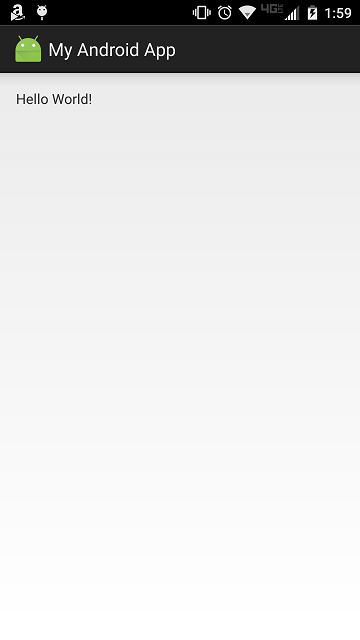
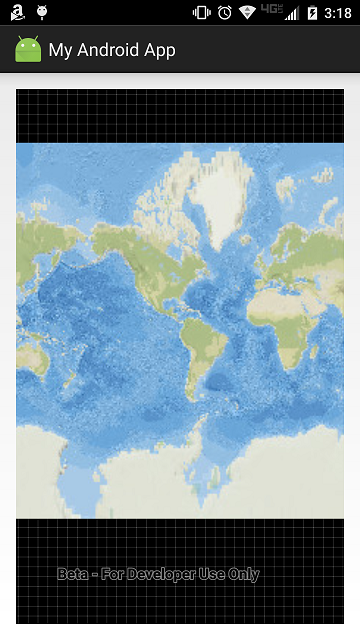

# Exercise 1: Map (Android)

This exercise walks you through the following:
- Create a new Android app
- Add ArcGIS Runtime to the app
- Add a map to the app

Prerequisites:
- Install the Java Development Kit (JDK) version 6 or higher. Version 8 or higher is recommended.
- Install Android Studio. (You can build apps using the Android SDK Tools and a different IDE of your choice, but these exercises assume that you have installed Android Studio.)
- Enable developer mode on your Android 4.1 or higher device. You may also need to install USB drivers for your device. If you use an emulator instead of a physical device, you must [configure hardware acceleration](https://developer.android.com/studio/run/emulator-acceleration.html).

For more details on these prerequisites, see the [ArcGIS Runtime SDK for Android (Quartz Beta) system requirements](https://developers.arcgis.com/android/beta/guide/system-requirements.htm).

If you need some help, you can refer to [the solution to this exercise](../../solutions/Android/Ex1_Map), available in this repository.

## Create a new Android app
1. Open Android Studio and start a new Android Studio project. Specify a minimum API level of 16 or higher, as required by ArcGIS Runtime Quartz. On the **Add an Activity to Mobile** screen, choose **Empty Activity** (not **Blank Activity** or **Add No Activity**). Call your activity `MainActivity`, ensure the **Generate Layout File** box is checked, and name the layout `activity_main`. For these exercises, it may be easier if you uncheck **Backwards Compatibility (AppCompat)**, but you should be able to complete the exercises either way. Click Finish, and an Android Studio project is created and opened.

1. Connect your Android device to your computer with a USB cable. In Android Studio, run your new app. Verify that a blank app runs, possibly with a default "Hello World" message inserted by Android Studio:

    
    
## Add ArcGIS Runtime to the app

1. In your Android Studio project, under **Gradle Scripts**, there are two files called `build.gradle`: one for the **project** and one for the **app module**. Open `build.gradle` for your project. Under `allprojects` > `repositories`, add a reference to the Esri Maven repository on Bintray. Make sure you do this under `allprojects` and not under `buildscript`:

    ```
    allprojects {
        repositories {
            jcenter()
            // Add the next three lines
            maven {
                url 'https://esri.bintray.com/arcgis'
            }
        }
    }
    ```
    
1. Open the `build.gradle` file for your app module. Under `dependencies`, add a reference to ArcGIS Runtime:

    ```
    dependencies {
        compile fileTree(dir: 'libs', include: ['*.jar'])
        androidTestCompile('com.android.support.test.espresso:espresso-core:2.2.2', {
            exclude group: 'com.android.support', module: 'support-annotations'
        })
        testCompile 'junit:junit:4.12'
        // Add the next line
        compile 'com.esri.arcgisruntime:arcgis-android:100.0.0-beta-3'
    }
    ```
    
1. Choose **Tools** > **Android** > **Sync Project with Gradle Files** (or click the sync button on the toolbar). The ArcGIS Runtime libraries are downloaded automatically from the Maven repository.

## Add a map to the app

1. Open `manifests/AndroidManifest.xml`. Inside the `<manifest>` element but not inside the `<application>` element, add the following elements to 1) request INTERNET permission and 2) require OpenGL:

    ```
    <uses-permission android:name="android.permission.INTERNET" />
    <uses-feature android:glEsVersion="0x00020000" android:required="true" />
    ```
    
1. In `AndroidManifest.xml`, add `android:configChanges="orientation|screenSize"` to the `<activity>` tag to stop the `Activity` from restarting when the device is rotated:

    ```
    <activity android:name=".MainActivity"
            android:configChanges="orientation|screenSize">
    ```

1. Under `app`, open `res/layout/activity_main.xml`. This XML file provides the layout for your app's main `Activity`. It probably contains a `RelativeLayout`, which contains a `TextView`. Replace the `TextView` with a `MapView` that fills the layout:

    ```
    <com.esri.arcgisruntime.mapping.view.MapView
        android:id="@+id/mapView"
        android:layout_width="fill_parent"
        android:layout_height="fill_parent" >
    </com.esri.arcgisruntime.mapping.view.MapView>
    ```

1. Open your `MainActivity` class. In that class, declare a non-final `MapView` and set it to `null`. Also declare and instantiate a new `ArcGISMap`:

    ```
    private MapView mapView = null;
    private ArcGISMap map = new ArcGISMap();
    ```
    
1. In `onCreate(Bundle)`, after the call to `setContentView(int)`, get the `MapView`, set the `ArcGISMap`'s basemap, and set the `MapView`'s map:

    ```
    mapView = (MapView) findViewById(R.id.mapView);
    map.setBasemap(Basemap.createNationalGeographic());
    mapView.setMap(map);
    ```
    
1. In `MainActivity`, override `onResume()`, `onPause()`, and `onDestroy()`, and call `resume()`, `pause()`, and `dispose()` respectively on the `MapView`:

    ```
    @Override
    protected void onResume() {
        mapView.resume();
        super.onResume();
    }

    @Override
    protected void onPause() {
        mapView.pause();
        super.onPause();
    }

    @Override
    protected void onDestroy() {
        mapView.dispose();
        super.onDestroy();
    }
    ```
    
1. Run your app. Verify that a map displays:

    
    
## How did it go?

If you have trouble, **refer to the solution code**, which is linked near the beginning of this exercise. You can also **submit an issue** in this repo to ask a question or report a problem. If you are participating live with Esri presenters, feel free to **ask a question** of the presenters.

If you completed the exercise, congratulations! You learned how to add a map to an app, using ArcGIS Runtime.

Ready for more? Start on [**Exercise 2: Add Zoom In and Zoom Out Buttons**](Exercise 2 Zoom Buttons.md).