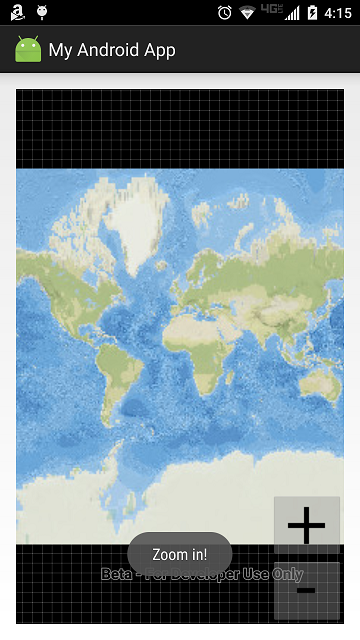

# Exercise 2: Add Zoom In and Zoom Out Buttons (Android)

This exercise walks you through the following:
- Add zoom in and zoom out buttons to the UI
- Zoom in and out on the map and the scene

Prerequisites:
- Complete [Exercise 1](Exercise 1 Map.md), or get the Exercise 1 code solution compiling and running properly, preferably in an IDE.

If you need some help, you can refer to [the solution to this exercise](../../solutions/Android/Ex2_ZoomButtons), available in this repository.

## Add zoom in and zoom out buttons to the UI

1. Go to [the images directory](../../images) of this repository and copy all of the images to your Android Studio project's `res/drawable` directory. (Copying the images is easier if you clone this repo, or if you fork this repo and clone your fork.)

1. In `res/layout/activity_main.xml`, add to the `RelativeLayout` two buttons: one for zooming in, and one for zooming out, and place them in the lower right corner of the app (note: `zoom_out` and `zoom_in` refer to images that you copied in the previous step):

    ```
    <ImageButton
        android:id="@+id/imageButton_zoomOut"
        android:layout_width="wrap_content"
        android:layout_height="wrap_content"
        android:layout_alignParentRight="true"
        android:layout_alignParentBottom="true"
        android:src="@drawable/zoom_out"
        android:onClick="imageButton_zoomOut_onClick"/>
    <ImageButton
        android:id="@+id/imageButton_zoomIn"
        android:layout_width="wrap_content"
        android:layout_height="wrap_content"
        android:layout_alignRight="@id/imageButton_zoomOut"
        android:layout_above="@id/imageButton_zoomOut"
        android:src="@drawable/zoom_in"
        android:onClick="imageButton_zoomIn_onClick"/>
    ```
    
1. The XML you just added specifies an `onClick` method for each button. Create a `public void` method with a `View` parameter for each of those method names. For now, you can put a `Toast` in each method just to see that they run:

    ```
    public void imageButton_zoomOut_onClick(View view) {
        Toast.makeText(this, "Zoom out!", Toast.LENGTH_SHORT).show();
    }
    
    public void imageButton_zoomIn_onClick(View view) {
        Toast.makeText(this, "Zoom in!", Toast.LENGTH_SHORT).show();
    }
    ```
    
1. Run your app. Verify that the zoom buttons display on top of the map and that the event handler methods are called when you click them:

    

## Zoom in and out on the map and the scene

1. Rather than writing zoom logic in two places for zoom in and zoom out, put it in one new `private void` method called `zoom(double)` method. It's a good idea to name the parameter `factor`.
    
1. In your zoom button event handler methods, replace the `Toast` with a call to `zoom(double)` with a _factor_. Use a factor between 0 and 1 to zoom out, and use a factor greater than 1 to zoom in:

    ```
    public void imageButton_zoomOut_onClick(View view) {
        zoom(0.5);
    }

    public void imageButton_zoomIn_onClick(View view) {
        zoom(2.0);
    }
    ```
    
1. For the ArcGIS Runtime `MapView`, the zoom mechanism is relatively simple: get the map scale, divide it by a factor, and use the quotient to set the `MapView`'s viewpoint scale. Write the code for this operation inside the `zoom(double)` method:

    ```
    mapView.setViewpointScaleAsync(mapView.getMapScale() / factor);
    ```
    
1. Run your app. Verify that the zoom in and out buttons work.
    
## How did it go?

If you have trouble, **refer to the solution code**, which is linked near the beginning of this exercise. You can also **submit an issue** in this repo to ask a question or report a problem. If you are participating live with Esri presenters, feel free to **ask a question** of the presenters.

If you completed the exercise, congratulations! You learned how to add buttons that programmatically zoom in and out on a map.

Ready for more? Start on [**Exercise 3: Add a Feature Layer**](Exercise 3 Local Feature Layer.md).