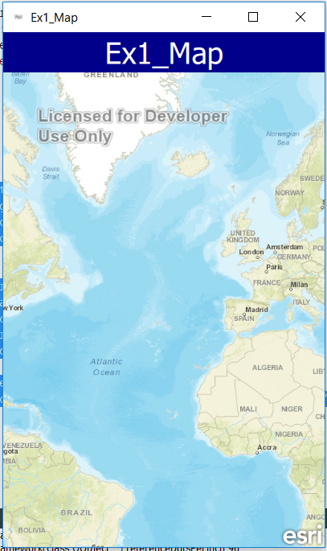
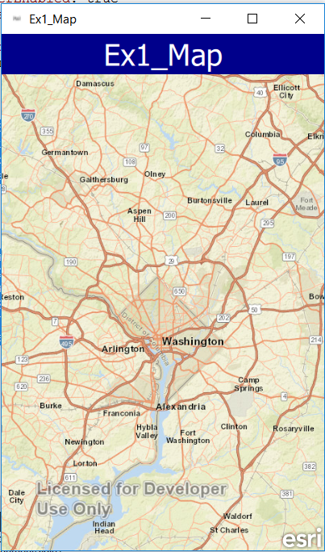

# Exercise 1: Map (AppStudio)

This exercise walks you through the following:

- Create a new AppStudio blank application
- Add a 2D map to the app with a title bar


Prerequisites:

- [Install AppStudio for ArcGIS](http://doc.arcgis.com/en/appstudio/download/)

If you need some help, you can refer to [the solution to this exercise](../../solutions/AppStudio/Ex1_Map), available in this repository.

## Create a new AppStudio for ArcGIS application and add a 2D map
1. Start AppStudio and double click the "New App" button.  Select the radio button for "Starter" and Click on "App" at the top.  Give the app a title like "Ex1_Map" and click "Ok".
    

2. The application should be highlighted in your list of applications.  In AppStudio click the green "Qt Creator button" has the tooltip "Edit".  Replace the Text {...} code with the following to create a title bar for your app.  if you want to change the title of your application that shows up in the title, that is located in the iteminfo.json file
    
    ```
    Rectangle {
        id: titleRect
        anchors {
            left: parent.left
            right: parent.right
            top: parent.top
        }

        height: titleText.paintedHeight + titleText.anchors.margins * 2
        color: app.info.propertyValue("titleBackgroundColor", "darkblue")

        Text {
            id: titleText

            anchors {
                left: parent.left
                right: parent.right
                top: parent.top
                margins: 2 * AppFramework.displayScaleFactor
            }

            text: app.info.title
            color: app.info.propertyValue("titleTextColor", "white")
            font {
                pointSize: 22
            }
            wrapMode: Text.WrapAtWordBoundaryOrAnywhere
            maximumLineCount: 2
            elide: Text.ElideRight
            horizontalAlignment: Text.AlignHCenter
        }

    }
    ```
3. Now lets add a map to the app.  First you will need to import ArcGIS.AppFramework.Runtime 1.0. Then you will need to add a map to your app by adding the below code after your rectangle you added above.

    ```
        Map {
        id: map

        anchors {
            left: parent.left
            right: parent.right
            top: titleRect.bottom
            bottom: parent.bottom
        }

        wrapAroundEnabled: true
        rotationByPinchingEnabled: true
        magnifierOnPressAndHoldEnabled: true
        mapPanningByMagnifierEnabled: true
        zoomByPinchingEnabled: true

        ArcGISTiledMapServiceLayer {
            url: app.info.propertyValue("basemapServiceUrl", "http://server.arcgisonline.com/ArcGIS/rest/services/World_Street_Map/MapServer")
        }
    }
    ```
4. Compile and run your app. The shortcut to this is Alt-Shift-R.

    
    
5. Since we will focus on the DC area let's set the initial extent of our map so it is zoomed into DC.  Added the following onStatusChanged and envelope code to update the extent when the map is ready.

    ```
   onStatusChanged: {
            if (status === Enums.MapStatusReady) {
                extent = initialExtent;
            }
        }
        Envelope {
            id: initialExtent
            xMax: -8539362.27
            yMax: 4723928.16
            xMin: -8610295.83
            yMin: 4702907.97
            spatialReference: map.spatialReference
        }
    ```
    
6. Compile and run your app. The shortcut to this is Alt-Shift-R.

    
    
    
## How did it go?

If you have trouble, **refer to the solution code**, which is linked near the beginning of this exercise. You can also **submit an issue** in this repo to ask a question or report a problem. If you are participating live with Esri presenters, feel free to **ask a question** of the presenters.

If you completed the exercise, congratulations! You learned how to add a 2D map, using AppStudio.

