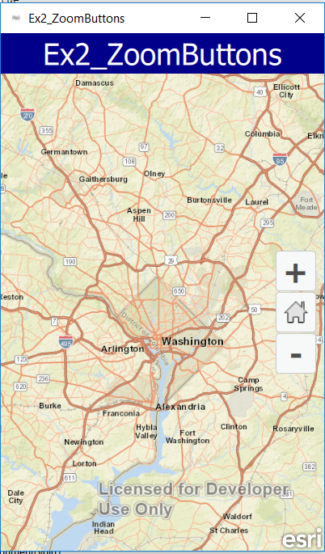
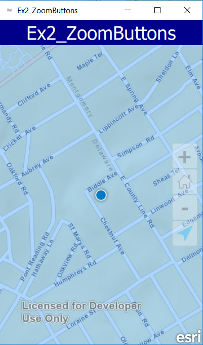

# Exercise 2: Add Zoom In, Zoom Out, and Location Buttons (AppStudio)

This exercise walks you through the following:
- Add zoom in, zoom out, and location buttons to the UI
- Zoom in and out on the map and the scene

Prerequisites:
- Complete [Exercise 1](Exercise 1 Map.md), or get the Exercise 1 code solution compiling and running properly, preferably in AppStudio.

If you need some help, you can refer to [the solution to this exercise](../../solutions/AppStudio/Ex2_ZoomButtons), available in this repository.

## Add zoom in, zoom out, and location buttons to the UI
1. If desired, make a copy of your Exercise 1 or continue to use the Exercise 1 solution. Just make sure you're running your Exercise 2 code as you complete this exercise.

1. First we need to import the ArcGIS.AppFramework.Runtime.Controls 1.0.

    ```
    import ArcGIS.AppFramework.Runtime.Controls 1.0
    ```
 
1. Next we need to add the buttons to the app.  This code can be added right after where you created the initial Extent.
    ```
    ZoomButtons {
            anchors {
                right: parent.right
                verticalCenter: parent.verticalCenter
                margins: 10
            }
        }

    ```
    
1. Compile and run your app. Verify that the zoom buttons display on top of the map:

    

## Add the location button 
1. To add the location button we need to import another library:
    
    ```
     import QtPositioning 5.3
    ```	
2.  To add the position button after the zoom buttons just add this code below the zoom buttons:

    ```
    positionDisplay {
         positionSource: PositionSource {
         }
    }
    ```	
1. Compile and run your app. Verify that the zoom buttons display on top of the map:

    

## How did it go?

If you have trouble, **refer to the solution code**, which is linked near the beginning of this exercise. You can also **submit an issue** in this repo to ask a question or report a problem. If you are participating live with Esri presenters, feel free to **ask a question** of the presenters.

If you completed the exercise, congratulations! You learned how to add buttons that  zoom in and out on a 2D map as well as add the button for location.

Ready for more? Start on [**Exercise 3: Add a Feature Layer**](Exercise 3 Feature Service.md).
