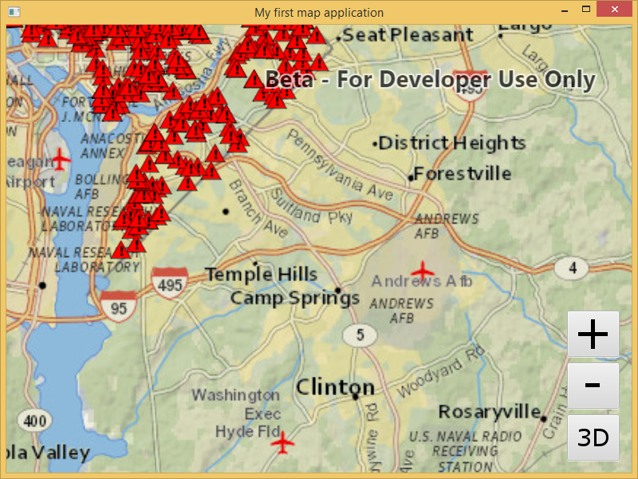
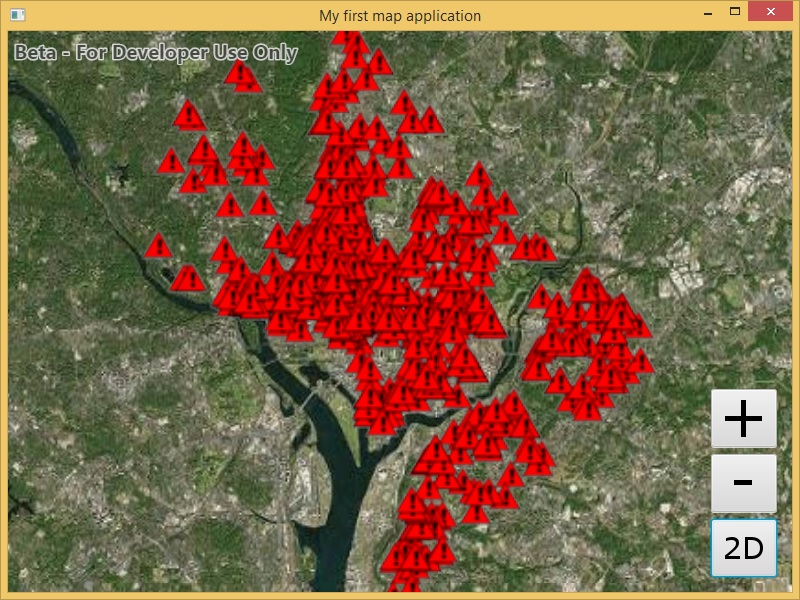
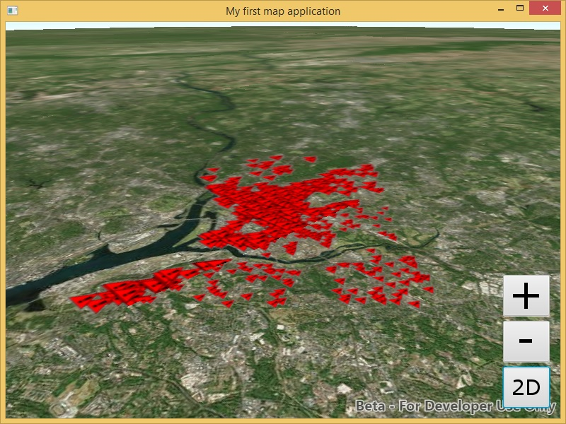

# Exercise 3: Add a Local Feature Layer (Java)

This exercise walks you through the following:
- Add a layer from a mobile map package to the 2D map
- Add a layer from a mobile map package to the 3D scene

Prerequisites:
- Complete [Exercise 2](Exercise 2 Zoom Buttons.md), or get the Exercise 2 code solution compiling and running properly, preferably in an IDE.

If you need some help, you can refer to [the solution to this exercise](../../solutions/Java/Ex3_LocalFeatureLayer), available in this repository.

## Add a layer from a mobile map package to the 2D map

ArcGIS Runtime provides a variety of ways to add **operational layers** to the map and scene--feature services, dynamic map services, offline geodatabases, and mobile map packages, for example. In this exercise, you will use the newest of these: a mobile map package.

1. If desired, make a copy of your Exercise 2 class. Just make sure you're running your Exercise 3 code as you complete this exercise.
1. Download the [D.C. Crime Data mobile map package (`DC_Crime_Data.mmpk`)](../../data/DC_Crime_Data.mmpk) that we have prepared for you. For this exercise, you can put it in your application working directory, leave it in your downloads directory, or put it anywhere that your app will be able to access it.
1. In your class, before your constructor, instantiate a constant called `MMPK_PATH` with the absolute or relative path of the mobile map package you downloaded. The following line assumes that the MMPK is in a directory called `data` that is three directories up from your application's working directory. Adjust this value as needed:

    ```
    private static final String MMPK_PATH = "../../../data/DC_Crime_Data.mmpk";
    ```
    
1. At the end of your constructor, instantiate a `MobileMapPackage` with the mobile map package constant, and add an event handler to run when the mobile map package is done loading. Then load the mobile map package asynchronously:

    ```
    final MobileMapPackage mmpk = new MobileMapPackage(MMPK_PATH);
    mmpk.addDoneLoadingListener(() -> {
    
    });
    mmpk.loadAsync();
    ```
    
1. Inside the `addDoneLoadingListener` event handler method, get the `MobileMapPackage`'s maps. A mobile map package can contain multiple maps. `DC_Crime_Data.mmpk` only has one map, but it's a good idea to make sure there's at least one. If so, get the first map (index 0), and use it to set the `MapView`'s map. (That's the easy way to add the mobile map package's layers; we will need to use a different way later in this exercise to add the layers to a 3D scene.) The map in this mobile map package has no basemap, so it's a good idea to set the basemap again. Here's the code that goes inside the event handler method:

    ```
    List<ArcGISMap> maps = mmpk.getMaps();
    if (0 < maps.size()) {
        map = maps.get(0);
        mapView.setMap(map);
    }
    map.setBasemap(Basemap.createNationalGeographic());
    ```
    
1. Compile and run your app. Verify that the map zooms to Washington, D.C., and that a layer of crime incidents appears on top of the basemap. The incidents appear as red triangles, which is the symbology specified in the mobile map package:

    

## Add a layer from a mobile map package to the 3D scene

A layer can only reside in one map or scene at a time. Therefore, to add layers to the 3D scene, you will have to open the mobile map package again. That will give you a `Map` as before, which you can't use with a `SceneView`--and there is no "`MobileScenePackage`"--so you will have to get the layers from this `Map` and add them to your existing `Scene`.

1. In your 2D/3D toggle button event handler method, after you instantiate your `ArcGISScene` set its basemap and surface, and instantiate your `SceneView`, add an event handler for when the scene is done loading:

    ```
    scene.addDoneLoadingListener(() -> {
    
    });
    ```
    
1. Inside this new event handler, load the mobile map package and listen for it to be done loading, just as you did a few steps ago for the 2D map:

    ```
    final MobileMapPackage mmpk = new MobileMapPackage(MMPK_PATH);
    mmpk.addDoneLoadingListener(() -> {
    
    });
    mmpk.loadAsync();
    ```
    
1. Get the first `Map` in the `MobileMapPackage`, as you did before for the 2D map. However, you cannot add a `Map` to a `SceneView`, so you will instead add the `Map`'s layers to the `Scene`'s operational layers. But a layer can only belong to one `Map` or `Scene` at a time, so you must load the map, make a list of the layers, clear the `Map`'s layer list (bonus: see what happens if you don't!), and only then add the list of layers to the scene. Here is the code for adding the MMPK's layers to your `Scene`. Put this code in the done loading listener you created in the previous step:

    ```
    List<ArcGISMap> maps = mmpk.getMaps();
    if (0 < maps.size()) {
        final ArcGISMap thisMap = maps.get(0);
        thisMap.addDoneLoadingListener(() -> {
            ArrayList<Layer> layers = new ArrayList<>();
            layers.addAll(thisMap.getOperationalLayers());
            thisMap.getOperationalLayers().clear();
            scene.getOperationalLayers().addAll(layers);
        });
        thisMap.loadAsync();
    }
    ```
    
1. After adding the layers to the scene (inside the lambda code block from the previous step), zoom to the layer you added by giving your `SceneView` the MMPK map's `Viewpoint`:

    ```
    sceneView.setViewpoint(thisMap.getInitialViewpoint());
    ```
    
1. Compile and run your app. Verify that when you switch to 3D, the scene displays Washington, D.C., with the red triangles representing crime incidents:

    
    
1. Remember in [Exercise 2](Exercise 2 Zoom Buttons.md#zoom-in-and-out-on-the-map-and-the-scene) when you manipulated a `Camera` to zoom in and out? Here we will also use a `Camera`, but this time we will rotate the camera to provide an oblique view of the scene. We will focus the rotation on the current viewpoint's target point. The `Camera.rotateAround` method lets us specify a change in heading, pitch, and roll; let's change the heading by 45 degrees and the pitch by 65 degrees. After `rotateAround`, we will give the rotated `Camera` to the `SceneView`. Here is the code to insert immediately after the previous step (still inside the `if` block):

    ```
    Viewpoint viewpoint = sceneView.getCurrentViewpoint(Viewpoint.Type.CENTER_AND_SCALE);
    Point targetPoint = (Point) viewpoint.getTargetGeometry();
    Camera camera = sceneView.getCurrentViewpointCamera()
            .rotateAround(targetPoint, 45.0, 65.0, 0.0);
    sceneView.setViewpointCameraAsync(camera);
    ```

1. Compile and run your app. Verify that when you switch to 3D, the crime incidents display and the view is rotated and pitched. Also try the built-in 3D navigation by holding the right mouse button and moving the mouse:

    
    
## How did it go?

If you have trouble, **refer to the solution code**, which is linked near the beginning of this exercise. You can also **submit an issue** in this repo to ask a question or report a problem. If you are participating live with Esri presenters, feel free to **ask a question** of the presenters.

If you completed the exercise, congratulations! You learned how to add a local feature layer from a mobile map package to a 2D map and a 3D scene.

Ready for more? Choose from the following:

- [**Exercise 4: Buffer a Point and Query Features**](Exercise 4 Buffer and Query.md)
- **Bonus**: we used a mobile map package, but you can also add **feature services** to your map and scene. Go to [ArcGIS Online](http://www.arcgis.com/home/index.html), find a feature service URL (hint: a feature service URL has the term `FeatureServer` at or near the end of the URL), and use the [`FeatureLayer`](https://developers.arcgis.com/java/latest/api-reference/reference/com/esri/arcgisruntime/layers/FeatureLayer.html) and [`ServiceFeatureTable`](https://developers.arcgis.com/java/latest/api-reference/reference/com/esri/arcgisruntime/data/ServiceFeatureTable.html) classes to add the feature service to your map and/or globe. You can refer to a [code sample](https://developers.arcgis.com/java/latest/sample-code/feature-layer-feature-service.htm) if you need it. Also, the [`ServiceFeatureTable`](https://developers.arcgis.com/java/latest/api-reference/reference/com/esri/arcgisruntime/data/ServiceFeatureTable.html) documentation has a feature service URL in the Class Overview section that you can use instead of finding one in ArcGIS Online if desired. We could give that URL to you here, but that wouldn't force you to go look at the documentation, would it? :-)