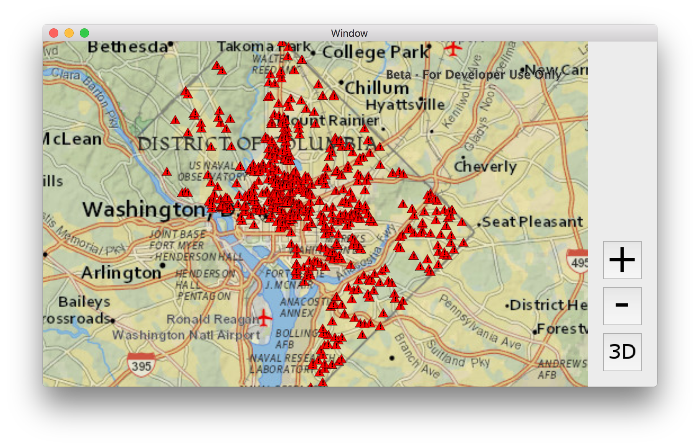
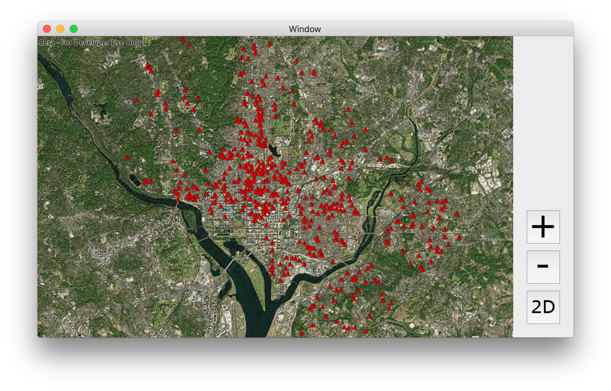
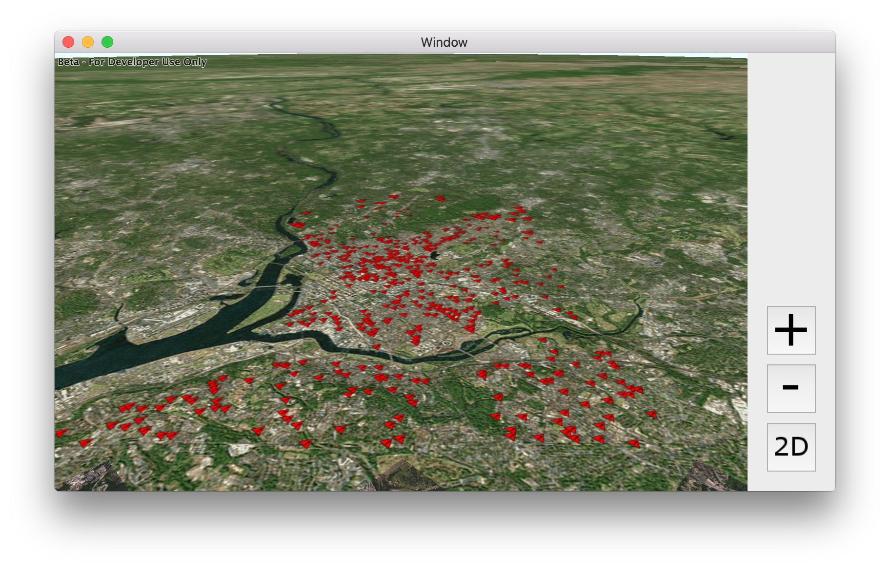

# Exercise 3: Add a Local Feature Layer (Mac OS S/Swift)

This exercise walks you through the following:
- Add a layer from a mobile map package to the 2D map
- Add a layer from a mobile map package to the 3D scene

Prerequisites:
- Complete [Exercise 2](Exercise 2 Zoom Buttons.md), or get the Exercise 2 code solution compiling and running properly in Xcode.

If you need some help, you can refer to [the solution to this exercise](../../../solutions/OS X/Swift/Ex3_LocalFeatureLayer), available in this repository.

## Add a layer from a mobile map package to the 2D map

ArcGIS Runtime provides a variety of ways to add **operational layers** to the map and scene--feature services, dynamic map services, offline geodatabases, and mobile map packages, for example. In this exercise, you will use the newest of these: a mobile map package.

1. Download the [D.C. Crime Data mobile map package (`DC_Crime_Data.mmpk`)](../../../data/DC_Crime_Data.mmpk) that we have prepared for you. In Xcode, add `DC_Crime`Data.mmpk` to your project (select your project in the Navigator and choose **File** > **Add Files to <project name>**).

1. In `ViewController.swift`, declare a constant for the MMPK path. Use `NSBundle.mainBundle().pathForResource` to construct the path:

    ```
    private let MMPK_PATH = NSBundle.mainBundle().pathForResource("DC_Crime_Data", ofType:"mmpk")
    ```

1. At the end of `viewDidLoad()`, instantiate an `AGSMobileMapPackage` with the mobile map package constant. Then load the mobile map package with a completion to run when the mobile map package is done loading:

    ```
    let mmpk = AGSMobileMapPackage(path: MMPK_PATH!)
    mmpk.loadWithCompletion { [weak self] (error: NSError?) in
        
    }
    ```
    
1. Inside the `loadWithCompletion` completion code, get the `MobileMapPackage`'s maps. A mobile map package can contain multiple maps. `DC_Crime_Data.mmpk` only has one map, but it's a good idea to make sure there's at least one. If so, get the first map (index 0), and use it to set the map view’s map. (That's the easy way to add the mobile map package's layers; we will need to use a different way later in this exercise to add the layers to a 3D scene.) The map in this mobile map package has no basemap, so it's a good idea to set the basemap again. Here's the code that goes inside the event handler method:

    ```
    if 0 < mmpk.maps.count {
        self!.mapView.map = mmpk.maps[0]
    }
    self!.mapView.map!.basemap = AGSBasemap.nationalGeographicBasemap()
    ```
    
1. Run your app. Verify that the map zooms to Washington, D.C., and that a layer of crime incidents appears on top of the basemap. The incidents appear as red triangles, which is the symbology specified in the mobile map package:

    

## Add a layer from a mobile map package to the 3D scene

A layer can only reside in one map or scene at a time. Therefore, to add layers to the 3D scene, you will have to open the mobile map package again. That will give you an `AGSMap` as before, which you can't use with an `AGSSceneView`--and there is no "`AGSMobileScenePackage`"--so you will have to get the layers from this `AGSMap` and add them to your existing `AGSScene`.

1. At the end of `viewDidLoad()`, instantiate an `AGSMobileMapPackage` with the mobile map package constant. Then load the mobile map package with a completion to run when the mobile map package is done loading. (This should seem familiar.)

    ```
    let sceneMmpk = AGSMobileMapPackage(path: MMPK_PATH!)
    sceneMmpk.loadWithCompletion { [weak self] (error: NSError?) in

    }
    ```
    
1. Inside the `loadWithCompletion` completion code, get the first map in the MMPK, as you did before for the 2D map. However, you cannot add a map to a scene view, so you will instead add the map's layers to the scene's operational layers. But a layer can only belong to one map or scene at a time, so you must make a list of the layers, clear the map's layer list (bonus: see what happens if you don't!), and only then add the list of layers to the scene. Here is the code for adding the MMPK's layers to your scene:

    ```
    if 0 < sceneMmpk.maps.count {
        let thisMap = sceneMmpk.maps[0]
        var layers = [AGSLayer]()
        for layer in thisMap.operationalLayers {
            layers.append(layer as! AGSLayer)
        }
        thisMap.operationalLayers.removeAllObjects()
        self!.sceneView.scene?.operationalLayers.addObjectsFromArray(layers)
    }
    ```
    
1. After adding the layers to the scene (inside the `if` block from the previous step), zoom the scene to Washington, D.C.:

    ```
    self!.sceneView.setViewpoint(AGSViewpoint(latitude: 38.909, longitude: -77.016, scale: 150000))
    ```
    
1. Run your app. Verify that when you switch to 3D, the scene displays Washington, D.C., with the red triangles representing crime incidents:

    
    
1. Remember in [Exercise 2](Exercise 2 Zoom Buttons.md#zoom-in-and-out-on-the-map-and-the-scene) when you manipulated a camera to zoom in and out? Here we will also use a camera, but this time we will rotate the camera to provide an oblique view of the scene. We will focus the rotation on the current viewpoint's target point. The `AGSCamera.rotateAroundTargetPoint` method lets us specify a change in heading, pitch, and roll; let's change the heading by 45 degrees and the pitch by 65 degrees. After `rotateAroundTargetPoint`, we will give the rotated camera to the scene view. Here is the code to insert immediately after the previous step (still inside the `if` block):

    ```
    let viewpoint = self!.sceneView.currentViewpointWithType(AGSViewpointType.CenterAndScale)
    let targetPoint = viewpoint?.targetGeometry as! AGSPoint
    let camera = self!.sceneView.currentViewpointCamera()
            .rotateAroundTargetPoint(targetPoint, deltaHeading: 45, deltaPitch: 65, deltaRoll: 0)
    self!.sceneView.setViewpointCamera(camera)
    ```

1. Run your app. Verify that when you switch to 3D, the crime incidents display and the view is rotated and pitched. Also try the built-in 3D navigation by holding the alt key and mouse button and moving the mouse:

    
    
## How did it go?

If you have trouble, **refer to the solution code**, which is linked near the beginning of this exercise. You can also **submit an issue** in this repo to ask a question or report a problem. If you are participating live with Esri presenters, feel free to **ask a question** of the presenters.

If you completed the exercise, congratulations! You learned how to add a local feature layer from a mobile map package to a 2D map and a 3D scene.

Ready for more? Choose from the following:

- [**Exercise 4: Buffer a Point and Query Features**](Exercise 4 Buffer and Query.md)
- **Bonus**: we used a mobile map package, but you can also add **feature services** to your map and scene. Go to [ArcGIS Online](http://www.arcgis.com/home/index.html), find a feature service URL (hint: a feature service URL has the term `FeatureServer` at or near the end of the URL), and use the [`AGSFeatureLayer`](https://developers.arcgis.com/os-x/quartz/api-reference//interface_a_g_s_feature_layer.html) and [`AGSServiceFeatureTable`](https://developers.arcgis.com/os-x/quartz/api-reference//interface_a_g_s_service_feature_table.html) classes to add the feature service to your map and/or globe. You can refer to a [code sample](https://developers.arcgis.com/os-x/quartz/swift/sample-code/feature-layer-feature-service.htm) if you need it.