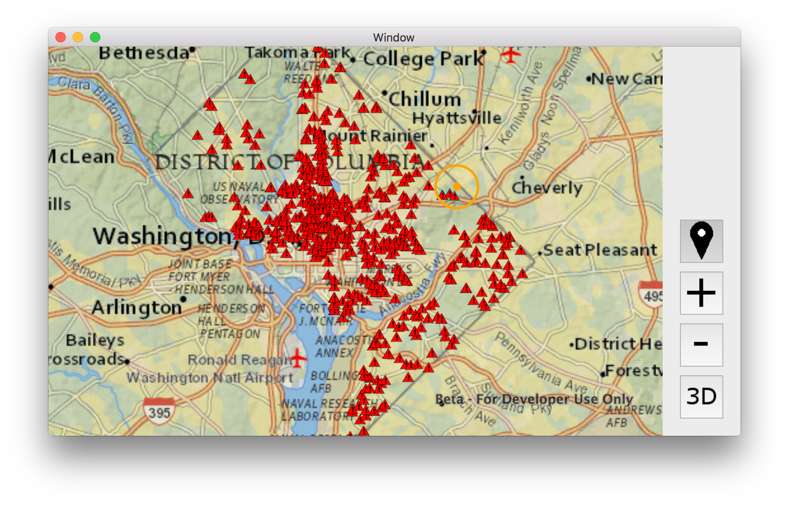

# Exercise 4: Buffer a Point and Query Features (Mac OS X/Swift)

This exercise walks you through the following:
- Get the user to click a point
- Display the clicked point and a buffer around it
- Query for features within the buffer

Prerequisites:
- Complete [Exercise 3](Exercise 3 Local Feature Layer.md), or get the Exercise 3 code solution compiling and running properly in Xcode.

If you need some help, you can refer to [the solution to this exercise](../../../solutions/OS X/Swift/Ex4_BufferAndQuery), available in this repository.

## Get the user to click a point

You can use ArcGIS Runtime to detect when and where the user interacts with the map, either with the mouse or with a touchscreen. In this exercise, you just need the user to click or tap a point. You could detect every user click, but instead, we will let the user activate and deactivate this capability with a toggle button. _Note: in Quartz Beta 1 for OS X, `AGSSceneView` does not give developers the ability to get user events on the scene. Therefore, this exercise only deals with the 2D map. This capability is expected to be present in the Quartz release._

1. In `Main.storyboard`, add a **Custom Button** above your zoom buttons. Use the `location` image for this button, and check the **Bordered** checkbox. Change the button type to **Push On Push Off** to make it a toggle button. Make the size 50x50 and add constraints as with the other buttons.

1. Open `ViewController.swift` in the Assistant Editor. Right-click and drag the button to create an **Action** connection in `ViewController`, then close the Assistant Editor:

    ```
    @IBAction func button_bufferAndQuery_onAction(sender: NSButton) {
    }
    ```

1. ArcGIS Runtime Quartz for OS X uses **touch delegates** to capture user actions on the map. In `ViewController.swift`, after the `import` statements but before the `ViewController` class declaration, declare a new touch delegate class. In this exercise, we call this class `BufferAndQueryTouchDelegate`. In a production app, you might put this class in its own Swift file. For this exercise, it’s fine to put this class in `ViewController.swift`. Here is the class declaration to add:

    ```
    class BufferAndQueryTouchDelegate: NSObject, AGSMapViewTouchDelegate {
    }
    ```

1. In your new delegate class, add a `mapView` method to get a user’s tap on the screen. You will write most of the code for this method later, but for now, just do a `println`:

    ```
    func mapView(mapView: AGSMapView, didTapAtScreenPoint screenPoint: CGPoint, mapPoint: AGSPoint) {
        print("Clicked on map!")
    }
    ```

1. This delegate class will use an `AGSGraphicsOverlay` to display the point that the user clicks and the buffer around it. In `BufferAndQueryTouchDelegate`, declare a field to store a graphics overlay:

    ```
    private let graphicsOverlay: AGSGraphicsOverlay
    ```

1. In your delegate class, implement an initializer that accepts an `AGSGraphicsOverlay` as a parameter:

    ```
    init(mapGraphics: AGSGraphicsOverlay) {
        self.graphicsOverlay = mapGraphics
    }
    ```

1. In `ViewController`, declare a field of the type of your new delegate class:

    ```
    private let bufferAndQueryTouchDelegate: BufferAndQueryTouchDelegate
    ```

1. In `ViewController`, declare and instantiate a field of type `AGSGraphicOverlay`. This is the graphics overlay you will use to display the point that the user clicks and the buffer around it. Later, you will add this overlay to the map. For now, just declare and instantiate it:

    ```
    private let bufferAndQueryMapGraphics = AGSGraphicsOverlay()
    ```

1. Implement an initializer for your `ViewController` class. In this initializer, instantiate the delegate you declared above, and don’t forget to call `super.init`:

    ```
    required init?(coder: NSCoder) {
        self.bufferAndQueryTouchDelegate = BufferAndQueryTouchDelegate(mapGraphics: bufferAndQueryMapGraphics)
        super.init(coder: coder)
    }
    ```
    
1. Go back to your action method for the buffer and query toggle button (we called it `button_bufferAndQuery_onAction`). This method runs when the user toggles the button on or off. If the button is toggled on, we need to tell the mapView to use our touch delegate. If the button is toggled off, we need to tell the map view to do nothing in particular when the user clicks the map by setting its touch delegate to `nil`:

    ```
    mapView.touchDelegate = (NSOnState == sender.state) ? bufferAndQueryTouchDelegate : nil
    ```
    
1. In Xcode, open the Debug area, and then run your app. Verify that a new toggle button appears and that your `print` prints text when and only when the toggle button is toggled on and you click the map:

    
    
## Display the clicked point and a buffer around it

You need to buffer the clicked point and display both the point and the buffer as graphics on the map.

1. In `BufferAndQueryTouchDelegate`, declare and instantiate a constant `NSColor` for drawing the click and buffer. Here we use an opaque yellow/orange color. Also declare an `AGSMarkerSymbol` and an `AGSFillSymbol`:

    ```
    private let CLICK_AND_BUFFER_COLOR = NSColor(red: 1.0, green: 0.647, blue: 0.0, alpha: 1.0)
    private let CLICK_SYMBOL: AGSMarkerSymbol
    private let BUFFER_SYMBOL: AGSFillSymbol
    ```

1. In the `BufferAndQueryTouchDelegate` initializer (i.e. the `init` method), instantiate the symbols you just declared, using the color you just instantiated:

    ```
    CLICK_SYMBOL = AGSSimpleMarkerSymbol(
        style: AGSSimpleMarkerSymbolStyle.Circle,
        color: CLICK_AND_BUFFER_COLOR,
        size: 10)
    BUFFER_SYMBOL = AGSSimpleFillSymbol(
        style: AGSSimpleFillSymbolStyle.Null,
        color: NSColor(deviceWhite: 1, alpha: 0),
        outline: AGSSimpleLineSymbol(
            style: AGSSimpleLineSymbolStyle.Solid,
            color: CLICK_AND_BUFFER_COLOR,
            width: 3))
    ```

1. In `ViewController.viewDidLoad`, add the graphics overlay to the map view`:

    ```
    mapView.graphicsOverlays.addObject(bufferAndQueryMapGraphics)
    ```
    
1. In `BufferAndQueryTouchDelegate.mapView`, you need to replace your `print` with code to create a buffer and display the point and buffer as graphics. First, create a 1000-meter buffer using `AGSGeometryEngine`:

    ```
    let buffer = AGSGeometryEngine.geodesicBufferGeometry(
            mapPoint,
            distance: 1000.0,
            distanceUnit: AGSLinearUnit.meters(),
            maxDeviation: 1,
            curveType: AGSGeodeticCurveType.Geodesic)
    ```

1. After creating the buffer, add the point and buffer as graphics. Clear the graphics first and then add the point and buffer as new `AGSGraphic` objects:

    ```
    graphicsOverlay.graphics.removeAllObjects()
    graphicsOverlay.graphics.addObject(AGSGraphic(geometry: buffer, symbol: BUFFER_SYMBOL))
    graphicsOverlay.graphics.addObject(AGSGraphic(geometry: mapPoint, symbol: CLICK_SYMBOL))
    ```

1. Run your app. Verify that if you toggle the buffer and select button and then click the map, the point you clicked and a 1000-meter buffer around it appear on the map:

    
    
## Query for features within the buffer

There are a few different ways to query and/or select features in ArcGIS Runtime. Here we will use `AGSFeatureLayer.selectFeaturesWithQuery`, which both highlights selected features on the map and provides a list of the selected features.

1. In `BufferAndQueryTouchDelegate.mapView`, after creating the buffer and adding graphics, instantiate an `AGSQueryParameters` object with the buffer geometry:

    ```
    let query = AGSQueryParameters()
    query.geometry = buffer
    ```
    
1. For each of the `AGSFeatureLayer` objects in the operational layers of the map, call `AGSFeatureLayer.selectFeaturesWithQuery`. Use `AGSSelectionMode.New` to do a new selection, as opposed to adding to or removing from the current selection. Add this code after instantiating the query object and setting its geometry:

    ```
    let operationalLayers = mapView.map?.operationalLayers.flatMap { $0 as? AGSFeatureLayer }
    for layer in operationalLayers! {
        layer.selectFeaturesWithQuery(query, mode: AGSSelectionMode.New, completion: nil)
    }
    ```
    
1. Run your app. Verify on the map that features within the clicked buffer are highlighted on the map:

    
    
## How did it go?

If you have trouble, **refer to the solution code**, which is linked near the beginning of this exercise. You can also **submit an issue** in this repo to ask a question or report a problem. If you are participating live with Esri presenters, feel free to **ask a question** of the presenters.

If you completed the exercise, congratulations! You learned how to get a user's input on the map, buffer a point, display graphics on the map, and select features based on a query.

Ready for more? Choose from the following:

- [**Exercise 5: Routing**](Exercise 5 Routing.md)
- **Bonus**
    - We selected features but didn't do anything with the selected features' attributes. The call to [`selectFeaturesWithQuery`](https://developers.arcgis.com/os-x/quartz/api-reference//interface_a_g_s_feature_layer.html#a0964636d94f96c0df8391e4ff58d57d7) allows you to specify a completion, where you can iterate through selected features. See if you can look at the feature attributes to get more information about the selected features.
    - Try setting properties on the `AGSQueryParameters` object to change the query's behavior. For example, maybe you want to select all features that are _outside_ the buffer instead of those that are inside. How would you do that by adding just one line of code? What other interesting things can you do with `AGSQueryParameters`?