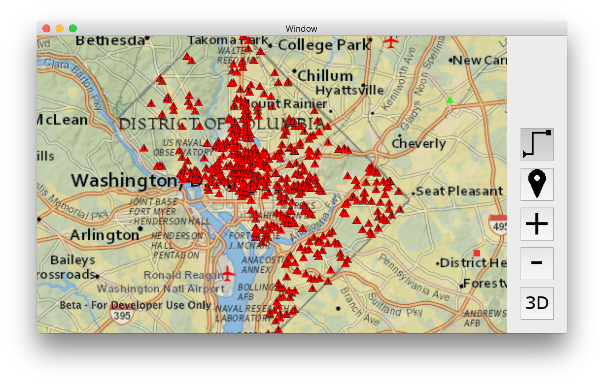
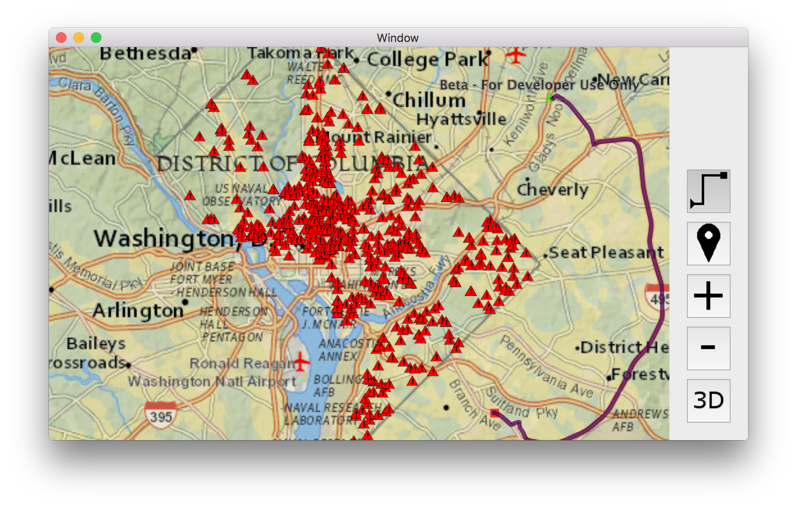

# Exercise 5: Routing (Mac OS X/Swift)

ArcGIS Runtime Quartz will feature the ability to run ArcGIS geoprocessing for analysis and data management. Quartz Beta 1 offers a taste of geoprocessing by supporting network routing using Network Analyst services and using local network datasets. By learning how to use routing in this exercise, you will learn key skills that will help you use other geoprocessing capabilities coming in Quartz.

This exercise walks you through the following:
- Get the user to click an origin point and a destination point
- Calculate a driving route and display it on the map

Prerequisites:
- Complete [Exercise 4](Exercise 4 Buffer and Query.md), or get the Exercise 4 code solution compiling and running properly in Xcode.

If you need some help, you can refer to [the solution to this exercise](../../../solutions/OS X/Swift/Ex5_Routing), available in this repository.

## Get the user to click an origin point and a destination point

After doing Exercise 4, this should seem familiar to you.

1. Create another new touch delegate class. Call this one `RoutingTouchDelegate`:

    ```
    class RoutingTouchDelegate: NSObject, AGSMapViewTouchDelegate {

    }
    ```

1. In `RoutingTouchDelegate`, instantiate constant symbols for the origin point, destination point, and route line:

    ```
    private let ROUTE_ORIGIN_SYMBOL = AGSSimpleMarkerSymbol(
        style: AGSSimpleMarkerSymbolStyle.Triangle,
        color: NSColor(red: 0.0, green: 1.0, blue: 0.0, alpha: 0.753),
        size: 10)
    private let ROUTE_DESTINATION_SYMBOL = AGSSimpleMarkerSymbol(
        style: AGSSimpleMarkerSymbolStyle.Square,
        color: NSColor(red: 1.0, green: 0.0, blue: 0.0, alpha: 0.753),
        size: 10)
    private let ROUTE_LINE_SYMBOL = AGSSimpleLineSymbol(
        style: AGSSimpleLineSymbolStyle.Solid,
        color: NSColor(red: 0.333, green: 0.0, blue: 0.333, alpha: 0.753),
        width: 5)
    ```

1. In `RoutingTouchDelegate`, declare fields for a graphics overlay and an origin point:

    ```
    private let mapRouteGraphics: AGSGraphicsOverlay
    private var originPoint: AGSPoint? = nil
    ```

1. In `RoutingTouchDelegate`, create an initializer that takes a graphics overlay as a parameter:

    ```
    init(mapGraphics: AGSGraphicsOverlay) {
        self.mapRouteGraphics = mapGraphics
    }
    ```

1. In `RoutingTouchDelegate`, implement a `reset` method that sets the origin point to `nil` and removes all routing graphics:

    ```
    func reset() {
        originPoint = nil
        mapRouteGraphics.graphics.removeAllObjects()
    }
    ```

1. In `RoutingTouchDelegate`, implement a `mapView` method, which will get called when the user taps the map. In this method, start out by declaring a `graphics` object for convenience (so you can type `graphics` throughout the method instead of `mapRouteGraphics.graphics`). Set a `point` variable, and remove its z-value, which if present would cause the routing not to work:

    ```
    func mapView(mapView: AGSMapView, didTapAtScreenPoint screenPoint: CGPoint, mapPoint: AGSPoint) {
        let graphics = mapRouteGraphics.graphics
        var point = mapPoint
        if point.hasZ {
            point = AGSPoint(x: point.x, y: point.y, spatialReference: point.spatialReference)
        }
    }
    ```

1. In `RoutingTouchDelegate.mapView`, after removing the z-value from `point` if necessary, check to see whether this is the first point clicked or the second. You will fill in the `if` and `else` blocks in the steps that follow:

    ```
    if (nil == originPoint) {

    } else {

    }
    ```

1. If `originPoint` is `nil`, this is the first point clicked. Set `originPoint` to `point`, remove all graphics, and add a new route origin graphic.

    ```
    originPoint = point
    graphics.removeAllObjects()
    graphics.addObject(AGSGraphic(geometry: point, symbol: ROUTE_ORIGIN_SYMBOL))
    ```

1. If `originPoint` is not `nil`, this is the second point clicked. Add a new route destination graphic. This is where you will eventually write the code for calculating the route, but you will write that code later. For now, just add a graphic, and also set `originPoint` to `nil` so that the next click will be for a new origin instead of another destination:

    ```
    graphics.addObject(AGSGraphic(geometry: point, symbol: ROUTE_DESTINATION_SYMBOL))
    ```

1. Open `Main.storyboard` and add a new button to enable routing. Make it very similar to the buffer and query button, but use the `routing` image. Set constraints, size, and all else as with previous buttons. Most importantly, change the button type to **Push On Push Off**.

1. Open `ViewController.swift` in the Assistant Editor. Right-click and drag both the buffer and query button and the routing button, one at a time, to create an Outlet connection for each in the `ViewController` class:

    ```
    @IBOutlet weak var button_bufferAndQuery: NSButton!
    @IBOutlet weak var button_routing: NSButton!
    ```

1. Right-click and drag the routing button to create an Action connection in the `ViewController` class:

    ```
    @IBAction func button_routing_onAction(sender: NSButton) {
    }
    ```

1. In `ViewController`, declare a variable of the type of the touch delegate you just created. Also declare and instantiate a graphics overlay:

    ```
    private var routingTouchDelegate: RoutingTouchDelegate?

    private let routingMapGraphics = AGSGraphicsOverlay()
    ```

1. In `ViewController.init`, instantiate the `RoutingTouchDelegate` that you just declared. This instantiation will change completely and become more complicated when you set up the actual routing, but for now, we’re just doing graphics, and the instantiation is only one line:

    ```
    routingTouchDelegate = RoutingTouchDelegate(mapGraphics: self.routingMapGraphics)
    ```

1. In `ViewController.viewDidLoad`, add the new graphics overlay to the map view:

    ```
    mapView.graphicsOverlays.addObject(routingMapGraphics)
    ```

1. In `button_routing_onAction`, if the routing button has been selected, set the map view’s touch delegate to `routingTouchDelegate`; otherwise, set it to `nil`. Unselect the buffer and query button if the routing button has been selected. Finally, reset the routing touch delegate, in order to clear any origin point and graphics that have already been saved and displayed:

    ```
    @IBAction func button_routing_onAction(button_routing: NSButton) {
        mapView.touchDelegate = (NSOnState == button_routing.state) ? routingTouchDelegate : nil
        
        if NSOnState == button_routing.state {
            button_bufferAndQuery.state = NSOffState
        }
        
        if (nil != routingTouchDelegate) {
            routingTouchDelegate!.reset()
        }
    }
    ```

1. Run your app. Verify that you can toggle on the routing button, click an origin point, click a destination point, and see both points displayed:

    
    
## Calculate a driving route and display it on the map

1. In `RoutingTouchDelegate`, declare a `RouteTask` field and a `RouteParameters` field:

    ```
    private let routeTask: AGSRouteTask
    private let routeParameters: AGSRouteParameters
    ```

1. Change the `RoutingTouchDelegate` initializer so that it accepts a graphics overlay, a route task, and a route parameters object:

    ```
    init(
        mapGraphics: AGSGraphicsOverlay,
        routeTask: AGSRouteTask,
        routeParameters: AGSRouteParameters) {
        self.mapRouteGraphics = mapGraphics
        self.routeTask = routeTask
        self.routeParameters = routeParameters
    }
    ```
    
1. In `ViewController.init`, modify the instantiation of the `RoutingTouchDelegate` so that it takes a route task and a route parameters object. When instantiating the route task, set its ArcGIS Online username and password, and get the route parameters from the route task. But instantiate them in such a way that if getting the route parameters fails, both the route task and the route parameters are set to `nil`, as a signal to the rest of the code that routing is not available; in this case, also disable the routing button. _Note: in this exercise, we're naïvely hard-coding our username and password. Don't do that! It is too easy for someone to decompile your code. There are at least three better options: use an OAuth 2.0 user login, use an OAuth 2.0 app login (not supported in ArcGIS Runtime Quartz Beta 2, and presents a problem of its own since you shouldn't hard-code your client secret), or challenge the user for credentials. For now, since the exercise is about routing and not security, just hard-code the username and password. You can omit that line of code, and then the app will automatically prompt you for a username and password...every time you run the app._ Here is the code to use in `ViewController.init` instead of the one-line instantiation of `routingTouchDelegate` that you wrote before:

    ```
    let routeTask = AGSRouteTask(URL: NSURL(string: "http://route.arcgis.com/arcgis/rest/services/World/Route/NAServer/Route_World")!)
    // Don't share this code without removing plain text username and password!!!
    routeTask.credential = AGSCredential(user: "myUsername", password: "myPassword")
    routeTask.defaultRouteParametersWithCompletion { (routeParameters, err) in
        var routingTouchDelegate: RoutingTouchDelegate? = nil
        if nil == routeParameters {
            self.button_routing.enabled = false
        } else {
            routingTouchDelegate = RoutingTouchDelegate(mapGraphics: self.routingMapGraphics, routeTask: routeTask, routeParameters: routeParameters!)
        }
        self.routingTouchDelegate = routingTouchDelegate
    }
    ```
    
1. Write the rest of the code for the `RoutingTouchDelegate.mapView` method. In that method, you have an `else` block containing two lines of code: a line that adds a graphic, and a line that sets `originPoint` to `nil`. Between those two lines, clear the route parameters' stops and add both `originPoint` and `point` to the route parameters` stops:

    ```
    routeParameters.clearStops()
    var stops: [AGSStop] = []
    for p in [ originPoint, point ] {
        stops.append(AGSStop(point: p!))
    }
    routeParameters.setStops(stops)
    ```
    
1. After adding the stops, call `RouteTask.solveRouteWithParameters` to solve the route asynchronously. In the completion code for that call, get the first route and add it as a graphic:

    ```
    routeTask.solveRouteWithParameters(routeParameters, completion: { (routeResult, err) in
        if 0 < routeResult?.routes.count {
            graphics.addObject(AGSGraphic(
                geometry: routeResult!.routes[0].routeGeometry,
                symbol: self.ROUTE_LINE_SYMBOL))
        }
    })
    ```
    
1. Compile and run your app. Verify that you can calculate and display a route:

    
    
## How did it go?

If you have trouble, **refer to the solution code**, which is linked near the beginning of this exercise. You can also **submit an issue** in this repo to ask a question or report a problem. If you are participating live with Esri presenters, feel free to **ask a question** of the presenters.

If you completed the exercise, congratulations! You learned how to calculate a driving route using a web service and display the route on the map.

Ready for more? Choose from the following bonus challenges:
- Instead of hard-coding your ArcGIS Online username and password, challenge the user for a username and password. Runtime for OS X will do this automatically, but it would be very handy for the user if you wrote code to put up your own username/password dialog and store the resulting login token.
- In fact, you can do even better than creating your own username/password dialog. A wise user will feel nervous about typing his or her username and password into an arbitrary app. You can give the user some reassurance by implementing an OAuth 2.0 user login, in which ArcGIS Online (or ArcGIS Enterprise) generates a login page, which you display in a web control. That way, your program never directly handles the username and password, but you get back a short-lived token that you can use to authenticate to ArcGIS services. See if you can implement an OAuth 2.0 user login for the routing. _Note: OAuth will be much better implemented in future releases than it is in ArcGIS Runtime Quartz Beta 1 for OS X. This bonus challenge would be quite difficult with Beta 1._
- Allow the user to add more than two points for the route.
- Allow the user to add barriers in addition to stops.
- Look at the properties you can set on [`AGSRouteParameters`](https://developers.arcgis.com/os-x/quartz/api-reference//interface_a_g_s_route_parameters.html) and try a few of them to change the routing behavior.

That concludes the exercises for this workshop. Well done!