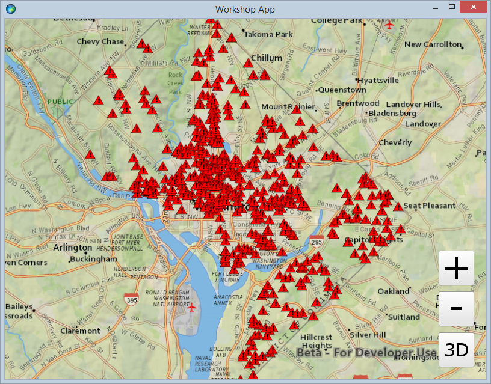
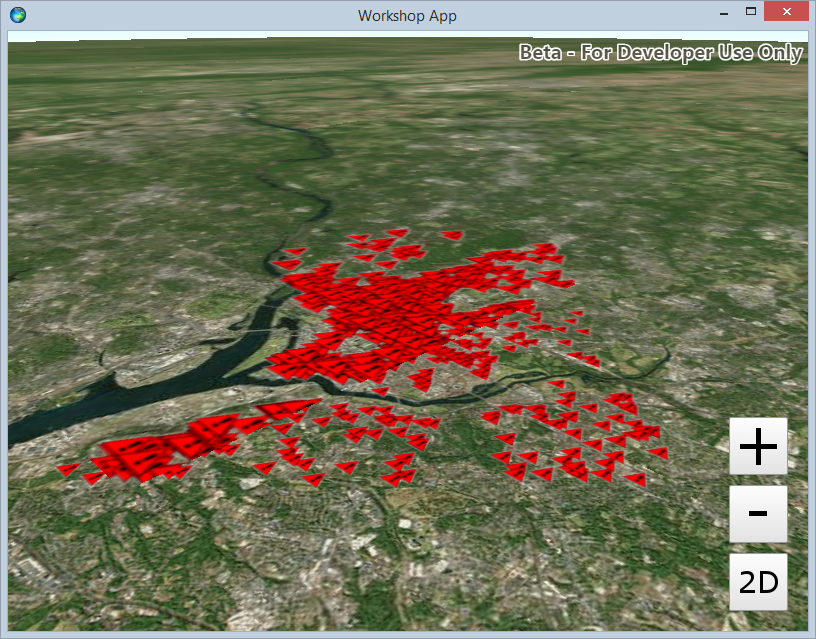

# Exercise 3: Add a Local Feature Layer (Qt Quick)

This exercise walks you through the following:
- Add a layer from a mobile map package to the 2D map
- Add a layer from a mobile map package to the 3D scene

Prerequisites:
- Complete [Exercise 2](Exercise 2 Zoom Buttons.md), or get the Exercise 2 code solution compiling and running properly in Qt Creator.

If you need some help, you can refer to [the solution to this exercise](../../../solutions/Qt/Qt Quick/Ex3_LocalFeatureLayer), available in this repository.

## Add a layer from a mobile map package to the 2D map

ArcGIS Runtime provides a variety of ways to add **operational layers** to the map and scene--feature services, dynamic map services, offline geodatabases, and mobile map packages, for example. In this exercise, you will use the newest of these: a mobile map package.

1. Download the [D.C. Crime Data mobile map package (`DC_Crime_Data.mmpk`)](../../../data/DC_Crime_Data.mmpk) that we have prepared for you. For this exercise, you can put it in your application working directory, leave it in your downloads directory, or put it anywhere that your app will be able to access it.

1. In your QML file, declare a constant for the location of your downloaded MMPK:

    ```
    readonly property string mmpkPath: "../../../../../data/DC_Crime_Data.mmpk"
    ```

1. After your `MapView`, add a `MobileMapPackage`. Load it and set its map on your `MapView`. Don't forget to reset the basemap. Here's the code:

    ```
    MobileMapPackage {
        id: mmpk
        path: mmpkPath

        property var basemap: BasemapNationalGeographic {}

        Component.onCompleted: {
            mmpk.load();
        }

        onLoadStatusChanged: {
            if (loadStatus === Enums.LoadStatusLoaded) {
                mapView.map = mmpk.maps[0];
                mapView.map.basemap = basemap;
            }
        }
    }
    ```
    
1. Run your app and verify that the map zooms to Washington, D.C., and that a layer of crime incidents appears on top of the basemap. The incidents appear as red triangles, which is the symbology specified in the mobile map package:

    

## Add a layer from a mobile map package to the 3D scene

A layer can only reside in one map or scene at a time. Therefore, to add layers to the 3D scene, you will have to open the mobile map package again. That will give you a `Map` as before, which you can't use with a `SceneView`--and there is no "`MobileScenePackage`"--so you will have to get the layers from this `Map` and add them to your existing `Scene`.

1. After your `SceneView`, add another `MobileMapPackage`. The code for this one is more complicated because you have to remove the layers from this MobileMapPackage's map and add them to your scene. Optionally, you can zoom and rotate to show the features. Here is the code:

    ```
    MobileMapPackage {
        id: sceneMmpk
        path: mmpkPath

        Component.onCompleted: {
            sceneMmpk.load();
        }

        onLoadStatusChanged: {
            if (loadStatus === Enums.LoadStatusLoaded) {
                var thisMap = sceneMmpk.maps[0];
                var layers = [];
                thisMap.operationalLayers.forEach(function (layer) {
                    layers.push(layer);
                });
                thisMap.operationalLayers.clear();
                layers.forEach(function (layer) {
                    sceneView.scene.operationalLayers.append(layer);
                });

                // Zoom and rotate
                var camera = ArcGISRuntimeEnvironment.createObject("Camera", {
                    location: thisMap.initialViewpoint.extent.center,
                    heading: 0,
                    pitch: 0,
                    roll: 0
                }).elevate(20000).rotateAround(thisMap.initialViewpoint.extent.center, 45, 65, 0);
                sceneView.setViewpointCamera(camera);
            }
        }
    }
    ```

1. Run your app. Verify that when you switch to 3D, the crime incidents display and the view is rotated and pitched. Also try the built-in 3D navigation by holding the right mouse button and moving the mouse:

    
    
## How did it go?

If you have trouble, **refer to the solution code**, which is linked near the beginning of this exercise. You can also **submit an issue** in this repo to ask a question or report a problem. If you are participating live with Esri presenters, feel free to **ask a question** of the presenters.

If you completed the exercise, congratulations! You learned how to add a local feature layer from a mobile map package to a 2D map and a 3D scene.

Ready for more? Choose from the following:

- [**Exercise 4: Buffer a Point and Query Features**](Exercise 4 Buffer and Query.md)
- **Bonus**: we used a mobile map package, but you can also add **feature services** to your map and scene. Go to [ArcGIS Online](http://www.arcgis.com/home/index.html), find a feature service URL (hint: a feature service URL has the term `FeatureServer` at or near the end of the URL), and use the `FeatureLayer` and `ServiceFeatureTable` classes to add the feature service to your map and/or globe. There is documentation for these classes on the ArcGIS developer site, and there are code samples on GitHub that might be helpful.