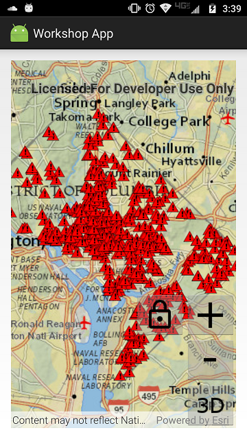

# Exercise 3: Add a Local Feature Layer (Android)

This exercise walks you through the following:
- Add a layer from a mobile map package to the 2D map
- Add a scene layer to the 3D scene
- Add a KML layer to the 2D map and 3D scene

Prerequisites:
- Complete [Exercise 2](Exercise%202%20Zoom%20Buttons.md), or get the Exercise 2 code solution compiling and running properly, preferably in an IDE.

If you need some help, you can refer to [the solution to this exercise](../../solutions/Android/Ex3_OpLyrs), available in this repository.

## Add a layer from a mobile map package to the 2D map

ArcGIS Runtime provides a variety of ways to add **operational layers** to the map--feature services, dynamic map services, offline geodatabases, and mobile map packages, for example. In this exercise, you will use the newest of these: a mobile map package.

1. Download the [D.C. Crime Data mobile map package (`DC_Crime_Data.mmpk`)](../../data/DC_Crime_Data.mmpk) that we have prepared for you. Transfer it to your Android device. Remember where it is; you might even want to use a file browser on your device to get the absolute path of the MMPK.

1. In `manifests/AndroidManifest.xml`, inside the `<manifest>` element but outside the `<application>` element, request READ_EXTERNAL_STORAGE permission:

    ```
    <uses-permission android:name="android.permission.READ_EXTERNAL_STORAGE" />
    ```

1. In Android 6 (API level 23) and higher, in addition to the `uses-permission` element, a production app should include Java code to [request permissions at runtime](https://developer.android.com/training/permissions/requesting.html). You could instead go to **Settings > Apps > &lt;your app&gt; > Permissions** on your Android device and grant the **Storage** permission manually, but that permission sometimes gets wiped out when you reinstall the app during development, which becomes very inconvenient. Therefore, here we will take the time to request permissions at runtime.
    
    Open the app's `build.gradle` file where you added a reference to the ArcGIS Runtime Android library. Add a reference to the Android Support Library `v4` library:
    
    ```
    implementation 'com.android.support:support-v4:27.1.1'
    ```
    
    Create an empty `private void` method for loading the mobile map package (you will fill in the method body later):
    
    ```
    private void loadMobileMapPackage() {
    
    }
    ```
    
    Declare an integer constant with a nonnegative value as a request code for requesting permissions needed for opening a mobile map package:
    
    ```
    private static final int PERM_REQ_OPEN_MMPK = 1;
    ```
    
    In your Activity class, at the end of `onCreate`, add code that checks for the `READ_EXTERNAL_STORAGE` permission:
    
    ```
    if (ContextCompat.checkSelfPermission(this, Manifest.permission.READ_EXTERNAL_STORAGE)
            == PackageManager.PERMISSION_GRANTED) {
        
    } else {
        
    }
    ```
    
    If permission is granted, simply call your method for loading the mobile map package:
    
    ```
    loadMobileMapPackage();
    ```
    
    If permission is not yet granted, request it from the user:
    
    ```
    ActivityCompat.requestPermissions(this,
            new String[] {Manifest.permission.READ_EXTERNAL_STORAGE}, PERM_REQ_OPEN_MMPK);
    ```
    
    When the user grants or refuses read permission, your Activity class's `onRequestPermissionsResult` method is called. Override this method:
    
    ```
    @Override
    public void onRequestPermissionsResult(int requestCode, @NonNull String[] permissions, @NonNull int[] grantResults) {

    }
    ```
    
    In `onRequestPermissionsResult`, if the request code matches the request code you passed to `requestPermissions`, check the list of granted permissions for READ_EXTERNAL_STORAGE. If that permission is present and granted, call your method for loading the mobile map package:
    
    ```
    if (PERM_REQ_OPEN_MMPK == requestCode) {
        for (int i = 0; i < permissions.length; i++) {
            String permission = permissions[i];
            if (Manifest.permission.READ_EXTERNAL_STORAGE.equals(permission) && PackageManager.PERMISSION_GRANTED == grantResults[i]) {
                loadMobileMapPackage();
                break;
            }
        }
    }
    ```

1. In your class, instantiate a constant called `MMPK_PATH` with the absolute path of the mobile map package you downloaded. In a real app, you might include this file as a resource in your app, but for this exercise, be lazy and just use the copy you put on the device in a previous step. In many cases, you may be able to use `Environment.getExternalStorageDirectory().getPath()` to get the first part of the path. For example, if you put `DC_Crime_Data.mmpk` in a directory called `data` in your device's normal storage directory, you can instantiate the path like this:

    ```
    private static final String MMPK_PATH =
            Environment.getExternalStorageDirectory().getPath() + "/data/DC_Crime_Data.mmpk";
    ```
    
1. In your method for loading the mobile map package, instantiate a `MobileMapPackage` with the mobile map package constant, and add an event handler to run when the mobile map package is done loading. Then load the mobile map package asynchronously:

    ```
    final MobileMapPackage mmpk = new MobileMapPackage(MMPK_PATH);
    mmpk.addDoneLoadingListener(new Runnable() {
        @Override
        public void run() {

        }
    });
    mmpk.loadAsync();
    ```
    
1. Inside the `addDoneLoadingListener` event handler method, get the `MobileMapPackage`'s maps. A mobile map package can contain multiple maps. `DC_Crime_Data.mmpk` only has one map, but it's a good idea to make sure there's at least one. If so, get the first map (index 0), and use it to set the `MapView`'s map. The map in this mobile map package has no basemap, so it's a good idea to set the basemap again. Here's the code that goes inside the event handler method:

    ```
    List<ArcGISMap> maps = mmpk.getMaps();
    if (0 < maps.size()) {
        map = maps.get(0);
        mapView.setMap(map);
    }
    map.setBasemap(Basemap.createTopographicVector());
    ```

1. After `mapView.setMap(map)`, add a listener to run when the `Map` is done loading. In that listener, zoom the `MapView` to the `Map`'s initial viewpoint:

    ```
    map.addDoneLoadingListener(new Runnable() {
        @Override
        public void run() {
            Viewpoint viewpoint = map.getInitialViewpoint();
            if (null != viewpoint) {
                mapView.setViewpointAsync(viewpoint);
            }
        }
    });
    ```

1. Run your app. Verify that the map zooms to Washington, D.C., and that a layer of crime incidents appears on top of the basemap. The incidents appear as red triangles, which is the symbology specified in the mobile map package:

    
    
## Add a scene layer to the 3D scene

Web scene layers are cached web layers that are optimized for displaying a large amount of 2D and 3D features. Scene layers can be viewed in a variety of ArcGIS clients, including ArcGIS Runtime. Here you will add a scene layer to your 3D scene.

1. Declare a constant value to specify the URL of a scene service. You can use a `SceneServer` URL or an ArcGIS Online or Portal for ArcGIS item URL that represents a scene service. The following URL shows buildings in San Francisco:

    ```
    private static final String SCENE_SERVICE_URL =
        "https://www.arcgis.com/home/item.html?id=943d302fd85b4b6dbd35f399cfb9a4a8";
    ```

    The following URL shows photo-realistic buildings in Philadelphia:
    
    ```
    private static final String SCENE_SERVICE_URL =
        "https://www.arcgis.com/home/item.html?id=2c9286dfc69349408764e09022b1f52e";
    ```

1. In Exercise 1, you added code to set up the scene with a basemap and an elevation source. After that code, in the same block, create a new `final ArcGISSceneLayer` based on the scene service, give the layer an event handler for when it is done loading, and add the layer to the scene:

    ```
    final ArcGISSceneLayer sceneLayer = new ArcGISSceneLayer(SCENE_SERVICE_URL);
    sceneLayer.addDoneLoadingListener(new Runnable() {
        @Override
        public void run() {
            
        }
    });
    scene.getOperationalLayers().add(sceneLayer);
    ```
    
1. Inside this new event handler, set your `SceneView`'s viewpoint to a new `Viewpoint` using the scene layer's full extent:

    ```
    sceneView.setViewpoint(new Viewpoint(sceneLayer.getFullExtent()));
    ```
    
1. Compile and run your app. Verify that when you switch to 3D, the scene displays the 3D features from the scene layer.
    
1. Remember in [Exercise 2](Exercise%202%20Zoom%20Buttons.md#zoom-in-and-out-on-the-map-and-the-scene) when you manipulated a `Camera` to zoom in and out? Here we will also use a `Camera`, but this time we will rotate the camera to provide an oblique view of the scene. We will focus the rotation on the current viewpoint's target point. The `Camera.rotateAround` method lets us specify a change in heading, pitch, and roll; let's change the heading by 45 degrees and the pitch by 65 degrees. After `rotateAround`, we will give the rotated `Camera` to the `SceneView`. Here is the code to insert immediately after the previous step:

    ```
    Viewpoint viewpoint = sceneView.getCurrentViewpoint(Viewpoint.Type.CENTER_AND_SCALE);
    Point targetPoint = (Point) viewpoint.getTargetGeometry();
    Camera camera = sceneView.getCurrentViewpointCamera()
        .rotateAround(targetPoint, 45.0, 65.0, 0.0);
    sceneView.setViewpointCameraAsync(camera);
    ```

1. Compile and run your app. Verify that when you switch to 3D, the 3D features display and the view is rotated and pitched.

## Add a KML layer to the 2D map and 3D scene

Most organizations use a mix of ArcGIS and non-ArcGIS data formats. Many organizations distribute mapping data in the Keyhole Markup Language (KML) format. Here you will use a KML URL to add a layer to your 2D map and 3D scene.

1. Declare a constant value to specify the URL of a KML file or network link. The following URL shows earthquakes of magnitude 1.0 or greater in the past seven days, colored by age:

    ```
    private static final String KML_URL =
        "https://earthquake.usgs.gov/earthquakes/feed/v1.0/summary/1.0_week_age_link.kml";
    ```

1. You added a listener to the mobile map package to set up the map after the mobile map package loads. In that listener, after setting the map and the basemap, create a KML layer and add it to the map:

    ```
	KmlLayer kmlLayer = new KmlLayer(new KmlDataset(KML_URL));
	map.getOperationalLayers().add(kmlLayer);
	```

1. You added a scene layer to the scene. After that, create a KML layer and add it to the scene:

    ```
	KmlLayer kmlLayer = new KmlLayer(new KmlDataset(KML_URL));
	scene.getOperationalLayers().add(kmlLayer);
	```

1. Compile and run your app. Zoom out and verify that the earthquake dots appear on the 2D map. Switch to 3D and verify that the earthquake dots appear on the 3D scene.

## How did it go?

If you have trouble, **refer to the solution code**, which is linked near the beginning of this exercise. You can also **submit an issue** in this repo to ask a question or report a problem. If you are participating live with Esri presenters, feel free to **ask a question** of the presenters.

If you completed the exercise, congratulations! You learned how to add a local feature layer from a mobile map package to a map. You also learned how to add KML to a 2D map and a 3D scene.

Ready for more? Choose from the following:

- [**Exercise 4: Buffer a Point and Query Features**](Exercise%204%20Buffer%20and%20Query.md)
- **Bonus**: we used a mobile map package, but you can also add **feature services** to your map. Go to [ArcGIS Online](http://www.arcgis.com/home/index.html), find a feature service URL (hint: a feature service URL has the term `FeatureServer` at or near the end of the URL), and use the [`FeatureLayer`](https://developers.arcgis.com/android/latest/api-reference/reference/com/esri/arcgisruntime/layers/FeatureLayer.html) and [`ServiceFeatureTable`](https://developers.arcgis.com/android/latest/api-reference/reference/com/esri/arcgisruntime/data/ServiceFeatureTable.html) classes to add the feature service to your map. You can refer to a [code sample](https://developers.arcgis.com/android/latest/sample-code/feature-layer-feature-service.htm) if you need it. Also, the [`ServiceFeatureTable`](https://developers.arcgis.com/android/latest/api-reference/reference/com/esri/arcgisruntime/data/ServiceFeatureTable.html) documentation has a feature service URL in the Class Overview section that you can use instead of finding one in ArcGIS Online if desired. We could give that URL to you here, but that wouldn't force you to go look at the documentation, would it? :-)
