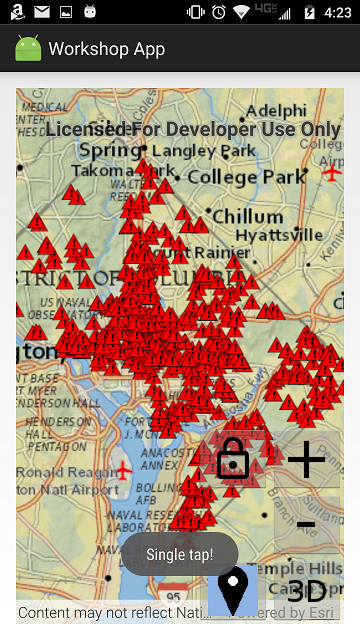
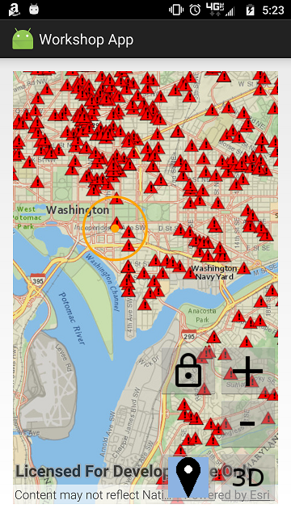
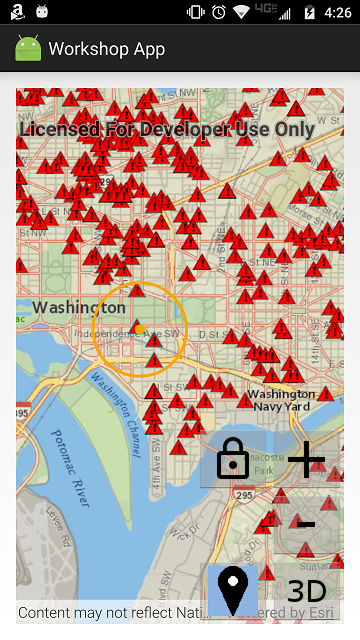

# Exercise 4: Buffer a Point and Query Features (Android)

This exercise walks you through the following:
- Get the user to tap a point
- Display the tapped point and a buffer around it
- Query for features within the buffer

Prerequisites:
- Complete [Exercise 3](Exercise%203%20Operational%20Layers.md), or get the Exercise 3 code solution compiling and running properly, preferably in an IDE.

If you need some help, you can refer to [the solution to this exercise](../../solutions/Android/Ex4_BufferQuery), available in this repository.

## Get the user to tap a point

You can use ArcGIS Runtime to detect when and where the user interacts with the map, either with the mouse or with a touchscreen. In this exercise, you just need the user to tap a point. You could detect every tap, but instead, we will let the user activate and deactivate this capability with a toggle button.

1. Inside `res/drawable`, create a new drawable resource file called `buffer_and_query_button.xml`. Android Studio creates this file with a `<selector>` element. Add two `<item>` elements to the selector: one for drawing the button when it is selected, and one for drawing the button when it is not selected. `drawable/location` and `drawable/location_selected` refer to images that you added to `res/drawable` in a previous exercise. Your `buffer_and_query_button.xml` should look something like this:

    ```
    <?xml version="1.0" encoding="utf-8"?>
    <selector xmlns:android="http://schemas.android.com/apk/res/android">
        <item android:state_selected="false" android:drawable="@drawable/location" />
        <item android:state_selected="true" android:drawable="@drawable/location_selected" />
    </selector>
    ```
    
1. Open `activity_main.xml`. Add an `ImageButton` to your `RelativeLayout` whose `android:src` is the `buffer_and_query_button` drawable resource you created in the previous step. Give the `ImageButton` an `onClick` event handler (here we call it `imageButton_bufferAndQuery_onClick`):

    ```
    <ImageButton
        android:id="@+id/imageButton_bufferAndQuery"
        android:layout_width="wrap_content"
        android:layout_height="wrap_content"
        android:layout_toLeftOf="@id/imageButton_zoomOut"
        android:layout_alignBottom="@id/imageButton_zoomOut"
        android:src="@drawable/buffer_and_query_button"
        android:onClick="imageButton_bufferAndQuery_onClick"/>
    ```
    
1. In your `MainActivity` class, create the `public void` event listener method that you attached to the button in the previous step. This method should take a `View` as a parameter:

    ```
    public void imageButton_bufferAndQuery_onClick(View view) {
    
    }
    ```
    
1. In your class, declare an `ImageButton` field and set it to `null`:

    ```
    private ImageButton imageButton_bufferAndQuery = null;
    ```
    
1. In `onCreate(Bundle)`, after `setContentView`, set `imageButton_bufferAndQuery` to the `ImageButton` you created in XML, using `findViewById`:

    ```
    imageButton_bufferAndQuery = findViewById(R.id.imageButton_bufferAndQuery);
    ```
    
1. Create a `private void bufferAndQuery(MotionEvent)` method that will eventually create a buffer around a tapped point and query for features within that buffer. For now, just have the method display a `Toast` indicating that a single tap was received:

    ```
    private void bufferAndQuery(MotionEvent singleTapEvent) {
        Toast.makeText(MainActivity.this, "Single tap!", Toast.LENGTH_SHORT).show();
    }
    ```
    
1. In `imageButton_bufferAndQuery_onClick(View)`, invert the button's `selected` property, and then add an `if-else` statement for whether or not the button is selected. _Note: we could have used a ToggleButton instead of an ImageButton._ Here is the code to add to the listener method:

    ```
    imageButton_bufferAndQuery.setSelected(!imageButton_bufferAndQuery.isSelected());
    if (imageButton_bufferAndQuery.isSelected()) {
    
    } else {
    
    }
    ```
    
1. In the code you just added, if the button is selected, give the `MapView` an `OnTouchListener` to get a user's tap. Use a new `DefaultMapViewOnTouchListener` so that you only have to implement one method, `onSingleTapConfirmed(MotionEvent)`. In `onSingleTapConfirmed`, call `bufferAndQuery` with the `MotionEvent` parameter. Return `true` to indicate that your method consumes the single tap:

    ```
    mapView.setOnTouchListener(new DefaultMapViewOnTouchListener(this, mapView) {
        @Override
        public boolean onSingleTapConfirmed(MotionEvent event) {
            bufferAndQuery(event);
            return true;
        }
    });
    ```
    
1. In that same method, if the button is not selected, give the `MapView` a `DefaultMapViewOnTouchListener` and the `SceneView` a `DefaultSceneViewOnTouchListener` with no overridden methods, in order to reset to the default touch behavior:

    ```
    mapView.setOnTouchListener(new DefaultMapViewOnTouchListener(this, mapView));
    sceneView.setOnTouchListener(new DefaultSceneViewOnTouchListener(sceneView));
    ```

1. Run your app. Verify that when you select the buffer and query button and tap the map, the `Toast` appears:

    
    
## Display the tapped point and a buffer around it

You need to buffer the tapped point and display both the point and the buffer as graphics on the map.

1. In your class, instantiate fields for the symbols for the tapped point and buffer. You can adjust the colors, styles, and widths if desired. In the following code, the point symbol is a 10-pixel circle with an orange (FFA500) color and no transparency (alpha = FF), and the buffer symbol is a hollow polygon with a 3-pixel orange (FFA500) solid line border with no transparency (alpha = FF):

    ```
    private static final SimpleMarkerSymbol CLICK_SYMBOL =
            new SimpleMarkerSymbol(SimpleMarkerSymbol.Style.CIRCLE, 0xFFffa500, 10);
    private static final SimpleFillSymbol BUFFER_SYMBOL =
            new SimpleFillSymbol(SimpleFillSymbol.Style.NULL, 0xFFFFFFFF,
                    new SimpleLineSymbol(SimpleLineSymbol.Style.SOLID, 0xFFFFA500, 3));
    ```
    
1. Instantiate a `GraphicsOverlay` field:

    ```
    private final GraphicsOverlay bufferAndQueryMapGraphics = new GraphicsOverlay();
    ```
    
1. In `onCreate(Bundle)`, add the map `GraphicsOverlay` to the `MapView`:

    ```
    mapView.getGraphicsOverlays().add(bufferAndQueryMapGraphics);
    ```

1. Create a `private Point getGeoPoint(MotionEvent)` method to convert a `MotionEvent` to a `Point`. This method should use either the `MapView` or the `SceneView` to convert a screen point to a geographic point, depending on whether the app is currently in 2D mode or 3D mode. You're only going to call `getGeoPoint(MotionEvent)` in one place here in Exercise 4, so you don't really have to create a method just for this. But you will thank yourself for writing this method when you get to Exercise 5. _Note: `MapView.screenToLocation` takes a `android.graphics.Point` and returns a `com.esri.arcgisruntime.geometry.Point`. You can import one or the other but not both, so here we imported the ArcGIS `Point` class and used the fully qualified Android `Point` class name inline, since this is the only place in the exercises that we will need the Android `Point` class. You can do it the other way around if you prefer._ Here is the `getGeoPoint` code:

    ```
    private Point getGeoPoint(MotionEvent singleTapEvent) {
        android.graphics.Point screenPoint = new android.graphics.Point(
                Math.round(singleTapEvent.getX()),
                Math.round(singleTapEvent.getY()));
        return threeD ?
                sceneView.screenToBaseSurface(screenPoint) :
                mapView.screenToLocation(screenPoint);
    }
    ```

1. In `bufferAndQuery(MotionEvent)`, you need to replace your `Toast` with code to create a buffer and display the point and buffer as graphics. First, use `getGeoPoint(MotionEvent)` to convert the `MotionEvent` to a geographic point. Next, create a 1000-meter buffer, which is pretty simple with ArcGIS Runtime's `GeometryEngine` class. _Note: ArcGIS Runtime Quartz Beta 3 cannot create geodesic buffers, so here you must project the point to a projected coordinate system (PCS), such as Web Mercator (3857), before creating the buffer. Using a PCS specific to the geographic area in question would produce a more accurate buffer. However, it is anticipated that ArcGIS Runtime Quartz will provide support for geodesic buffers, so writing code to find a better PCS will not be necessary with the Quartz release. Therefore, we did not write that code for this tutorial._

    ```
    Point geoPoint = getGeoPoint(singleTapEvent);
    geoPoint = (Point) GeometryEngine.project(geoPoint, SpatialReference.create(3857));
    Polygon buffer = GeometryEngine.buffer(geoPoint, 1000.0);
    ```

1. In `bufferAndQuery(MotionEvent)`, clear the graphics and then add the point and buffer as new `Graphic` objects:

    ```
    ListenableList<Graphic> graphics = bufferAndQueryMapGraphics.getGraphics();
    graphics.clear();
    graphics.add(new Graphic(buffer, BUFFER_SYMBOL));
    graphics.add(new Graphic(geoPoint, CLICK_SYMBOL));
    ```

1. Compile and run your app. Verify that if you toggle the buffer and select button and then tap the map, the point you tapped and a 1000-meter buffer around it appear on the map:

    
    
## Query for features within the buffer

There are a few different ways to query and/or select features in ArcGIS Runtime. Here we will use `FeatureLayer.selectFeaturesAsync(QueryParameters, FeatureLayer.SelectionMode)`, which both highlights selected features on the map or scene and provides a list of the selected features.

1. In `bufferAndQuery(MotionEvent)`, after creating the buffer and adding graphics, instantiate a `QueryParameters` object with the buffer geometry:

    ```
    QueryParameters query = new QueryParameters();
    query.setGeometry(buffer);
    ```
    
1. For each of the `FeatureLayer` objects in the operational layers of the `SceneView`'s scene or the `MapView`'s map, call `selectFeaturesAsync(QueryParameters, FeatureLayer.SelectionMode)`. Use `FeatureLayer.SelectionMode.NEW` to do a new selection, as opposed to adding to or removing from the current selection. Add this code after instantiating the query object and setting its geometry:

    ```
    LayerList operationalLayers = mapView.getMap().getOperationalLayers();
    for (Layer layer : operationalLayers) {
        if (layer instanceof FeatureLayer) {
            ((FeatureLayer) layer).selectFeaturesAsync(query, FeatureLayer.SelectionMode.NEW);
        }
    };
    ```
    
1. Compile and run your app. Verify that features within the tapped buffer are highlighted on the map:

    
    
## How did it go?

If you have trouble, **refer to the solution code**, which is linked near the beginning of this exercise. You can also **submit an issue** in this repo to ask a question or report a problem. If you are participating live with Esri presenters, feel free to **ask a question** of the presenters.

If you completed the exercise, congratulations! You learned how to get a user's input on the map, buffer a point, display graphics on the map, and select features based on a query.

Ready for more? Choose from the following:

- [**Exercise 5: Routing**](Exercise%205%20Routing.md)
- **Bonus**
    - We selected features but didn't do anything with the selected features' attributes. The call to [`selectFeaturesAsync`](https://developers.arcgis.com/android/latest/api-reference//reference/com/esri/arcgisruntime/layers/FeatureLayer.html#selectFeaturesAsync(com.esri.arcgisruntime.data.QueryParameters%2C%20com.esri.arcgisruntime.layers.FeatureLayer.SelectionMode)) returns a Java `Future` with a `get()` method that returns a `FeatureQueryResult`, which lets you iterate through selected features. See if you can look at the feature attributes to get more information about the selected features.
    - Try setting properties on the `QueryParameters` object to change the query's behavior. For example, maybe you want to select all features that are _outside_ the buffer instead of those that are inside. How would you do that by adding just one line of code? What other interesting things can you do with `QueryParameters`?
