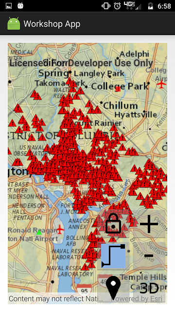
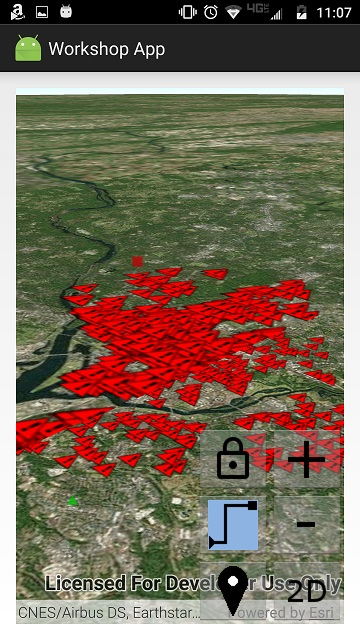
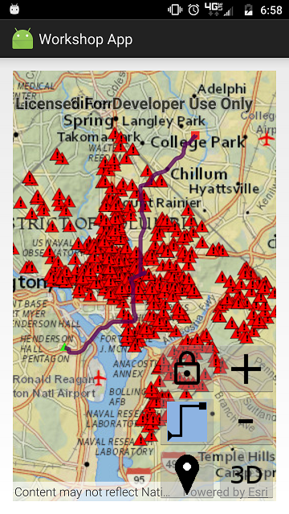
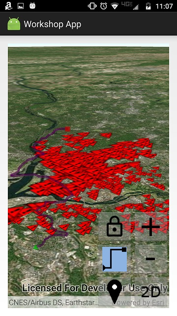

# Exercise 5: Routing (Android)

ArcGIS Runtime features the ability to run ArcGIS geoprocessing for analysis and data management. The `GeoprocessingTask` class lets you call any geoprocessing service. ArcGIS Runtime provides more specific support for certain types of geoprocessing, such as network routing using Network Analyst services or local network datasets. By learning how to use routing in this exercise, you will learn key skills that will help you use other geoprocessing capabilities that ArcGIS Runtime supports.

This exercise walks you through the following:
- Get the user to tap an origin point and a destination point
- Calculate a driving route from the origin to the destination
- Display the route on the map or scene

Prerequisites:
- Complete [Exercise 4](Exercise%204%20Buffer%20and%20Query.md), or get the Exercise 4 code solution compiling and running properly, preferably in an IDE.

If you need some help, you can refer to [the solution to this exercise](../../solutions/Android/Ex5_Routing), available in this repository.

## Get the user to tap an origin point and a destination point

After doing Exercise 4, this should seem familiar to you.

1. In your class, instantiate symbols for the origin point, destination point, and route line:

    ```
    private static final SimpleMarkerSymbol ROUTE_ORIGIN_SYMBOL =
            new SimpleMarkerSymbol(SimpleMarkerSymbol.Style.TRIANGLE, 0xFF00FF00, 10);
    private static final SimpleMarkerSymbol ROUTE_DESTINATION_SYMBOL =
            new SimpleMarkerSymbol(SimpleMarkerSymbol.Style.SQUARE, 0xFFFF0000, 10);
    private static final SimpleLineSymbol ROUTE_LINE_SYMBOL =
            new SimpleLineSymbol(SimpleLineSymbol.Style.SOLID, 0xFF550055, 5);
    ```

1. Instantiate two `GraphicsOverlay` objects for routing: one for the map and one for the scene. Also declare a non-`final` Point to store the origin point and set it to `null` for now:

    ```
    private final GraphicsOverlay mapRouteGraphics = new GraphicsOverlay();
    private final GraphicsOverlay sceneRouteGraphics = new GraphicsOverlay();
    private Point originPoint = null;
    ```
    
1. In `onCreate(Bundle)`, add the `GraphicsOverlay`s to the `MapView` and `SceneView` respectively. Set the scene's graphics overlay to drape on the 3D surface:

    ```
    mapView.getGraphicsOverlays().add(mapRouteGraphics);
    sceneRouteGraphics.getSceneProperties().setSurfacePlacement(LayerSceneProperties.SurfacePlacement.DRAPED);
    sceneView.getGraphicsOverlays().add(sceneRouteGraphics);
    ```
    
1. Inside `res/drawable`, create a new drawable resource file called `routing_button.xml`. Android Studio creates this file with a `<selector>` element. Add two `<item>` elements to the selector: one for drawing the button when it is selected, and one for drawing the button when it is not selected. `drawable/routing` and `drawable/routing_selected` refer to images that you added to `res/drawable` in a previous exercise. Your `buffer_and_query_button.xml` should look something like this:

    ```
    <?xml version="1.0" encoding="utf-8"?>
    <selector xmlns:android="http://schemas.android.com/apk/res/android">
        <item android:state_selected="false" android:drawable="@drawable/routing" />
        <item android:state_selected="true" android:drawable="@drawable/routing_selected" />
    </selector>
    ```
    
1. Open `activity_main.xml`. Add an `ImageButton` to your `RelativeLayout` whose `android:src` is the `routing_button` drawable resource you created in the previous step. Give the `ImageButton` an `onClick` event handler (here we call it `imageButton_routing_onClick`):

    ```
    <ImageButton
        android:id="@+id/imageButton_routing"
        android:layout_width="wrap_content"
        android:layout_height="wrap_content"
        android:layout_toLeftOf="@id/imageButton_toggle2d3d"
        android:layout_alignBottom="@id/imageButton_toggle2d3d"
        android:src="@drawable/routing_button"
        android:onClick="imageButton_routing_onClick"/>
    ```
    
1. In your `MainActivity` class, create the `public void` event listener method that you attached to the button in the previous step. This method should take a `View` as a parameter:

    ```
    public void imageButton_routing_onClick(View view) {
    
    }
    ```
    
1. In your class, declare an `ImageButton` field and set it to `null`:

    ```
    private ImageButton imageButton_routing = null;
    ```
    
1. In `onCreate(Bundle)`, after `setContentView`, set `imageButton_routing` to the `ImageButton` you created in XML, using `findViewById`:

    ```
    imageButton_routing = findViewById(R.id.imageButton_routing);
    ``` 
    
1. In `imageButton_bufferAndQuery_onClick()`, if the buffer and query toggle button is selected, un-select the routing toggle button. _Note: if we had more than two toggle buttons, we would want to do something smarter than this. Since this exercise is not about building a UI, we're naïvely assuming there will only ever be two toggle buttons._

    ```
    imageButton_routing.setSelected(false);
    ```
    
1. Create a `private void addStopToRoute(MotionEvent)` method that takes a motion event, converts it to a geographic point, adds it to the map as a graphic, and either saves it as an origin point or calculates the route if an origin point already exists. For now, we'll do everything but actually calculate the route. Start by declaring the method:

    ```
    private void addStopToRoute(MotionEvent singleTapEvent) {
    
    }
    ```
    
1. In `addStopToRoute(MouseEvent)`, get the list of route graphics, depending on whether or not we are in 3D mode. Call `getGeoPoint(MotionEvent)` to convert the `MotionEvent` to a geographic `Point`. Remove the point's z-value if present, since a z-value will cause the routing not to work:

    ```
    final ListenableList<Graphic> graphics = (threeD ? sceneRouteGraphics : mapRouteGraphics).getGraphics();
    Point point = getGeoPoint(singleTapEvent);
    if (point.hasZ()) {
        point = new Point(point.getX(), point.getY(), point.getSpatialReference());
    }
    ```
    
1. In `addStopToRoute(MouseEvent)`, after the `if` block, create an `if-else` statement that determines whether or not `originPoint` is `null`:

    ```
    if (null == originPoint) {
    
    } else {
    
    }
    ```
    
1. If `originPoint` is `null`, then this is the first route point the user has tapped. Save the point as `originPoint`, clear the graphics, and add `originPoint` as a graphic:

    ```
    originPoint = point;
    graphics.clear();
    graphics.add(new Graphic(originPoint, ROUTE_ORIGIN_SYMBOL));
    ```
    
1. If `originPoint` is not `null`, then this is the second route point the user has tapped. Add the point as a graphic, and then reset the routing by setting `originPoint` to `null`. It is in this block that you will write the code that calculates the route, but you will write that code later in this exercise. For now, just add the graphic and set `originPoint` to `null`:

    ```
    graphics.add(new Graphic(point, ROUTE_DESTINATION_SYMBOL));
    originPoint = null;
    ```
    
1. Fill in the body of `imageButton_routing_onClick(View)`. If the routing toggle button has been un-selected, set the `MapView` and `SceneView`'s `onTouchListener` to an `OnTouchListener` with no overridden methods. If the routing toggle button has been selected, un-select `imageButton_bufferAndQuery` and set the `onTouchListener` to an `OnTouchListener` with an overridden `onSingleTapConfirmed(MotionEvent)` method. In `onSingleTapConfirmed`, call `addStopToRoute` with the motion event, and return `true` to indicate that the event has been consumed:

    ```
    imageButton_routing.setSelected(!imageButton_routing.isSelected());
    final DefaultMapViewOnTouchListener mapListener;
    final DefaultSceneViewOnTouchListener sceneListener;
    if (imageButton_routing.isSelected()) {
        mapListener = new DefaultMapViewOnTouchListener(this, mapView) {
            @Override
            public boolean onSingleTapConfirmed(MotionEvent event) {
                addStopToRoute(event);
                return true;
            }
        };
        sceneListener = new DefaultSceneViewOnTouchListener(sceneView) {
            @Override
            public boolean onSingleTapConfirmed(MotionEvent event) {
                addStopToRoute(event);
                return true;
            }
        };
        imageButton_bufferAndQuery.setSelected(false);
    } else {
        mapListener = new DefaultMapViewOnTouchListener(this, mapView);
        sceneListener = new DefaultSceneViewOnTouchListener(sceneView);
    }
    mapView.setOnTouchListener(mapListener);
    sceneView.setOnTouchListener(sceneListener);
    ```

1. Run your app. Verify that you can toggle on the routing button, click an origin point, click a destination point, and see both points displayed:

    

    
    
## Display the route on the map

1. Declare a `RouteTask` field and a `RouteParameters` field, and set them both to `null`:

    ```
    private RouteTask routeTask = null;
    private RouteParameters routeParameters = null;
    ```
    
1. Declare a constant `TAG` string for logging:

    ```
    private static final String TAG = MainActivity.class.getSimpleName();
    ```
    
1. In `onCreate(Bundle)`, instantiate the `RouteTask`, set its ArcGIS Online username and password, and get the `RouteParameters` from the `RouteTask`. But instantiate them in such a way that if getting the `RouteParameters` fails, both the `RouteTask` and the `RouteParameters` are set to `null`, as a signal to the rest of the code that routing is not available. _Note: in this exercise, we're naïvely hard-coding our username and password. Don't do that! It is too easy for someone to decompile your code. There are at least three better options: use an OAuth 2.0 user login, use an OAuth 2.0 app login (presents a problem since you shouldn't hard-code your client secret), or challenge the user for credentials. For now, since the exercise is about routing and not security, just hard-code the username and password._ Here is the code to add to your constructor:

    ```
    routeTask = new RouteTask(this, "http://route.arcgis.com/arcgis/rest/services/World/Route/NAServer/Route_World");
    // Don't share this code without removing plain text username and password!!!
    routeTask.setCredential(new UserCredential("theUsername", "thePassword"));
    try {
        routeParameters = routeTask.createDefaultParametersAsync().get();
    } catch (InterruptedException | ExecutionException e) {
        routeTask = null;
        Log.e(TAG, "Could not get route parameters", e);
    }
    ```
    
1. In `onCreate(Bundle)`, after setting `routeTask` and `routeParameters`, if getting the `RouteParameters` succeeded (i.e. if `routeParameters` is not `null`), set some of the parameters. We don't need route directions or stops (we already have the stops), but we do need routes. If the `RouteParameters` object is null, disable the routing toggle button because routing is not available:

    ```
    if (null != routeParameters) {
        routeParameters.setReturnDirections(false);
        routeParameters.setReturnRoutes(true);
        routeParameters.setReturnStops(false);
    } else {
        imageButton_routing.setEnabled(false);
    }
    ```
    
1. Write the rest of the code for the `addStopToRoute` method. In that method, you have an `else` block containing two lines of code: a line that adds a graphic, and a line that sets `originPoint` to `null`. Between those two lines, clear the route parameters' stops and add both `originPoint` and `point` to the route parameters` stops:

    ```
    routeParameters.clearStops();
    routeParameters.setStops(Arrays.asList(new Stop(originPoint), new Stop(point)));
    ```
    
1. After adding the stops, call `RouteTask.solveRouteAsync(RouteParameters)` to solve the route asynchronously. That call returns a `ListenableFuture`, on which you can add a done listener. In that listener, call `get()` on the `ListenableFuture`, and then call `getRoutes()`, get the first route, and add it as a graphic. The call to `get()` can throw two different types of exceptions, which you must catch (or catch all `Throwable` objects if you prefer):

    ```
    final ListenableFuture<RouteResult> solveFuture = routeTask.solveRouteAsync(routeParameters);
    solveFuture.addDoneListener(new Runnable() {
        @Override
        public void run() {
            RouteResult routeResult = null;
            try {
                routeResult = solveFuture.get();
                if (0 < routeResult.getRoutes().size()) {
                    graphics.add(new Graphic(routeResult.getRoutes().get(0).getRouteGeometry(), ROUTE_LINE_SYMBOL));
                }
            } catch (InterruptedException | ExecutionException e) {
                Log.e(TAG, "Could not get solved route", e);
            }
        }
    });
    ```

1. Compile and run your app. Verify that you can calculate and display a route in both 2D and 3D:

    

    

## How did it go?

If you have trouble, **refer to the solution code**, which is linked near the beginning of this exercise. You can also **submit an issue** in this repo to ask a question or report a problem. If you are participating live with Esri presenters, feel free to **ask a question** of the presenters.

If you completed the exercise, congratulations! You learned how to calculate a driving route using a web service and display the route on the map.

Ready for more? Choose from the following bonus challenges:
- Instead of hard-coding your ArcGIS Online username and password, challenge the user for a username and password. This is more of a UI problem than an ArcGIS problem; just get the username and password in a dialog or something and pass them to the `UserCredential` constructor.
- In fact, you can do even better than creating your own username/password dialog. A wise user will feel nervous about typing his or her username and password into an arbitrary app. You can give the user some reassurance by implementing an OAuth 2.0 user login, in which ArcGIS Online (or ArcGIS Enterprise) generates a login page, which you display in a web control. That way, your app never directly handles the username and password, but you get back a short-lived token that you can use to authenticate to ArcGIS services. See if you can implement an OAuth 2.0 user login for the routing. Hint: take a look at [`OAuthTokenCredentialRequest`](https://developers.arcgis.com/android/latest/api-reference/reference/com/esri/arcgisruntime/security/OAuthTokenCredentialRequest.html); that documentation has suggested steps for performing the OAuth 2.0 login.
- Allow the user to add more than two points for the route.
- Allow the user to add barriers in addition to stops.
- Look at the properties you can set on [`RouteParameters`](https://developers.arcgis.com/android/latest/api-reference/reference/com/esri/arcgisruntime/tasks/networkanalysis/RouteParameters.html) and try a few of them to change the routing behavior.

That concludes the exercises for this workshop. Well done!
