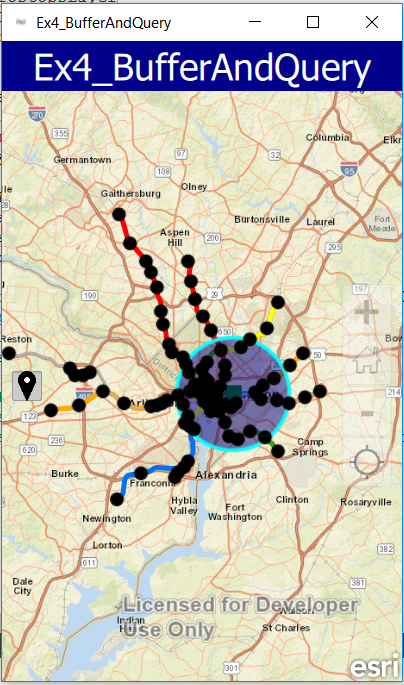

# Exercise 4: Buffer a Point and Query Features (AppStudio)

This exercise walks you through the following:
- Get the user to click a point
- Display the clicked point and a buffer around it
- Query for features within the buffer

Prerequisites:
- Complete [Exercise 3](Exercise 3 Add Feature Service.md), or get the Exercise 3 code solution compiling and running properly, preferably in AppStudio.

If you need some help, you can refer to [the solution to this exercise](../../solutions/Appstudio/Ex4_BufferAndQuery), available in this repository.

## Get the user to click a point

You can use ArcGIS Runtime to detect when and where the user interacts with the map, either with the mouse or with a touchscreen. In this exercise, you just need the user to click or tap a point. You could detect every user click, but instead, we will let the user activate and deactivate this capability with a button.

1. We will add a new button to the UI using [one of the images in the repo](../../images/location.png).  Add the following code below:

    ```
        Column{
            id: controls
            spacing: 10
            anchors {
                left: parent.left
                verticalCenter: parent.verticalCenter
                margins: 10
            }

            Button {
                id: bufferqueryButton
                enabled: true
                Image {
                        anchors.fill: parent
                        source: "https://raw.githubusercontent.com/garys-esri/geodev-dc-labs/master/2016-11-runtime/images/location.png"
                        fillMode: Image.PreserveAspectFit
                }

                checkable: true
                width: 30
                height: 30
                checked: false
                onPressedChanged: {
                    

                }

            }
        }
    ```
    
1. Next we need to add a GraphicsOverlay to add the graphics to the map.  :

    ```
   GraphicsOverlay{
            id: startGraphics
            renderer: SimpleRenderer {
                SimpleMarkerSymbol {
                    style: Enums.SimpleMarkerSymbolStyleSquare
                    size: 10
                    color: "green"
                }
            }
        }
        

    ```
      

    
1. Next let's create the graphic for the buffer that is created:

    ```
    Graphic {
            id: bufferGraphic
            symbol: SimpleFillSymbol {
                color: Qt.rgba(0.0, 0, 0.5, 0)
                outline:  SimpleLineSymbol {
                    color: "aqua"
                    style: Enums.SimpleLineSymbolStyleSolid
                    width: 2
                }
            }
        }
    ```
    
1. Next let's add the metro stops feature service to query when we do the buffer

    ```
       FeatureLayer {
               id: metrostopsLayer
               visible: false
               ServiceFeatureTable {
                   url: "http://services.arcgis.com/lA2FZKuu26Fips7U/ArcGIS/rest/services/MetroStops/FeatureServer/0"
               }
           }
    ```
    
1. Now let's add the onMouseClick and create the buffer:

       ```
	    onMouseClicked: {
            startGraphics.graphics.clear();
            metrostopsLayer.clearSelection();
            var graphic = ArcGISRuntimeEnvironment.createObject("Graphic");
            graphic.geometry = mouse.mapPoint;
            graphic.spatialReference = map.spatialReference;
               if (bufferqueryButton.checked) {
                   //console.log(startGraphics.numberOfGraphics);
                   if (startGraphics.graphics.count === 0) {
                       startGraphics.graphics.append(graphic);
                       metrostopsLayer.visible = true;
                       //console.log(graphic.spatialReference);

                       //var bufferPolygon = graphic.geometry.buffer(10000, map.spatialReference.unit);
                       var bufferPolygon = GeometryEngine.buffer(graphic.geometry, 10000)
                       console.log(bufferPolygon);
                       //var graphic1 = ArcGISRuntimeEnvironment.createObject("Graphic");
                       bufferGraphic.geometry = bufferPolygon;
                       startGraphics.graphics.append(bufferGraphic);

                       queryParams.geometry = bufferGraphic.geometry;
                       metrostopsLayer.selectionColor = "aqua";
                       metrostopsLayer.selectFeaturesWithQuery(queryParams,Enums.SelectionModeNew);

                   }
               }
           }
    ```
1.  You will need your queryparameters to be used in the query.
    ```
	QueryParameters {
                id: queryParams
                spatialRelationship: Enums.SpatialRelationshipIntersects
        }
    ```    
1. Compile and run your app. Verify that when you click the button and click on the map you get a point and buffer

    


1.  Let's add one last bit of code to clear graphics when the button is pressed again.  You will add this to the code for the button's onPressedChanged:
	```
	if (!checked){
                        startGraphics.graphics.clear();
                        metrostopsLayer.clearSelection();
                    }
    }
    ```	
## How did it go?

If you have trouble, **refer to the solution code**, which is linked near the beginning of this exercise. You can also **submit an issue** in this repo to ask a question or report a problem. If you are participating live with Esri presenters, feel free to **ask a question** of the presenters.

If you completed the exercise, congratulations! You learned how to get a user's input on the map, buffer a point, display graphics on the map, and select features based on a query.

Ready for more? Choose from the following:

- [**Exercise 5: Service Area**](Exercise 5 ServiceArea.md)
