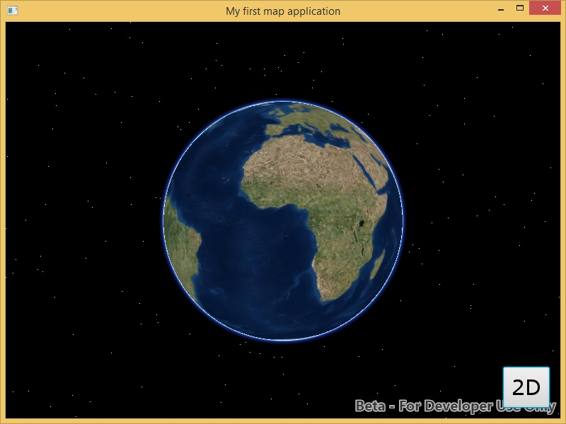

# Exercise 1: Map and Scene (Java)

This exercise walks you through the following:
- Create a new JavaFX app
- Add ArcGIS Runtime to the app
- Add a 2D map to the app
- Add a 3D scene to the app, and use a toggle button to switch between 2D and 3D

Prerequisites:
- Install the Java Development Kit (JDK) version 11 or higher.
- Optional: install a Java integrated development environment (IDE).

If you need some help, you can refer to [the solution to this exercise](../../solutions/Java/Ex1_MapAndScene), available in this repository.

## Create a new JavaFX app

1. Create a new JavaFX application project in the IDE of your choice. (Note: if you use an IDE that supports Gradle and create a Gradle project, you will be able to use Gradle when it's time to add ArcGIS Runtime to the project. The same applies with Maven.) Create a class that extends `javafx.application.Application`:

    ```
    package workshopapp;

    import javafx.application.Application;

    public class WorkshopApp extends Application {

    }
    ```

	**Note:** In recent Java releases, the JDK no longer includes JavaFX, so you will probably need to add a JavaFX dependency to your new project. In Maven, this is done as follows inside `pom.xml`'s `<dependencies>` element (which you should create if it does not yet exist):

    ```
	<dependency>
		<groupId>org.openjfx</groupId>
		<artifactId>javafx-controls</artifactId>
		<version>11.0.1</version>
	</dependency>
	```

1. Instantiate a field of type `AnchorPane` that will hold the app's UI components:

    ```
    private final AnchorPane anchorPane = new AnchorPane();
    ```

1. Create a Java package called `resources` in your application. Go to [the images directory](../../images) of this repository and copy all of the images to your `resources` package. (Copying the images is easier if you clone this repo, or if you fork this repo and clone your fork.) Then instantiate a `Button` and two `ImageView` fields that reference the images you copied. Use the 3D `ImageView` for the Button. Be sure to import `javafx.scene.image.Image`, rather than some other `Image` class. (Note: you can use text buttons without the images if you prefer.)

    ```
    private final ImageView imageView_2d =
          new ImageView(new Image(WorkshopApp.class.getResourceAsStream("/resources/two_d.png")));
    private final ImageView imageView_3d =
          new ImageView(new Image(WorkshopApp.class.getResourceAsStream("/resources/three_d.png")));
    private final Button button_toggle2d3d = new Button(null, imageView_3d);
    ```

1. Add a default constructor to your class:

    ```
    public WorkshopApp() {
        super();
    }
    ```
    
1. Implement the `start(Stage)` method. In `start(Stage)`, add the `Button` near the lower-right corner of the `AnchorPane`. Create a new JavaFX `Scene` with your `AnchorPane`. Set the `Stage`'s title, width, height, and scene, and then call `show` on the `Stage`:

    ```
    @Override
    public void start(Stage primaryStage) {
        AnchorPane.setRightAnchor(button_toggle2d3d, 15.0);
        AnchorPane.setBottomAnchor(button_toggle2d3d, 15.0);
        anchorPane.getChildren().addAll(button_toggle2d3d);

        Scene javaFxScene = new Scene(anchorPane);
        primaryStage.setTitle("My first map application");
        primaryStage.setWidth(800);
        primaryStage.setHeight(600);
        primaryStage.setScene(javaFxScene);
        primaryStage.show();
    }
    ```
    
1. Add a `main` method to your class that calls `Application.launch`:

    ```
    public static void main(String[] args) {
        launch(args);
    }
    ```

1. In newer versions of Java, you will probably get the following error if you run the app right now:

    >Error: JavaFX runtime components are missing, and are required to run this application

	Solve this error by creating a new class with a `main` method and having it call your app class's `main` method, and run this new class instead of your app class ([more info](https://stackoverflow.com/a/52654791/720773)):

	```
	public class Launcher {

		public static void main(String[] args) {
			WorkshopApp.main(args);
		}

	}
	```

1. Compile and run your app. Verify that a button appears in the lower-right corner of the app:

    
    
## Add ArcGIS Runtime to the app

You have three options for adding ArcGIS Runtime to your Java application project. Choose one of the following:

1. **Use Gradle**: you can use Gradle if you started the exercise by creating a Gradle project. Open `build.gradle` and add ArcGIS dependencies. See [Develop your first map app with Gradle](https://developers.arcgis.com/java/latest/guide/develop-your-first-map-app-with-gradle.htm) for details.

    ```
    apply plugin: 'eclipse'
    apply plugin: 'application'
    apply plugin: 'com.esri.arcgisruntime.java'

    buildscript {
        repositories { maven { url 'https://esri.bintray.com/arcgis' } }
        dependencies { classpath 'com.esri.arcgisruntime:gradle-arcgis-java-plugin:1.0.0' }
    }

    arcgis.version = '100.4.0'

    // download javadoc
    eclipse.classpath.downloadJavadoc = true
    ```

2. **Use Maven**: you can use Maven if you started the exercise by creating a Maven project. Open `pom.xml` and add ArcGIS dependencies. See [Develop your first map app with Maven](https://developers.arcgis.com/java/latest/guide/develop-your-first-map-app-with-maven.htm) for details.

    ```
    <repositories>
        <repository>
            <id>arcgis</id>
            <url>https://esri.bintray.com/arcgis</url>
        </repository>
    </repositories>

    <pluginRepositories>
        <pluginRepository>
            <id>arcgis-plugin</id>
            <url>https://esri.bintray.com/arcgis</url>
        </pluginRepository>
    </pluginRepositories>

    <dependencies>
        <dependency>
            <groupId>com.esri.arcgisruntime</groupId>
            <artifactId>arcgis-java</artifactId>
            <version>100.4.0</version>
        </dependency>
    </dependencies>

    <build>
        <plugins>
            <plugin>
                <groupId>com.esri.arcgisruntime</groupId>
                <artifactId>arcgis-java-maven-plugin</artifactId>
                <version>1.0</version>
                <configuration>
                    <version>100.4.0</version>
                </configuration>
		<!-- Add an execution element to have ArcGIS Runtime
		     automatically downloaded during the compile phase. -->
		<executions>
			<execution>
				<phase>compile</phase>
				<goals>
					<goal>arcgis</goal>
				</goals>
			</execution>
		</executions>
            </plugin>
        </plugins>
    </build>
    ```
    
    **Note:** Maven downloads the ArcGIS Runtime install to `<user home>/.arcgis`. ArcGIS Runtime tries to find it there, but that can fail under certain conditions, especially with older ArcGIS Runtime releases. If it fails, you can go inside that install directory and copy the `jniLibs` and `resources` directories to your app's working directory.

3. **Use the downloaded ArcGIS Runtime SDK**: download the ArcGIS Runtime SDK for Java and unzip it. In your Java project, reference the JAR files in the SDK's `libs` directory. You must also copy the SDK's `jniLibs` and `resources` directories to your Java project directory. (There are other ways of referencing ArcGIS Runtime, but copying `jniLibs` and `resources` is the simplest.) See [Develop your first map app using the downloaded SDK](https://developers.arcgis.com/java/latest/guide/develop-your-first-map-app.htm) for details.

## Add a 2D map to the app

1. Before your constructor, instantiate a `MapView` field and an `ArcGISMap` field:

    ```
    private final MapView mapView = new MapView();
    private ArcGISMap map = new ArcGISMap();
    ```
    
1. In your constructor, set the `ArcGISMap`'s basemap and set the `MapView`'s map:

    ```
    map.setBasemap(Basemap.createTopographicVector());
    mapView.setMap(map);
    ```
    
1. Fill the `AnchorPane` with the `MapView`. Edit the `addAll` call to add the `MapView` before adding the `Button`:

    ```
    AnchorPane.setLeftAnchor(mapView, 0.0);
    AnchorPane.setRightAnchor(mapView, 0.0);
    AnchorPane.setTopAnchor(mapView, 0.0);
    AnchorPane.setBottomAnchor(mapView, 0.0);
    // Edit the addAll call you added previously
    anchorPane.getChildren().addAll(mapView, button_toggle2d3d);
    ```
    
1. Implement the `stop()` method. Inside that method, call `dispose()` on the MapView:

    ```
    @Override
    public void stop() throws Exception {
        mapView.dispose();
        
        super.stop();
    }
    ```
    
1. Compile and run your app. Verify that a map fills the window and that a button appears in the lower-right corner of the app on top of the map:

    
    
## Add a 3D scene to the app, and use a toggle button to switch between 2D and 3D

Everyone loves 3D! To conclude this exercise, you will add a 3D scene to the app, as well as a button that lets the user toggle between seeing the 2D map and seeing the 3D scene.

1. Before your constructor, instantiate a constant for the URL of an elevation service:

    ```
    private static final String ELEVATION_IMAGE_SERVICE = 
            "https://elevation3d.arcgis.com/arcgis/rest/services/WorldElevation3D/Terrain3D/ImageServer";
    ```
    
1. Before your constructor, declare a `SceneView` field and an `ArcGISScene` field. Set them to `null`; we don't want to instantiate them unless the user actually switches to 3D mode. Instantiate a `boolean` field to keep track of whether the app is currently displaying 3D or not:

    ```
    private SceneView sceneView = null;
    private ArcGISScene scene = null;
    private boolean threeD = false;
    ```
    
1. Declare a `private void` method to be called when the 2D/3D toggle button is clicked. This event handler method should take no parameters. Inside this method, change the value of the `threeD` field, and change the button's image (or change the button's text if you opted not to use images):

    ```
    private void button_toggle2d3d_onAction() {
        threeD = !threeD;
        button_toggle2d3d.setGraphic(threeD ? imageView_2d : imageView_3d);
    }
    ```
    
1. In your constructor, set the toggle button's `onAction` event to call your event handler method. (The thin arrow syntax declares a [lambda expression](https://docs.oracle.com/javase/tutorial/java/javaOO/lambdaexpressions.html). Lambdas are new in Java 8. We recommend lambdas for performance and readability, but of course you may use the traditional approach of creating anonymous handler classes if you prefer.)

    ```
    button_toggle2d3d.setOnAction(event -> button_toggle2d3d_onAction());
    ```
    
1. Compile and run your app. Verify that clicking the button changes its image (or text).
    
1. In your event handler method for the 2D/3D toggle button, after changing the value of the `threeD` field, add an `if` statement to handle whether we're switching to 2D or switching to 3D:

    ```
    if (threeD) {
    
    } else {
    
    }
    ```
    
1. If we're switching to 3D, and we have not been in 3D mode before during the current run of the app, we need to set up the 3D scene. If `scene` is null, do the following:
    1. Instantiate `scene` as a new `ArcGISScene`.
    1. Set the `ArcGISScene`'s basemap and elevation surface.
    1. Instantiate the `SceneView` and set its `ArcGISScene`.
    1. Use `AnchorPane` to set up the `SceneView` to fill the app.
    
    ```
    if (null == scene) {
        // Set up the 3D scene. This only happens the first time the user switches to 3D.
        scene = new ArcGISScene();
        scene.setBasemap(Basemap.createImagery());
        Surface surface = new Surface();
        surface.getElevationSources().add(new ArcGISTiledElevationSource(ELEVATION_IMAGE_SERVICE));
        scene.setBaseSurface(surface);
        sceneView = new SceneView();
        sceneView.setArcGISScene(scene);
        AnchorPane.setLeftAnchor(sceneView, 0.0);
        AnchorPane.setRightAnchor(sceneView, 0.0);
        AnchorPane.setTopAnchor(sceneView, 0.0);
        AnchorPane.setBottomAnchor(sceneView, 0.0);
    }
    ```
    
1. If we're switching to 3D, regardless of whether this is the first time (i.e. outside the `if (null == scene)` block), remove the `MapView` from the `AnchorPane` and add the `SceneView` instead, adding it at index 0 so that it is underneath the toggle button:

    ```
    anchorPane.getChildren().remove(mapView);
    anchorPane.getChildren().add(0, sceneView);
    ```
    
1. If we're switching to 2D, i.e. the `else` block, remove the `SceneView` from the `AnchorPane` and add the `MapView` instead, adding it at index 0 so that it is underneath the toggle button:

    ```
    anchorPane.getChildren().remove(sceneView);
    anchorPane.getChildren().add(0, mapView);
    ```
    
1. In your `stop()` method, dispose of the `SceneView` if it is not null:

    ```
    if (null != sceneView) {
        sceneView.dispose();
    }
    ```
    
1. Compile and run your app. Verify that clicking the button changes its image (or text) and also toggles between 2D and 3D:
    
    
    
## How did it go?

If you have trouble, **refer to the solution code**, which is linked near the beginning of this exercise. You can also **submit an issue** in this repo to ask a question or report a problem. If you are participating live with Esri presenters, feel free to **ask a question** of the presenters.

If you completed the exercise, congratulations! You learned how to add a 2D map and a 3D scene to an app, using ArcGIS Runtime.

Ready for more? Choose from the following:

- [**Exercise 2: Add Zoom In and Zoom Out Buttons**](Exercise%202%20Zoom%20Buttons.md)
- **Bonus**: the map and scene we added operate independently. When you pan the map, the scene does not move, and when you pan the scene, the map does not move. Can you figure out how to link the viewpoints of the map and the scene so that when you pan one, the other automatically pans? 2D and 3D use different mechanisms for panning and zooming, so watch out! Send us a pull request if you figure it out.
