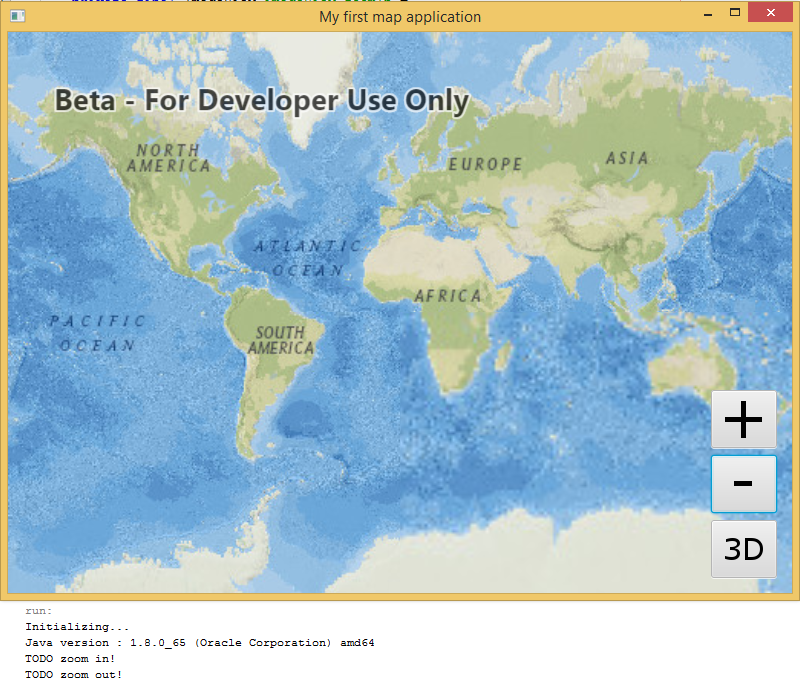
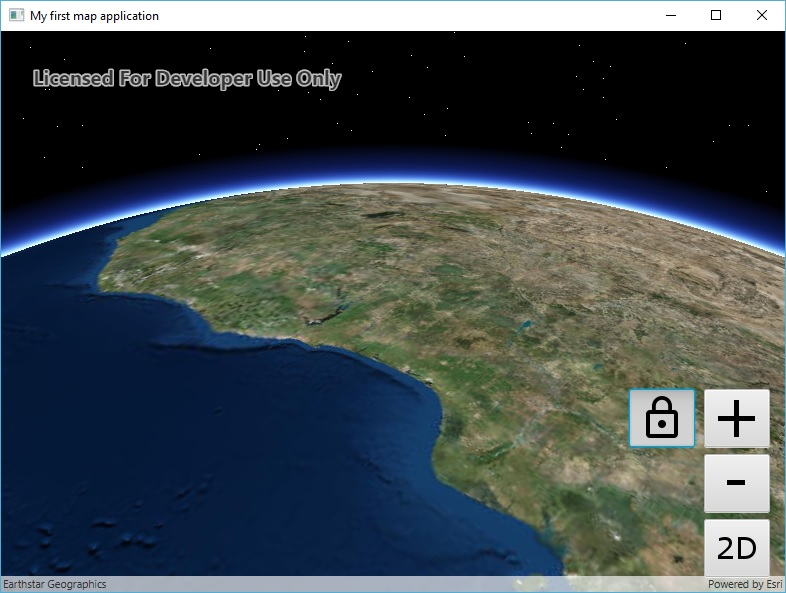

# Exercise 2: Add Zoom In and Zoom Out Buttons (Java)

This exercise walks you through the following:
- Add zoom in and zoom out buttons to the UI
- Zoom in and out on the map and the scene
- Add a button for locking the scene's focus point

Prerequisites:
- Complete [Exercise 1](Exercise%201%20Map%20and%20Scene.md), or get the Exercise 1 code solution compiling and running properly, preferably in an IDE.

If you need some help, you can refer to [the solution to this exercise](../../solutions/Java/Ex2_ZoomButtons), available in this repository.

## Add zoom in and zoom out buttons to the UI
1. If desired, make a copy of your Exercise 1 class. Just make sure you're running your Exercise 2 code as you complete this exercise.
1. In your class, before your constructor, instantiate two buttons: one for zooming in, and one for zooming out:

    ```
    private final ImageView imageView_zoomIn =
            new ImageView(new Image(WorkshopApp.class.getResourceAsStream("/resources/zoom_in.png")));
    private final ImageView imageView_zoomOut =
            new ImageView(new Image(WorkshopApp.class.getResourceAsStream("/resources/zoom_out.png")));
    private final Button button_zoomIn = new Button(null, imageView_zoomIn);
    private final Button button_zoomOut = new Button(null, imageView_zoomOut);
    ```
    
1. In your `start(Stage)` method, after adding the MapView and 2D/3D toggle button to the UI, add the zoom in and zoom out buttons to the UI, near the 2D/3D toggle button in the lower right corner:

    ```
    AnchorPane.setRightAnchor(button_zoomOut, 15.0);
    AnchorPane.setBottomAnchor(button_zoomOut, 80.0);
    AnchorPane.setRightAnchor(button_zoomIn, 15.0);
    AnchorPane.setBottomAnchor(button_zoomIn, 145.0);
    anchorPane.getChildren().addAll(button_zoomOut, button_zoomIn);
    ```
    
1. Create `private void` event handler methods for the zoom in and zoom out buttons. Add a `System.out.println` to each event handler for now, just to verify that the buttons work:

    ```
    private void button_zoomIn_onAction() {
        System.out.println("TODO zoom in!");
    }
    
    private void button_zoomOut_onAction() {
        System.out.println("TODO zoom out!");
    }
    ```
    
1. In your constructor, set the zoom buttons' `onAction` handlers to call the event handler methods you just created:

    ```
    button_zoomIn.setOnAction(event -> button_zoomIn_onAction());
    button_zoomOut.setOnAction(event -> button_zoomOut_onAction());
    ```
    
1. Compile and run your app. Verify that the zoom buttons display on top of the map, that they do not block the 2D/3D toggle button, and that the event handler methods are called when you click them:

    

## Zoom in and out on the map and the scene

1. In ArcGIS Runtime, zooming on a map and zooming on a scene use simple but quite different mechanisms. We'll talk more about those mechanisms later, but for now, get ready to zoom by creating an empty `private void zoomMap(double)` method and a `private void zoomScene(double)` method in your class. For each of these methods, it's a good idea to name the parameter `factor`.

1. Rather than having your event handlers call `zoomMap` and `zoomScene` directly, you can simplify your code by creating a generic `zoom(double)` method that calls `zoomMap` or `zoomScene` depending on whether you're currently in 2D mode or 3D mode:

    ```
    private void zoom(double factor) {
        if (threeD) {
            zoomScene(factor);
        } else {
            zoomMap(factor);
        }
    }
    ```
    
1. In your zoom button event handler methods, replace the `System.out.println` call with a call to `zoom(double)` with a _factor_. Use a factor between 0 and 1 to zoom out, and use a factor greater than 1 to zoom in:

    ```
    private void button_zoomIn_onAction() {
        zoom(2.0);
    }
    
    private void button_zoomOut_onAction() {
        zoom(0.5);
    }
    ```
    
1. For the ArcGIS Runtime 2D `MapView`, the zoom mechanism is relatively simple: get the map scale, divide it by a factor, and use the quotient to set the `MapView`'s viewpoint scale. Create a new `zoomMap(double)` method and add this code to it:

    ```
    mapView.setViewpointScaleAsync(mapView.getMapScale() / factor);
    ```

1. Create a private method called `getSceneTarget()` that returns the point on Earth's surface on which the camera is currently focusing. You can use this method for zooming and also the lock focus button you will add later:

    ```
    private Geometry getSceneTarget() {
        return sceneView.getCurrentViewpoint(Viewpoint.Type.CENTER_AND_SCALE).getTargetGeometry();
    }
    ```
    
1. 3D is awesome, but it is almost always more complicated than 2D, and zooming is no exception. ArcGIS Runtime's 3D `SceneView` uses a _viewpoint_ with a _camera_ to change the user's view of the scene. Objects of type `Camera` are immutable and have a fluent API, so you can get a copy of the `SceneView`'s current viewpoint camera, use a factor to move it toward or away from the camera's current target, and use it as the `SceneView`'s new viewpoint camera. You can even animate the camera's movement and specify the duration of the animated camera movement (the code that follows uses `0.5f` to animate for half a second). In this case, we will use the `Camera`'s `zoomToward` method to create a new `Camera`. Create a new `zoomScene(double)` method and add the following code to it. As you do, make sure you import `com.esri.arcgisruntime.geometry.Point` and `com.esri.arcgisruntime.mapping.view.Camera` instead of some other `Point` and `Camera` classes:

    ```
    Geometry target = getSceneTarget();
    if (target instanceof Point) {
        Camera camera = sceneView.getCurrentViewpointCamera()
                .zoomToward((Point) target, factor);
        sceneView.setViewpointCameraAsync(camera, 0.5f);
    } else {
        // This shouldn't happen, but in case it does...
        Logger.getLogger(WorkshopApp.class.getName()).log(Level.WARNING,
                "SceneView.getCurrentViewpoint returned {0} instead of {1}",
                new String[] { target.getClass().getName(), Point.class.getName() });
    }
    ```
    
1. Compile and run your app. Verify that the zoom in and out buttons work in both 2D mode and 3D mode.

## Add a button for locking the scene's focus point

This portion of the exercise will teach you how to use _camera controllers_ in ArcGIS Runtime.

1. In WorkshopApp.java, declare two new final fields: an `ImageView` that for `lock.png`, and a `ToggleButton` for the new `ImageView`:

    ```
    private final ImageView imageView_lockFocus =
            new ImageView(new Image(WorkshopApp.class.getResourceAsStream("/resources/lock.png")));
    private final ToggleButton toggleButton_lockFocus = new ToggleButton(null, imageView_lockFocus);
    ```

1. In `start(Stage)`, place the lock focus button in the UI. In this example, the button goes to the left of the zoom in button:

    ```
    AnchorPane.setRightAnchor(toggleButton_lockFocus, 90.0);
    AnchorPane.setBottomAnchor(toggleButton_lockFocus, 145.0);
    /**
     * You can edit your addAll call to include the new button,
     * or just call addAll again with only the new button.
     */
    anchorPane.getChildren().addAll(button_zoomOut, button_zoomIn, toggleButton_lockFocus);
    ```

1. In your constructor, connect your new button to a listener method that you will create later. Also, disable the new button, since the 3D scene has not yet been set up:

    ```
    toggleButton_lockFocus.setOnAction(event -> toggleButton_lockFocus_onAction());
    toggleButton_lockFocus.setDisable(true);
    ```

1. In your 2D/3D toggle listener method, you previously wrote code where you instantiate an `ArcGISScene` and a `SceneView`. In that code block, enable the new lock focus toggle button when the scene is set up:

    ```
    toggleButton_lockFocus.setDisable(false);
    ```

1. Create a `private void` event listener method that you attached to the button in the previous step:

    ```
    private void toggleButton_lockFocus_onAction() {
    
    }
    ```

1. In `toggleButton_lockFocus_onAction()`, add an `if-else` statement for whether or not the button is selected:

    ```
    if (toggleButton_lockFocus.isSelected()) {
    
    } else {
    
    }
    ```

1. If the button is NOT selected, it's only one line of code to set the `SceneView`'s camera controller to a default `GlobeCameraController`. Insert this line in your new `else` block:

    ```
    sceneView.setCameraController(new GlobeCameraController());
    ```

1. If the button IS selected, you need to give the `SceneView` a new `OrbitLocationCameraController`, which locks the camera's focus on a given point. `OrbitLocationCameraController`'s constructor takes two arguments:

    1. The target point on Earth's surface. You can use the current camera's target point by calling your `getSceneTarget()` method.
    1. The distance (in meters) from the target at which the camera should be placed. ArcGIS Runtime's `GeometryEngine` lets you calculate the x/y distance in meters between two points, but the constructor needs an x/y/z distance, which you can calculate using the [Pythagorean theorem](https://en.wikipedia.org/wiki/Pythagorean_theorem) (did we mention that this workshop would require junior high school math?).

    The following steps will help you set up this camera controller.

1. In your empty `if` block, get the scene target, verify that it is of type `Point`, and cast it to `Point`:

    ```
    Geometry target = getSceneTarget();
    if (target instanceof Point) {
        final Point targetPoint = (Point) target;
        
    }
    ```

1. After getting `targetPoint`, get the `SceneView`'s current camera and its location, and verify that the location is not null:

    ```
    final Camera currentCamera = sceneView.getCurrentViewpointCamera();
    Point currentCameraPoint = currentCamera.getLocation();
    if (null != currentCameraPoint) {
        
    }
    ```

1. If the current camera point is not null, use [`GeometryEngine.distanceGeodetic(Point, Point, LinearUnit, AngularUnit, GeodeticCurveType)`](https://developers.arcgis.com/java/latest/api-reference/reference/com/esri/arcgisruntime/geometry/GeometryEngine.html#distanceGeodetic(com.esri.arcgisruntime.geometry.Point%2C%20com.esri.arcgisruntime.geometry.Point%2C%20com.esri.arcgisruntime.geometry.LinearUnit%2C%20com.esri.arcgisruntime.geometry.AngularUnit%2C%20com.esri.arcgisruntime.geometry.GeodeticCurveType)) to calculate the ground distance between the target point and the x/y part of the current camera location. Then use the Pythagorean theorem to calculate the distance from the target point and the current camera:

    ```
    final double xyDistance = GeometryEngine.distanceGeodetic(targetPoint, currentCameraPoint,
            new LinearUnit(LinearUnitId.METERS),
            new AngularUnit(AngularUnitId.DEGREES),
            GeodeticCurveType.GEODESIC
    ).getDistance();
    final double zDistance = currentCameraPoint.getZ();
    final double distanceToTarget = Math.sqrt(Math.pow(xyDistance, 2.0) + Math.pow(zDistance, 2.0));
    ```

1. Create a new [`OrbitLocationCameraController`](https://developers.arcgis.com/java/latest/api-reference/reference/com/esri/arcgisruntime/mapping/view/OrbitLocationCameraController.html) with the target point and distance you calculated. Set its heading and pitch from the current camera. Then give the `SceneView` the camera controller you created:

    ```
    final OrbitLocationCameraController cameraController = new OrbitLocationCameraController(
            (Point) target, distanceToTarget
    );
    cameraController.setCameraHeadingOffset(currentCamera.getHeading());
    cameraController.setCameraPitchOffset(currentCamera.getPitch());
    sceneView.setCameraController(cameraController);
    ```
    
1. Run your app. Switch to 3D mode, navigate to a point where you want to lock, and click the lock button. Verify that navigation now focuses on the target point. Click the lock button again and verify that normal navigation is restored:

    
    
## How did it go?

If you have trouble, **refer to the solution code**, which is linked near the beginning of this exercise. You can also **submit an issue** in this repo to ask a question or report a problem. If you are participating live with Esri presenters, feel free to **ask a question** of the presenters.

If you completed the exercise, congratulations! You learned how to add buttons that programmatically zoom in and out on a 2D map and a 3D scene, as well as how to work with camera controllers.

Ready for more? Choose from the following:
- Start on [**Exercise 3: Add Operational Layers**](Exercise%203%20Operational%20Layers.md).
- We used `OrbitLocationCameraController`, which causes navigation to orbit around a fixed location. [`OrbitGeoElementCameraController`](https://developers.arcgis.com/java/latest/api-reference/reference/com/esri/arcgisruntime/mapping/view/OrbitGeoElementCameraController.html) causes navigation to orbit around a [`GeoElement`](https://developers.arcgis.com/java/latest/api-reference/reference/com/esri/arcgisruntime/mapping/GeoElement.html), whose location can move. See if you can figure out how to make the camera focus on a moving point.
