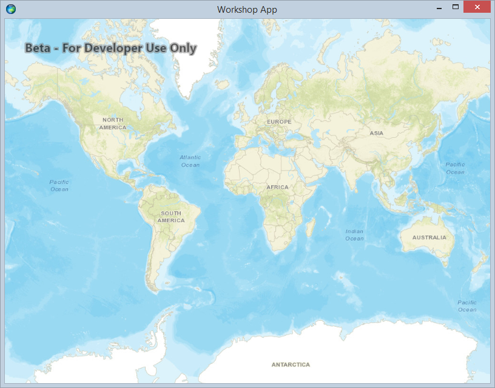
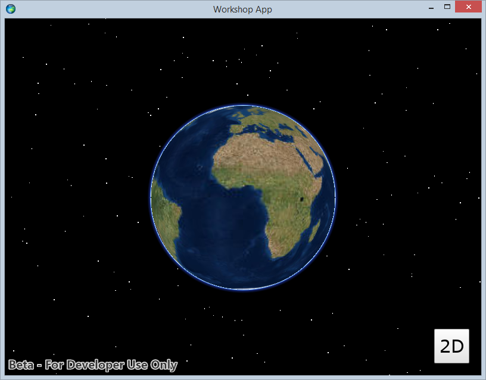

# Exercise 1: Map and Scene (Qt Quick)

This exercise walks you through the following:
- Create a new Qt Quick app with ArcGIS Runtime
- Add a 3D scene to the app, and use a toggle button to switch between 2D and 3D

Prerequisites:
- Meet [the system requirements for the ArcGIS Runtime SDK for Qt](https://developers.arcgis.com/qt/latest/qml/guide/arcgis-runtime-sdk-for-qt-system-requirements.htm), including the need for OpenSSL. **_Important: use OpenSSL 1.0.2 with Qt 5.6 through 5.9! OpenSSL 1.1.0 does not work with those releases of Qt!_**
- Install Qt Creator. Refer to the ArcGIS Runtime system requirements for supported versions of Qt and Qt Creator. If you use Windows, you need to use a Qt kit for Visual Studio, rather than a Qt kit for MinGW, and you need to open Qt Creator from a Visual Studio command prompt.
- Install the ArcGIS Runtime SDK 100.2.1 for Qt. Go to [the ArcGIS Runtime SDK for Qt home page](https://developers.arcgis.com/qt/latest/) and click **Download SDK** if you haven't downloaded the SDK. Go to [the ArcGIS Runtime SDK for Qt guide](https://developers.arcgis.com/qt/latest/qml/guide/arcgis-runtime-sdk-for-qt.htm) and expand **Get started** to see links to the install instructions. Follow all of the applicable install instructions in order to configure Runtime with Qt Creator. (Note: there is no need to follow the Android portion of the instructions if you're not deploying to Android for this workshop.)
- This exercise was developed for Windows. If you would like to deploy to a different platform, such as Linux, Mac, Android, or iOS, additional setup may be required.

If you need some help, you can refer to [the solution to this exercise](../../../solutions/Qt/Qt%20Quick/Ex1_MapAndScene), available in this repository.

## Create a new Qt Quick app with ArcGIS Runtime

1. In Qt Creator, create a new **ArcGIS Runtime Qt Quick app** project. Go through the wizard to create the project. Do not check the **3D project** checkbox (we will add 3D to the app in a different way).

1. Add OpenSSL support to your app by adding the following lines to your project's `.pro` file:

    ```
    OPENSSL_LIBS = /path/to/openssl/lib
    OPENSSL_INCLUDE = /path/to/openssl/include

    LIBS += -L$$OPENSSL_LIBS
    INCLUDEPATH += $$OPENSSL_INCLUDE
    ```
    
    Adding OpenSSL is necessary in order to use ArcGIS Online basemaps, which ArcGIS Runtime loads over HTTPS.

1. Run the project to verify that you see an app with a map:

    
    
1. Open `main.qml` in your project under `Resources/qml/qml.qrc/qml/main.qml`. The `Map` component contains the basemap that you chose while creating the project. Change it here in the QML code if desired. If you type `Basemap` and then `Ctrl+Space`, Qt Creator offers code completion to show you the different basemaps available. The vector basemaps, such as `BasemapTopographicVector`, are a good choice for the 2D map because they offer great performance and lower bandwidth requirements than traditional cached image maps.

## Add a 3D scene to the app, and use a toggle button to switch between 2D and 3D

1. Add a property to your `ApplicationWindow` to track the 2D/3D state:

    ```
    property bool threeD: false
    ```
    
1. Give your `MapView` an ID:

    ```
    MapView {
        id: mapView
        ...
    }
    ```
    
1. After your `MapView`, add an invisible `SceneView` that fills the window just like the `MapView`. Give its scene a basemap, such as `BasemapImagery`:

    ```
    SceneView {
        id: sceneView
        anchors.fill: parent
        visible: false

        Scene {
            BasemapImagery {}
        }
    }
    ```

1. Add to your `Scene` a `Surface` that uses an `ArcGISTiledElevationSource` to give the scene some 3D terrain:

    ```
    Surface {
        ArcGISTiledElevationSource {
            url: "http://elevation3d.arcgis.com/arcgis/rest/services/WorldElevation3D/Terrain3D/ImageServer"
        }
    }
    ```
    
1. Download [the exercise images](../../../images) and add them to your project's `Resources.qrc` file, alongside the existing `AppIcon.png` file. In Qt Creator, right-click `Resources/Resources/Resources.qrc/Resources`, choose **Add Existing Files**, and select the files you downloaded. (Note: if you clone the repo, you can just copy the images from there instead of downloading again.)
    
1. After your `SceneView`, add a button to toggle between 2D and 3D:

    ```
    Button {
        id: button_toggle2d3d
        iconSource: "qrc:///Resources/three_d.png"
        anchors.right: mapView.right
        anchors.rightMargin: 20
        anchors.bottom: mapView.bottom
        anchors.bottomMargin: 20
    }
    ```
    
1. Add an `onClicked` handler to your button that 1) toggles the value of `threeD`, 2) toggles the visibility of the map view and scene view, and 3) changes the button's image:

    ```
    onClicked: {
        threeD = !threeD
        mapView.visible = !threeD
        sceneView.visible = threeD
        iconSource = "qrc:///Resources/" +
                (threeD ? "two" : "three") +
                "_d.png"
    }
    ```
    
1. Run your app. Verify that you can toggle between 2D and 3D:

    

## How did it go?

If you have trouble, **refer to the solution code**, which is linked near the beginning of this exercise. You can also **submit an issue** in this repo to ask a question or report a problem. If you are participating live with Esri presenters, feel free to **ask a question** of the presenters.

If you completed the exercise, congratulations! You learned how to add a 2D map and a 3D scene to an app, using ArcGIS Runtime.

Ready for more? Choose from the following:

- [**Exercise 2: Add Zoom In and Zoom Out Buttons**](Exercise%202%20Zoom%20Buttons.md)
- **Bonus**: the map and scene we added operate independently. When you pan the map, the scene does not move, and when you pan the scene, the map does not move. Can you figure out how to link the viewpoints of the map and the scene so that when you pan one, the other automatically pans? 2D and 3D use different mechanisms for panning and zooming, so watch out! Send us a pull request if you figure it out.