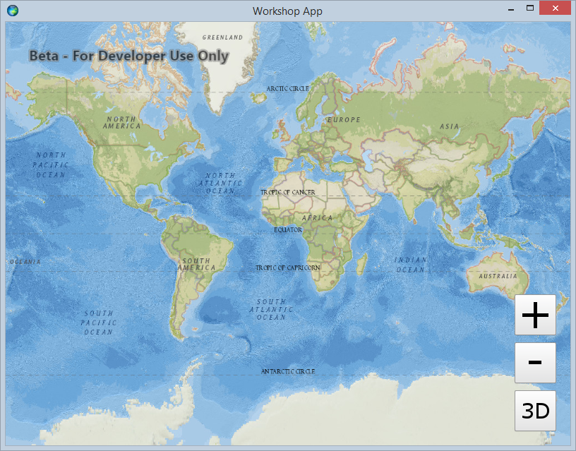
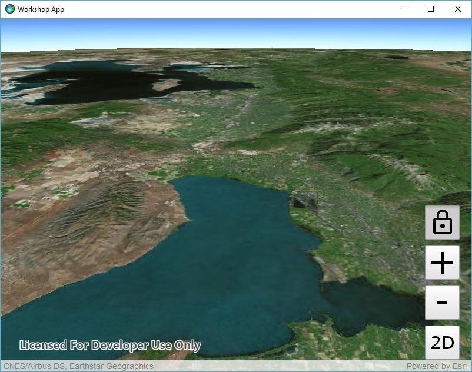

# Exercise 2: Add Zoom In and Zoom Out Buttons (Qt Quick)

This exercise walks you through the following:
- Add zoom in and zoom out buttons to the UI
- Zoom in and out on the map and the scene
- Add a button for locking the scene's focus point

Prerequisites:
- Complete [Exercise 1](Exercise%201%20Map%20and%20Scene.md), or get the Exercise 1 code solution compiling and running properly in Qt Creator.

If you need some help, you can refer to [the solution to this exercise](../../../solutions/Qt/Qt%20Quick/Ex2_ZoomButtons), available in this repository.

## Add zoom in and zoom out buttons to the UI

1. In your QML file, under `ApplicationWindow`, create a function called `zoom` that takes a parameter called `factor`. We will fill in this function later, but for now, just print to the console for debugging:

    ```
    function zoom(factor) {
        console.log("zoom factor: " + factor);
    }
    ```
    
1. After the 2D/3D toggle button, create zoom out and zoom in buttons that call your `zoom` function when clicked:

    ```
    Button {
        id: button_zoomOut
        iconSource: "qrc:///Resources/zoom_out.png"
        anchors.right: mapView.right
        anchors.rightMargin: 20
        anchors.bottom: button_toggle2d3d.top
        anchors.bottomMargin: 10

        onClicked: {
            zoom(0.5)
        }
    }
    
    Button {
        id: button_zoomIn
        iconSource: "qrc:///Resources/zoom_in.png"
        anchors.right: mapView.right
        anchors.rightMargin: 20
        anchors.bottom: button_zoomOut.top
        anchors.bottomMargin: 10

        onClicked: {
            zoom(2)
        }
    }
    ```
    
1. Run your app. Verify that the zoom buttons appear and that output is written to the log in Qt Creator when you click the new buttons:

    

## Zoom in and out on the map and the scene

1. Create a function for zooming the map and a function for zooming the scene:

    ```
    function zoomMap(factor) {
        mapView.setViewpointScale(mapView.mapScale / factor);
    }

    function zoomScene(factor) {
        var target = sceneView.currentViewpointCenter.center;
        var camera = sceneView.currentViewpointCamera.zoomToward(target, factor);
        sceneView.setViewpointCameraAndSeconds(camera, 0.5);
    }
    ```
    
1. In `zoom`, replace the `console.log` call with a call to either `zoomMap` or `zoomScene`, depending on whether we are in 2D mode or 3D mode:

    ```
    var zoomFunction = threeD ? zoomScene : zoomMap;
    zoomFunction(factor);
    ```
    
1. Run your app. Verify that the zoom in and zoom out buttons work on both the map and the scene.

## Add a button for locking the scene's focus point

This portion of the exercise will teach you how to use _camera controllers_ in ArcGIS Runtime.

1. In `main.qml`, after your zoom in and zoom out buttons, declare a button for toggling the lock focus. Make sure to set `checkable: true` so that the button will toggle. Include an empty `onClicked` handler that you will fill in later:

    ```
    Button {
        id: button_lockFocus
        iconSource: "qrc:///Resources/lock.png"
        anchors.right: mapView.right
        anchors.rightMargin: 20
        anchors.bottom: button_zoomIn.top
        anchors.bottomMargin: 10
        checkable: true
        
        onClicked: {
        
        }
    }
    ```

1. Before your new button, declare a default `GlobeCameraController` with no properties except `id`:

    ```
    GlobeCameraController {
        id: globeCameraController_default
    }
    ```

1. In the `onClicked` for your new button, add an `if-else` statement for whether or not the button is selected:

    ```
    if (button_lockFocus.checked) {

    } else {

    }
    ```

1. If the button is NOT selected, it's only one line of code to set the `SceneView`'s camera controller to the default `GlobeCameraController` you declared. Insert this line in your new `else` block:

    ```
    sceneView.cameraController = globeCameraController_default;
    ```

1. If the button IS selected, you need to give the `SceneView` a new `OrbitLocationCameraController`, which locks the camera's focus on a given point. `OrbitLocationCameraController`'s constructor takes two arguments:

    1. The target point on Earth's surface. You can use `sceneView.currentViewpointCenter.center` to access the current camera's target point.
    1. The distance (in meters) from the target at which the camera should be placed. ArcGIS Runtime's `GeometryEngine` lets you calculate the x/y distance in meters between two points, but the constructor needs an x/y/z distance, which you can calculate using the [Pythagorean theorem](https://en.wikipedia.org/wiki/Pythagorean_theorem) (did we mention that this workshop would require junior high school math?).

    The following steps will help you set up this camera controller.

1. In your empty `if` block, get the `SceneView`'s current camera and its location, and verify that the location is defined:

    ```
    var currentCamera = sceneView.currentViewpointCamera;
    var currentCameraPoint = currentCamera.location;
    if (currentCameraPoint) {

    }
    ```

1. If the current camera point is not null (i.e. in the new empty `if` block), use [`GeometryEngine.distanceGeodetic(Point, Point, LinearUnit, AngularUnit, GeodeticCurveType)`](https://developers.arcgis.com/qt/latest/qml/api-reference/qml-esri-arcgisruntime-geometryengine.html#distanceGeodetic-method) to calculate the ground distance between the target point and the x/y part of the current camera location. Then use the Pythagorean theorem to calculate the distance from the target point and the current camera:

    ```
    var xyDistance = GeometryEngine.distanceGeodetic(
                sceneView.currentViewpointCenter.center,
                currentCameraPoint,
                Enums.LinearUnitIdMeters,
                Enums.AngularUnitIdDegrees,
                Enums.GeodeticCurveTypeGeodesic
    ).distance;
    var zDistance = currentCameraPoint.z;
    var distanceToTarget = Math.sqrt(Math.pow(xyDistance, 2.0) + Math.pow(zDistance, 2.0));
    ```

1. Create a new [`OrbitLocationCameraController`](https://developers.arcgis.com/qt/latest/qml/api-reference/qml-esri-arcgisruntime-orbitlocationcameracontroller.html) with the target point and distance you calculated. Set its heading and pitch from the current camera. Then give the `SceneView` the camera controller you created:

    ```
    var cameraController = ArcGISRuntimeEnvironment.createObject("OrbitLocationCameraController", {
        targetLocation: sceneView.currentViewpointCenter.center,
        cameraDistance: distanceToTarget
    });
    cameraController.cameraHeadingOffset = currentCamera.heading;
    cameraController.cameraPitchOffset = currentCamera.pitch;
    sceneView.cameraController = cameraController;
    ```
    
1. Run your app. Switch to 3D mode, navigate to a point where you want to lock, and click the lock button. Verify that navigation now focuses on the target point. Click the lock button again and verify that normal navigation is restored:

    
    
## How did it go?

If you have trouble, **refer to the solution code**, which is linked near the beginning of this exercise. You can also **submit an issue** in this repo to ask a question or report a problem. If you are participating live with Esri presenters, feel free to **ask a question** of the presenters.

If you completed the exercise, congratulations! You learned how to add buttons that programmatically zoom in and out on a 2D map and a 3D scene.

Ready for more? Choose from the following:
- Start on [**Exercise 3: Add Operational Layers**](Exercise%203%20Operational%20Layers.md).
- We used `OrbitLocationCameraController`, which causes navigation to orbit around a fixed location. [`OrbitGeoElementCameraController`](https://developers.arcgis.com/qt/latest/qml/api-reference/qml-esri-arcgisruntime-orbitgeoelementcameracontroller.html) causes navigation to orbit around a [`GeoElement`](https://developers.arcgis.com/qt/latest/qml/api-reference/qml-esri-arcgisruntime-geoelement.html), whose location can move. See if you can figure out how to make the camera focus on a moving point.
