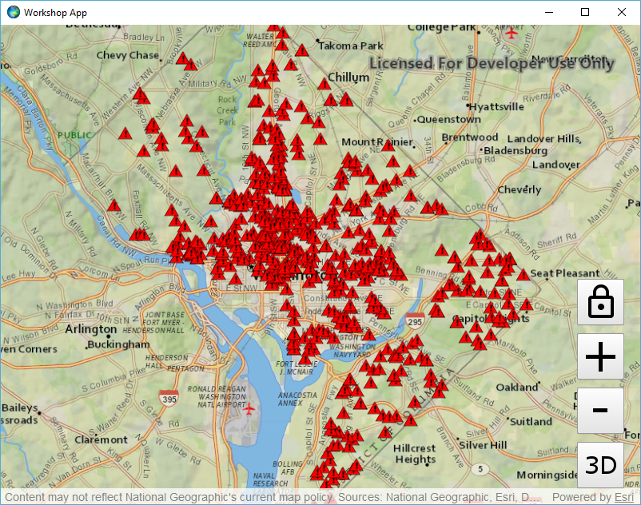
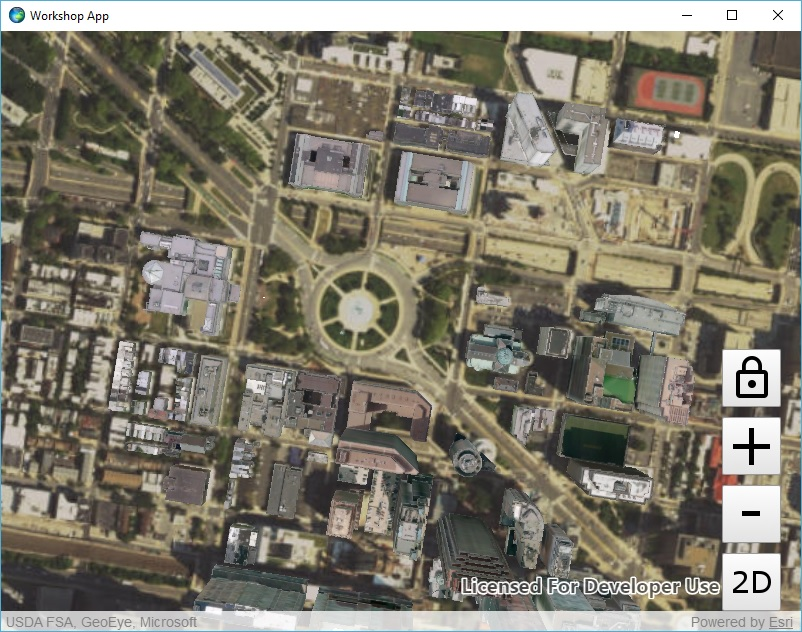
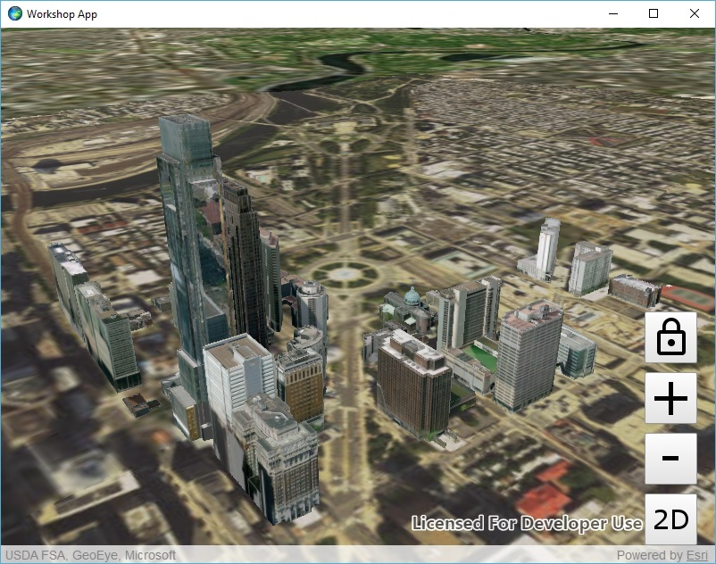

# Exercise 3: Add Operational Layers (Qt Quick)

This exercise walks you through the following:
- Add a layer from a mobile map package to the 2D map
- Add a scene layer to the 3D scene

Prerequisites:
- Complete [Exercise 2](Exercise%202%20Zoom%20Buttons.md), or get the Exercise 2 code solution compiling and running properly in Qt Creator.

If you need some help, you can refer to [the solution to this exercise](../../../solutions/Qt/Qt%20Quick/Ex3_OperationalLayers), available in this repository.

## Add a layer from a mobile map package to the 2D map

ArcGIS Runtime provides a variety of ways to add **operational layers** to the map and scene--feature services, dynamic map services, offline geodatabases, and mobile map packages, for example. In this exercise, you will use the newest of these: a mobile map package.

1. Download the [D.C. Crime Data mobile map package (`DC_Crime_Data.mmpk`)](../../../data/DC_Crime_Data.mmpk) that we have prepared for you. For this exercise, you can put it in your application working directory, leave it in your downloads directory, or put it anywhere that your app will be able to access it.

1. If you want your app to use a relative path to access the mobile map package, you need to set a _context property_ so that your QML code can access your working directory. In Qt Creator, under Sources, open your `.cpp` file. After the `QQmlApplicationEngine` object is instantiated, set a context property for the app's working directory:

    ```
    appEngine.rootContext()->setContextProperty("workingDirectory", QUrl::fromLocalFile(app.applicationDirPath()));
    ```
    
    _Setting this context property is unnecessary if you choose to hard-code the MMPK path in the next step._
    
    If you add this line of code to the .cpp file, you must also add an include at the top of the file:
    
    ```
    #include <QQmlContext>
    ```

1. In your QML file, declare a constant for the location of your downloaded MMPK:

    ```
    readonly property url mmpkPath: workingDirectory + "/../../../../../../data/DC_Crime_Data.mmpk"
    ```
    
    _`workingDirectory` refers to the context property set in the previous step. If you do not set this context property in C++, it will not exist in QML._

1. After your `MapView`, add a `MobileMapPackage`. Load it and set its map on your `MapView`. Don't forget to reset the basemap. Here's the code:

    ```
    MobileMapPackage {
        id: mmpk
        path: mmpkPath

        property var basemap: BasemapTopographicVector {}

        Component.onCompleted: {
            mmpk.load();
        }

        onLoadStatusChanged: {
            if (loadStatus === Enums.LoadStatusLoaded) {
                mapView.map = mmpk.maps[0];
                mapView.map.basemap = basemap;
            }
        }
    }
    ```
    
1. Run your app and verify that the map zooms to Washington, D.C., and that a layer of crime incidents appears on top of the basemap. The incidents appear as red triangles, which is the symbology specified in the mobile map package:

    

    _If the crime incidents do not appear, add code to `onLoadStatusChanged` to check for an object called [`loadError`](https://developers.arcgis.com/qt/latest/qml/api-reference/qml-esri-arcgisruntime-loadable.html#loadError-prop) and a string property called `loadError.message`, which may give you a clue about why the mobile map package did not display._

## Add a scene layer to the 3D scene

Web scene layers are cached web layers that are optimized for displaying a large amount of 2D and 3D features. Scene layers can be viewed in a variety of ArcGIS clients, including ArcGIS Runtime. Here you will add a scene layer to your 3D scene.

1. In your QML file, declare a constant for the URL of a scene service. You can use a `SceneServer` URL or an ArcGIS Online or Portal for ArcGIS item URL that represents a scene service. The following URL shows plain gray buildings in Washington, D.C.:

    ```
    readonly property url sceneServiceUrl: "https://www.arcgis.com/home/item.html?id=606596bae9e44394b42621e099ba392a"
    ```
    
    The following URL shows photo-realistic buildings in Philadelphia:
    
    ```
    readonly property url sceneServiceUrl: "https://www.arcgis.com/home/item.html?id=a7419641a50e412c980cf242c29aa3c0"
    ```

1. In your `Scene`, after the basemap and `Surface`, create a new `ArcGISSceneLayer` based on the scene service, and give the layer an event handler for when it is done loading:

    ```
    ArcGISSceneLayer {
        id: sceneLayer
        url: sceneServiceUrl
        onLoadStatusChanged: {

        }
    }
    ```

1. Inside this new event handler, if the layer has loaded, set your `SceneView`'s viewpoint to a new `Viewpoint` using the scene layer's full extent. Use the `ViewpointExtent` class, which extends `Viewpoint`:

    ```
    if (Enums.LoadStatusLoaded === loadStatus) {
        var viewpointExtent = ArcGISRuntimeEnvironment.createObject("ViewpointExtent", {
            extent: sceneLayer.fullExtent
        });
        sceneView.setViewpoint(viewpointExtent);
    }
    ```

1. Compile and run your app. Verify that when you switch to 3D, the scene displays the 3D buildings from the scene layer:

    

1. Remember in [Exercise 2](Exercise%202%20Zoom%20Buttons.md#zoom-in-and-out-on-the-map-and-the-scene) when you manipulated a `Camera` to zoom in and out? Here we will also use a `Camera`, but this time we will rotate the camera to provide an oblique view of the scene. We will focus the rotation on the current viewpoint's target point. The `Camera.rotateAround` method lets us specify a change in heading, pitch, and roll. After `rotateAround`, we will give the rotated `Camera` to the `SceneView`.

    Start by declaring a function in your `ArcGISSceneLayer`:
    
    ```
    function rotate() {
    
    }
    ```

1. In your `LoadStatusLoaded` listener that you added a few steps ago, before calling `setViewpoint`, connect the `SceneView`'s `setViewpointCompleted` signal to your new function:

    ```
    sceneView.setViewpointCompleted.connect(rotate);
    ```

1. You only want your `rotate` function to run the first time the viewpoint changes, so in your function, disconnect `setViewpointCompleted` from your `rotate` function:

    ```
    sceneView.setViewpointCompleted.disconnect(rotate);
    ```

1. After disconnecting the signal, rotate the `SceneView`'s camera around its center. Let's change the heading by 45 degrees and the pitch by 65 degrees. `rotateAround` returns a new camera rather than modifying the original camera, so we must then give the new camera to the `SceneView`:

    ```
    var camera = sceneView.currentViewpointCamera.rotateAround(
                sceneView.currentViewpointCenter.center, 45.0, 65.0, 0.0);
    sceneView.setViewpointCamera(camera);
    ```

1. Run your app. Verify that when you switch to 3D, the 3D buildings display and the view is rotated and pitched. Also try the built-in 3D navigation by holding the right mouse button and moving the mouse:

    
    
## How did it go?

If you have trouble, **refer to the solution code**, which is linked near the beginning of this exercise. You can also **submit an issue** in this repo to ask a question or report a problem. If you are participating live with Esri presenters, feel free to **ask a question** of the presenters.

If you completed the exercise, congratulations! You learned how to add a local feature layer from a mobile map package to a 2D map and a scene layer to a 3D scene.

Ready for more? Choose from the following:

- [**Exercise 4: Buffer a Point and Query Features**](Exercise%204%20Buffer%20and%20Query.md)
- **Bonus**: we used a mobile map package, but you can also add **feature services** to your map and scene. Go to [ArcGIS Online](http://www.arcgis.com/home/index.html), find a feature service URL (hint: a feature service URL has the term `FeatureServer` at or near the end of the URL), and use the `FeatureLayer` and `ServiceFeatureTable` classes to add the feature service to your map and/or globe. There is documentation for these classes on the ArcGIS developer site, and there are code samples on GitHub that might be helpful.