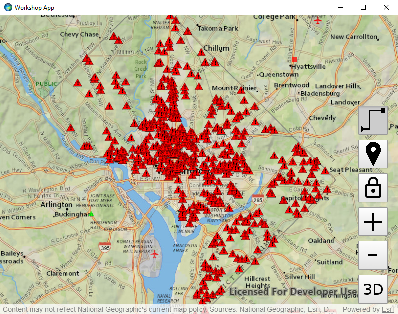
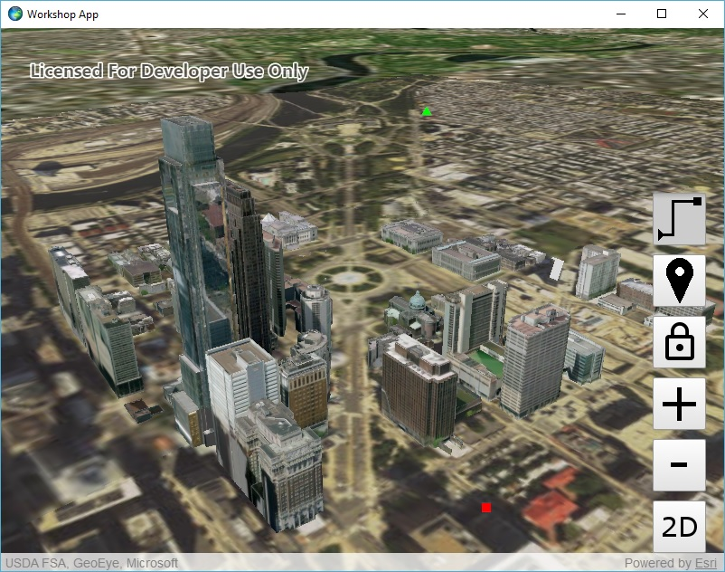
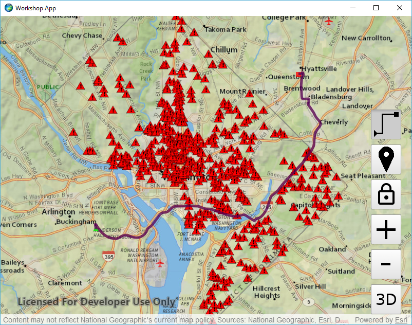
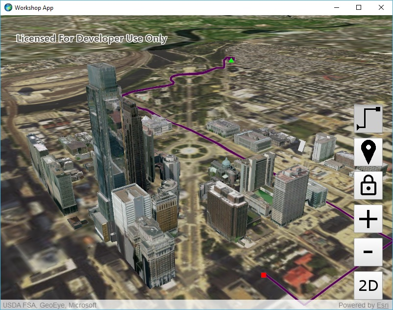

# Exercise 5: Routing (Qt Quick)

ArcGIS Runtime features the ability to run ArcGIS geoprocessing for analysis and data management. The `GeoprocessingTask` class lets you call any geoprocessing service and many geoprocessing packages (.gpk). ArcGIS Runtime provides more specific support for certain types of geoprocessing, such as network routing using Network Analyst services or local network datasets. By learning how to use routing in this exercise, you will learn key skills that will help you use other geoprocessing capabilities that ArcGIS Runtime supports.

This exercise walks you through the following:
- Get the user to click an origin point and a destination point
- Calculate a driving route from the origin to the destination
- Display the route on the map or scene

Prerequisites:
- Complete [Exercise 4](Exercise%204%20Buffer%20and%20Query.md), or get the Exercise 4 code solution compiling and running properly in Qt Creator.

If you need some help, you can refer to [the solution to this exercise](../../../solutions/Qt/Qt%20Quick/Ex5_Routing), available in this repository.

## Get the user to click an origin point and a destination point

After doing Exercise 4, this should seem familiar to you.

1. Create symbols for the origin point, destination point, and route line:

    ```
    SimpleMarkerSymbol {
        id: routeOriginSymbol
        style: Enums.SimpleMarkerSymbolStyleTriangle
        color: "#FF00FF00"
        size: 10
    }
    SimpleMarkerSymbol {
        id: routeDestinationSymbol
        style: Enums.SimpleMarkerSymbolStyleSquare
        color: "#FFFF0000"
        size: 10
    }
    SimpleLineSymbol {
        id: routeLineSymbol
        style: Enums.SimpleLineSymbolStyleSolid
        color: "#FF550055"
        width: 5
    }
    ```

1. Add a toggle button to enable routing:

    ```
    Button {
        id: button_routing
        iconSource: "qrc:///Resources/routing.png"
        anchors.right: mapView.right
        anchors.rightMargin: 20
        anchors.bottom: button_bufferAndQuery.top
        anchors.bottomMargin: 10
        checkable: true
    }
    ```
    
1. Create two `GraphicsOverlay` objects for routing, one for the map and one for the scene:

    ```
    GraphicsOverlay {
        id: mapRouteGraphics
    }
    GraphicsOverlay {
        id: sceneRouteGraphics
        sceneProperties: LayerSceneProperties {
            surfacePlacement: Enums.SurfacePlacementDraped
        }
    }
    ```
    
1. Declare a variable property to store the first point the user clicks:

    ```
    property var originPoint: undefined
    ```

1. In your `MapView` `Component.onCompleted` code, you added the buffer and query map graphics overlay. Do the same with your map route graphics overlay:

    ```
    graphicsOverlays.append(mapRouteGraphics)
    ```
    
1. Add your scene route graphics overlay to your `SceneView`:

    ```
    Component.onCompleted: {
        graphicsOverlays.append(sceneRouteGraphics)
    }
    ```
    
1. In the `onClicked` code in your 2D/3D toggle button, set `originPoint` to `undefined` so that we don't try to use an origin from the 2D map with a destination from the 3D scene or vice versa:

    ```
    originPoint = undefined;
    ```
    
1. In your buffer and query button, add an `onCheckedChanged` listener, and set the routing button to unchecked if the buffer and query button is checked. _Note: if we had more than two toggle buttons, we would want to do something smarter than this. Since this exercise is not about building a UI, we're naïvely assuming there will only ever be two toggle buttons._

    ```
    onCheckedChanged: {
        if (checked) {
            button_routing.checked = false;
        }
    }
    ```
    
1. In your routing button, add an `onCheckedChanged` listener, and set the buffer and query button to unchecked if the routing button is checked:

    ```
    onCheckedChanged: {
        if (checked) {
            button_bufferAndQuery.checked = false
        }
    }
    ```
    
1. Create a function called `addStopToRoute` that takes a mouse event parameter, converts it to a geographic point, adds it to the map or scene as a graphic, and either saves it as an origin point or calculates the route if an origin point already exists. For now, we'll do everything but actually calculate the route. Start by declaring the method and checking to see if it's a left mouse click:

    ```
    function addStopToRoute(event) {
        if (Qt.LeftButton === event.button) {
        
        }
    }
    ```
    
1. In `addStopToRoute`, inside the `if` block,  call `getGeoPoint` to convert the mouse event to a geographic `Point`. Remove the point's z-value if present, since a z-value will cause the routing not to work:

    ```
    var point = getGeoPoint(event);
    if (point.hasZ) {
        point = ArcGISRuntimeEnvironment.createObject("Point", {
            x: point.x,
            y: point.y,
            spatialReference: point.spatialReference
        });
    }
    ```
    
1. After getting the point (and after the `if (point.hasZ)` block), get the list of route graphics, depending on whether or not we are in 3D mode:

    ```
    var graphics = (threeD ? sceneRouteGraphics : mapRouteGraphics).graphics;
    ```
    
1. After getting the graphics, create an `if-else` statement that determines whether or not `originPoint` is `undefined`:

    ```
    if (!originPoint) {
    
    } else {
    
    }
    ```
    
1. If `originPoint` is `undefined`, then this is the first route point the user has clicked. Save the point as `originPoint`, clear the graphics, and add `originPoint` as a graphic:

    ```
    originPoint = point;
    graphics.clear();
    graphics.append(ArcGISRuntimeEnvironment.createObject("Graphic", {
        geometry: point,
        symbol: routeOriginSymbol
    }));
    ```
    
1. If `originPoint` is not `undefined`, then this is the second route point the user has clicked. Add the point as a graphic, and then reset the routing by setting `originPoint` to `undefined`. It is in this block that you will write the code that calculates the route, but you will write that code later in this exercise. For now, just add the graphic and set `originPoint` to `undefined`:

    ```
    graphics.append(ArcGISRuntimeEnvironment.createObject("Graphic", {
        geometry: point,
        symbol: routeDestinationSymbol
    }));
    originPoint = undefined;
    ```
    
1. In your `MapView` `onMouseClicked`, if the buffer and query button is checked, you're calling `bufferAndQuery`. Add an `else if` block to call `addStopToRoute` if the routing button is checked:

    ```
    } else if (button_routing.checked) {
        addStopToRoute(event);
    }
    ```
    
1. Add a similar `onMouseClicked` to the `SceneView`, except make this one only handle routing, not buffering and querying:

    ```
    onMouseClicked: function (event) {
        if (button_routing.checked) {
            addStopToRoute(event);
        }
    }
    ```

1. Run your app. Verify that you can toggle on the routing button, click an origin point, click a destination point, and see both points displayed. Verify this behavior in both 2D and 3D:

    

    
    
## Display the route on the map or scene

1. Set your routing button to be invisible until routing is enabled:

    ```
    visible: false
    ```

1. Create a variable property to store routing parameters:

    ```
    property var routeParameters: undefined
    ```
    
1. Create a `RouteTask` object and use an ArcGIS Online username and password. _Note: in this exercise, we're naïvely hard-coding our username and password. Don't do that! It is too easy for someone to decompile your code. There are at least three better options: use an OAuth 2.0 user login, use an OAuth 2.0 app login, or challenge the user for credentials. For now, since the exercise is about routing and not security, just hard-code the username and password._ Also, load the `RouteTask`. Here is the code to add to ApplicationWindow:

    ```
    RouteTask {
        id: routeTask
        url: "http://route.arcgis.com/arcgis/rest/services/World/Route/NAServer/Route_World"
        // Don't store your username and password in production code!
        credential: Credential {
            username: "myUsername"
            password: "myPassword"
        }
        
        Component.onCompleted: {
            load();
        }
    }
    ```
    
1. Add to your `RouteTask` an `onLoadStatusChanged` handler that creates default route parameters when the route task is loaded:

    ```
    onLoadStatusChanged: {
        if (Enums.LoadStatusLoaded === loadStatus) {
            createDefaultParameters();
        }
    }
    ```
    
1. Add to your `RouteTask` an `onCreateDefaultParametersStatusChanged` handler that sets the route parameters when the default route parameters have been created, as well as making the routing button visible:

    ```
    onCreateDefaultParametersStatusChanged: {
        if (Enums.TaskStatusCompleted === createDefaultParametersStatus) {
            routeParameters = createDefaultParametersResult;
            button_routing.visible = true;
        }
    }
    ```
    
1. Add to your `RouteTask` an `onSolveRouteStatusChanged` handler that adds graphics to the map or scene when a route has been calculated:

    ```
    onSolveRouteStatusChanged: {
        if (Enums.TaskStatusCompleted === solveRouteStatus && solveRouteResult && 0 < solveRouteResult.routes.length) {
            var routeGraphic = ArcGISRuntimeEnvironment.createObject("Graphic", {
                geometry: solveRouteResult.routes[0].routeGeometry,
                symbol: routeLineSymbol
            });
            (threeD ? sceneRouteGraphics : mapRouteGraphics).graphics.append(routeGraphic);
        } else if (error) {
            console.log("Error: " + error.message);
        }
    }
    ```
    
1. In your `addStopToRoute` function, you have an `else` block that adds a graphic and sets `originPoint` to `undefined`. After adding the graphic and before setting `originPoint` to `undefined`, clear the route parameters's stops, add both `originPoint` and `point` as stops, and solve the route:

    ```
    routeParameters.clearStops();
    var stops = [];
    [originPoint, point].forEach(function (p) {
        stops.push(ArcGISRuntimeEnvironment.createObject("Stop", {
            geometry: p
        }));
    });
    routeParameters.setStops(stops);
    routeTask.solveRoute(routeParameters);
    ```
    
1. Run your app. Verify that you can calculate and display a route in both 2D and 3D:

    
    
    
    
## How did it go?

If you have trouble, **refer to the solution code**, which is linked near the beginning of this exercise. You can also **submit an issue** in this repo to ask a question or report a problem. If you are participating live with Esri presenters, feel free to **ask a question** of the presenters.

If you completed the exercise, congratulations! You learned how to calculate a driving route using a web service and display the route on the map.

Ready for more? Choose from the following bonus challenges:
- Instead of hard-coding your ArcGIS Online username and password, challenge the user for a username and password. This is more of a UI problem than an ArcGIS problem; just get the username and password in a dialog or something and use them to create a `Credential` object.
- In fact, you can do even better than creating your own username/password dialog. A wise user will feel nervous about typing his or her username and password into an arbitrary app. You can give the user some reassurance by implementing an OAuth 2.0 user login, in which ArcGIS Online (or ArcGIS Enterprise) generates a login page, which you display in a web control. That way, your program never directly handles the username and password, but you get back a short-lived token that you can use to authenticate to ArcGIS services. See if you can implement an OAuth 2.0 user login for the routing.
- Allow the user to add more than two points for the route.
- Allow the user to add barriers in addition to stops.
- Look at the properties you can set on [`RouteParameters`](https://developers.arcgis.com/qt/latest/qml/api-reference/qml-esri-arcgisruntime-routeparameters.html) and try a few of them to change the routing behavior.

That concludes the exercises for this workshop. Well done!