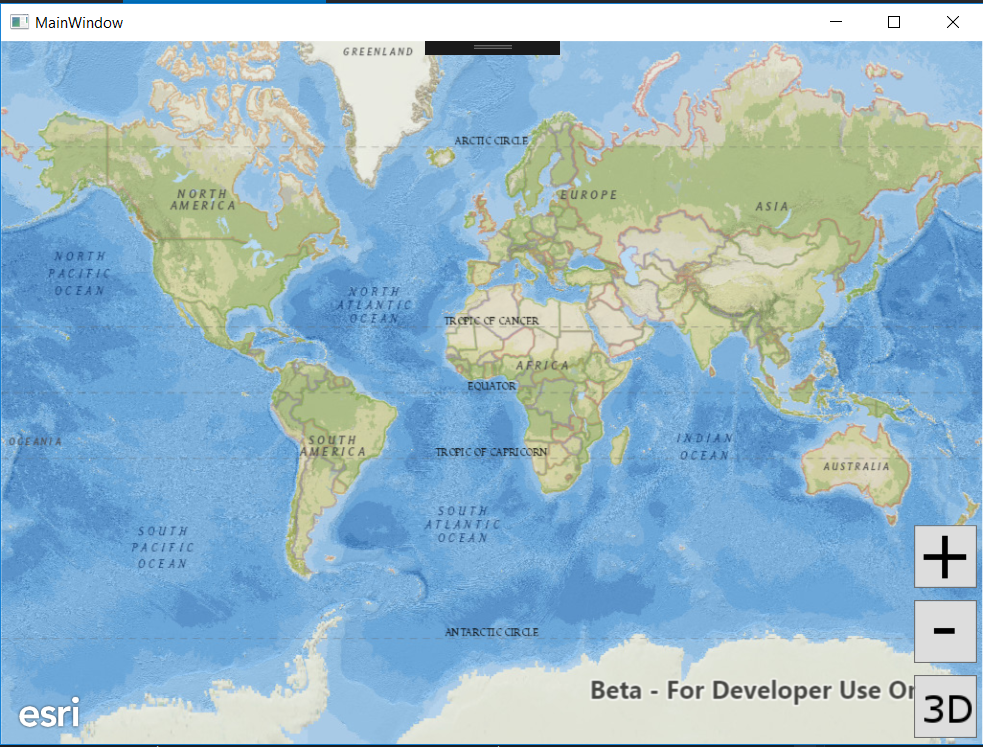

# Exercise 2: Add Zoom In and Zoom Out Buttons (.NET C#)

This exercise walks you through the following:
- Add zoom in and zoom out buttons to the UI
- Zoom in and out on the map and the scene
- Adding lock focus to a 3D scene

Prerequisites:
- Complete [Exercise 1](Exercise 1 Map and Scene.md), or get the Exercise 1 code solution compiling and running properly, preferably in an IDE.

If you need some help, you can refer to [the solution to this exercise](../../solutions/dotNETWPF/Ex2_ZoomButtons), available in this repository.

## Add zoom in and zoom out buttons to the UI
1. If desired, make a copy of your Exercise 1 or continue to use the Exercise 1 solution. Just make sure you're running your Exercise 2 code as you complete this exercise.
1. First let's create our two new buttons for zoom in and zoom out within the UI so go to MainWindow.xaml and add the following above the creation of the viewbutton from exercise 1:

    ```
    <Button x:Name="ZoomInButton" Width="50" Height="50" Padding="1" HorizontalAlignment="Right" Margin="0,5,12.4,5" Content="{DynamicResource ZoomIn}"/>
    <Button x:Name="ZoomOutButton" Width="50" Height="50" Padding="1" HorizontalAlignment="Right" RenderTransformOrigin="-0.919,0.469" Margin="0,5,12.4,5" Content="{DynamicResource ZoomOut}"/>

    ```
 
1. Create the click event for each button by typing click= and use tab to create the code in MainWindow.xaml.cs.  Your xaml will look like:

    ```
    <Button x:Name="ZoomInButton" Click="ZoomInButton_Click"  Width="50" Height="50" Padding="1" HorizontalAlignment="Right" Margin="0,5,5,5" Content="{DynamicResource ZoomIn}"/>
    <Button x:Name="ZoomOutButton" Click="ZoomOutButton_Click" Width="50" Height="50" Padding="1" HorizontalAlignment="Right" RenderTransformOrigin="-0.919,0.469" Margin="0,5,5,5" Content="{DynamicResource ZoomOut}"/>

    ```
    And the MainWindow.xaml.cs will have two new methods that look like:
     ```
     private void ZoomOutButton_Click(object sender, RoutedEventArgs e)
        {

        }

        private void ZoomInButton_Click(object sender, RoutedEventArgs e)
        {

        }
      ```
    
1. Compile and run your app. Verify that the zoom buttons display on top of the map, that they do not block the 2D/3D toggle button, and that the event handler methods are called when you click them:

    

## Zoom in and out on the map and the scene

1. In ArcGIS Runtime, zooming on a map and zooming on a scene use simple but quite different mechanisms. We'll talk more about those mechanisms later, but for now, get ready to zoom by creating an empty `private void zoomMap(double factor)` method and a `private void zoomScene(double factor)` method in your class. For each of these methods, it's a good idea to name the parameter `factor`.

1. Rather than having your event handlers call `zoomMap` and `zoomScene` directly, you can simplify your code by creating a generic `zoom(double)` method that calls `zoomMap` or `zoomScene` depending on whether you're currently in 2D mode or 3D mode:

    ```
    private void zoom(double factor) {
        if (threeD) {
            zoomScene(factor);
        } else {
            zoomMap(factor);
        }
    }
    ```
    
1. In your zoom button event handler methods, call to `zoom(double)` with a _factor_. Use a factor between 0 and 1 to zoom out, and use a factor greater than 1 to zoom in:

    ```
    
        private void ZoomInButton_Click(object sender, RoutedEventArgs e)
        {
            zoom(2);
        }
        private void ZoomOutButton_Click(object sender, RoutedEventArgs e)
        {
            zoom(.5);
        }
    ```
    
1. For the ArcGIS Runtime 2D `MapView`, the zoom mechanism is relatively simple: get the map scale, divide it by a factor, and use the quotient to set the `MapView`'s viewpoint scale. Write the code for this operation inside the `zoomMap(double)` method:

    ```
    mapView.SetViewpointScaleAsync(mapView.GetCurrentViewpoint(ViewpointType.CenterAndScale).TargetScale / factor);
    ```
    
1. 3D is awesome, but it is almost always more complicated than 2D, and zooming is no exception. ArcGIS Runtime's 3D `SceneView` uses a _viewpoint_ with a _camera_ to change the user's view of the scene. Objects of type `Camera` are immutable and have a fluent API, so you can get a copy of the `SceneView`'s current viewpoint camera, use a factor to move it toward or away from the camera's current target, and use it as the `SceneView`'s new viewpoint camera. You can even animate the camera's movement and specify the duration of the animated camera movement (the code that follows uses a TimeSpan). In this case, we will use the `Camera`'s `zoomToward` method to create a new `Camera`. Add the following code to your `zoomScene(double)` method. 

    ```
    private void zoomScene(double factor)
        {
            Esri.ArcGISRuntime.Geometry.Geometry target = sceneView.GetCurrentViewpoint(ViewpointType.CenterAndScale).TargetGeometry;
            if (target.GeometryType == GeometryType.Point)
            {
                Camera camera = sceneView.Camera.ZoomToward((Esri.ArcGISRuntime.Geometry.MapPoint)target, factor);
                sceneView.SetViewpointCameraAsync(camera, new TimeSpan(1000));
            }
        }
    ```
    
1. Compile and run your app. Verify that the zoom in and out buttons work in both 2D mode and 3D mode.

## Add a button for locking the scene's focus point

This portion of the exercise will teach you how to use _camera controllers_ in ArcGIS Runtime.

1. First let's make sure that you have the images added to your MainWindow.xml that will be used on the new button that will be added. The images goes in the <Window.Resources> area of the xml.

    ```
        <Image x:Key="LockFocus" Source="images/lock.png" Stretch="Fill"/>
        <Image x:Key="LockFocusSelected" Source="images/lock_selected.png" Stretch="Fill"/>
    ```

1. Next we need to create a new button and put it on the UI.  So in MainWindow.xaml, in the <Grid></Grid> add a new area to put the next set of buttons in on the UI.  We will want a border, stackpanel, and a new button using the images we added above. Set the button's `IsEnabled` property to false so that it can't be clicked until the user has toggled to 3D at some point. Here is the code to insert in MainWindow.xaml:

    ```
    <Border VerticalAlignment="Bottom"
            Margin="0,0,65,0" Width="67" Height="180" HorizontalAlignment="Right">
        <StackPanel Margin="0" Width="72" VerticalAlignment="Top">
            <Button x:Name="LockButton" Click="LockButton_Click" Width="50" Height="50"
                    Padding="1" Margin="0,5,5,5" HorizontalAlignment="Right"
                    RenderTransformOrigin="4.054,-0.693"
                    Content="{DynamicResource LockFocus}" IsEnabled="False"/>
        </StackPanel>
    </Border>
    ```

1. In your 2D/3D toggle button listener, which we called `ViewButton_Click` in Exercise 1, you probably have an `if` block that means the user is toggling from 2D to 3D. If it is the first time that 3D has been enabled, you have a code block that creates a new `Scene`. In that same block, enable your new lock focus button:

    ```
    LockButton.IsEnabled = true;
    ```

1. Add a click event to the button called LockButton_Click and in the MainWindow.cs it looks like this:

    ```
    private void LockButton_Click(object sender, RoutedEventArgs e)
    {
    
    }
    ```

1. If the button is clicked, we want to change the image of button.  You will add this to the click event on the button:

    ```
    private void LockButton_Click(object sender, RoutedEventArgs e)
        {
            //Change button to lock or lock_selected when button is clicked
            LockButton.Content = FindResource(LockButton.Content == FindResource("LockFocusSelected") ? "LockFocus" : "LockFocusSelected");
            if (LockButton.Content == FindResource("LockFocusSelected"))
            {
            }
            else 
            {
            }
    }
    ```

1. If the button is NOT selected, it's only one line of code to set the `SceneView`'s camera controller to a default `GlobeCameraController`. Insert this line in your new `else` block:

    ```
    sceneView.CameraController = new GlobeCameraController();
    ```

1. If the button IS selected, you need to give the `SceneView` a new `OrbitLocationCameraController`, which locks the camera's focus on a given point. `OrbitLocationCameraController`'s constructor takes two arguments:

    1. The target point on Earth's surface. You can use the current camera's target point by calling your `getSceneTarget()` method.
    1. The distance (in meters) from the target at which the camera should be placed. ArcGIS Runtime's `GeometryEngine` lets you calculate the x/y distance in meters between two points, but the constructor needs an x/y/z distance, which you can calculate using the [Pythagorean theorem](https://en.wikipedia.org/wiki/Pythagorean_theorem) (did we mention that this workshop would require junior high school math?).

    The following steps will help you set up this camera controller.

1. In your empty `if` block, get the scene target, verify that it is of type `Point`, and cast it to `Point`:

    ```
    Geometry target = sceneView.GetCurrentViewpoint(ViewpointType.CenterAndScale).TargetGeometry;
    if (target.GeometryType == GeometryType.Point)
    {
        Esri.ArcGISRuntime.Geometry.MapPoint targetPoint = (Esri.ArcGISRuntime.Geometry.MapPoint)target;
        
    }
    ```

1. After getting `targetPoint`, get the `SceneView`'s current camera and its location, and verify that the location is not null:

    ```
   Camera currentCamera = sceneView.Camera;
   Esri.ArcGISRuntime.Geometry.MapPoint currentCameraPoint = currentCamera.Location;
   if (null != currentCameraPoint)
   { 
        
    }
    ```

1. If the current camera point is not null, use [`GeometryEngine.DistanceGeodetic(MapPoint, MapPoint, LinearUnit, AngularUnit, GeodeticCurveType)`](https://developers.arcgis.com/net/latest/wpf/api-reference/html/M_Esri_ArcGISRuntime_Geometry_GeometryEngine_DistanceGeodetic.htm) to calculate the ground distance between the target point and the x/y part of the current camera location. Then use the Pythagorean theorem to calculate the distance from the target point and the current camera:

    ```
    double xyDistance = GeometryEngine.DistanceGeodetic(targetPoint, currentCameraPoint, LinearUnits.Meters, AngularUnits.Degrees, GeodeticCurveType.Geodesic).Distance;
    double zDistance = currentCameraPoint.Z;
    double distanceToTarget = Math.Sqrt(Math.Pow(xyDistance, 2.0) + Math.Pow(zDistance, 2.0));

    ```

1. Create a new [`OrbitLocationCameraController`](https://developers.arcgis.com/net/latest/wpf/api-reference/html/T_Esri_ArcGISRuntime_UI_OrbitLocationCameraController.htm) with the target point and distance you calculated. Set its heading and pitch from the current camera. Then give the `SceneView` the camera controller you created:

    ```
    OrbitLocationCameraController cameraController = new OrbitLocationCameraController((MapPoint)target, distanceToTarget);
    cameraController.CameraHeadingOffset = currentCamera.Heading;
    cameraController.CameraPitchOffset = currentCamera.Pitch;
    sceneView.CameraController = cameraController;
    ```
    
1. Run your app. Switch to 3D mode, navigate to a point where you want to lock, and tap the lock button. Verify that navigation now focuses on the target point. Tap the lock button again and verify that normal navigation is restored:

    
## How did it go?

If you have trouble, **refer to the solution code**, which is linked near the beginning of this exercise. You can also **submit an issue** in this repo to ask a question or report a problem. If you are participating live with Esri presenters, feel free to **ask a question** of the presenters.

If you completed the exercise, congratulations! You learned how to add buttons that programmatically zoom in and out on a 2D map and a 3D scene.

Ready for more? Start on [**Exercise 3: Add a Feature Layer**](Exercise 3 Local Feature Layer.md).
