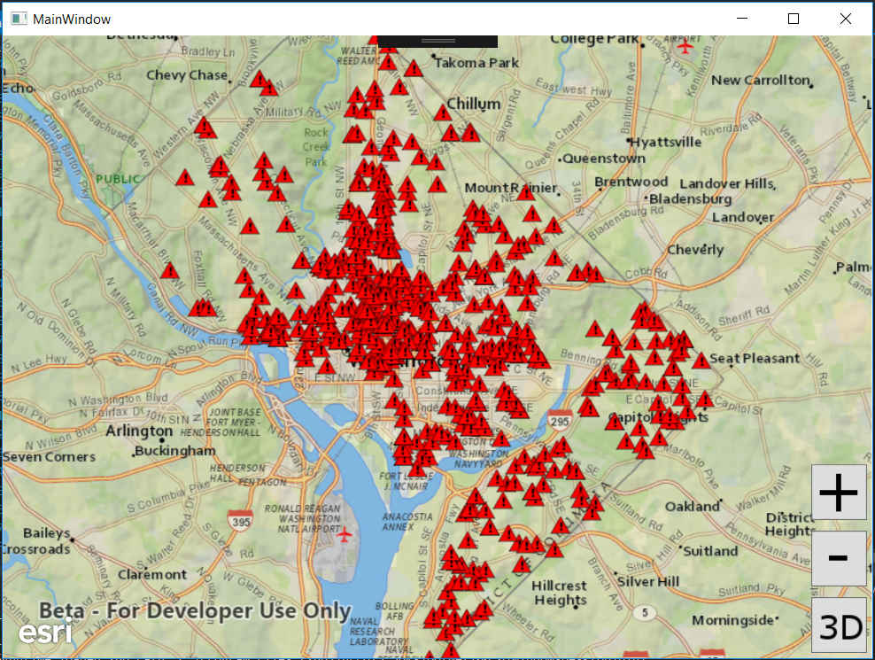

# Exercise 3: Add a Local Feature Layer (.NET C#)

This exercise walks you through the following:
- Add a layer from a mobile map package to the 2D map
- Add a scene service layer to the 3D scene

Prerequisites:
- Complete [Exercise 2](Exercise 2 Zoom Buttons.md), or get the Exercise 2 code solution compiling and running properly, preferably in an IDE.

If you need some help, you can refer to [the solution to this exercise](../../solutions/dotNETWPF/Ex3_LocalFeatureLayer), available in this repository.

## Add a layer from a mobile map package to the 2D map

ArcGIS Runtime provides a variety of ways to add **operational layers** to the map and scene--feature services, dynamic map services, offline geodatabases, and mobile map packages, for example. In this exercise, you will use the newest of these: a mobile map package.

1. If desired, make a copy of your Exercise 2 solution. Just make sure you're running your Exercise 3 code as you complete this exercise.
1. Download the [D.C. Crime Data mobile map package (`DC_Crime_Data.mmpk`)](../../data/DC_Crime_Data.mmpk) that we have prepared for you. For this exercise, you can put it in your application working directory, leave it in your downloads directory, or put it anywhere that your app will be able to access it.
1. In your class, before your constructor, instantiate a constant called `MMPK_PATH` with the absolute or relative path of the mobile map package you downloaded. The following line assumes that the MMPK is in a directory called `data` that is two directories up from your application's working directory. Adjust this value as needed:

    ```
    private static string MMPK_PATH = @"..\..\data\DC_Crime_Data.mmpk";
    ```
    
1. At the end of your initialize method, instantiate a `MobileMapPackage` with the mobile map package constant. Then open the mobile map package asynchronously.  Check to make sure it contains a map and set the map equal to the first map.  Since the package doesn't contain a basemap you will need to add a basemap and then set the map for the mapView:

    ```
    //Exercise 3: Add mobile map package to the map
            var mmpk = await MobileMapPackage.OpenAsync(MMPK_PATH);
            if (mmpk.Maps.Count >= 0)
            {
                myMap = mmpk.Maps[0];
                //Exercise 3: Mobile map package does not contain a basemap so must add one.
                myMap.Basemap = Basemap.CreateTopographicVector();
                mapView.Map = myMap;
            }
    ```
  You will get an error that that to use the await for the async all your method will need to be async.  Your initialize method will need 'private **async** void Initialize()'
  
1. Compile and run your app. Verify that the map zooms to Washington, D.C., and that a layer of crime incidents appears on top of the basemap. The incidents appear as red triangles, which is the symbology specified in the mobile map package:

    

## Add a scene layer to the 3D scene

Web scene layers are cached web layers that are optimized for displaying a large amount of 2D and 3D features. Scene layers can be viewed in a variety of ArcGIS clients, including ArcGIS Runtime. Here you will add a scene layer to your 3D scene.

1. Declare a constant value to specify the URL of a scene service. You can use a `SceneServer` URL or an ArcGIS Online or Portal for ArcGIS item URL that represents a scene service. The following URL shows plain gray buildings in Washington, D.C.:

    ```
    private static string SCENE_SERVICE_URL =
        "https://www.arcgis.com/home/item.html?id=606596bae9e44394b42621e099ba392a";
    ```

    The following URL shows photo-realistic buildings in Philadelphia:
    
    ```
    private static final String SCENE_SERVICE_URL =
        "https://www.arcgis.com/home/item.html?id=a7419641a50e412c980cf242c29aa3c0";
    ```

1. In Exercise 1, you added code to set up the scene with a basemap and an elevation source. After that code, in the same block, create a new `ArcGISSceneLayer` based on the scene service, give the layer an event handler for when it is done loading, and add the layer to the scene:

    ```
     _sceneLayer = new ArcGISSceneLayer(new Uri(SCENE_SERVICE_URL));
     myScene.OperationalLayers.Add(_sceneLayer);

     //Make sure layer is loaded
    _sceneLayer.LoadStatusChanged += SceneLayer_LoadStatusChanged;
    scene.getOperationalLayers().add(sceneLayer);
    
    private async void SceneLayer_LoadStatusChanged(object sender, Esri.ArcGISRuntime.LoadStatusEventArgs e)
        {
            // If layer isn't loaded, do nothing
            if (e.Status != Esri.ArcGISRuntime.LoadStatus.Loaded)
                return;
        }
    ```
    
1. Inside this new event handler, set your `SceneView`'s viewpoint to a new `Viewpoint` using the scene layer's full extent:

    ```
    sceneView.SetViewpoint(new Viewpoint(_sceneLayer.FullExtent));
    ```
    
1. Compile and run your app. Verify that when you switch to 3D, the scene displays the 3D features from the scene layer.
    
1. Remember in [Exercise 2](Exercise%202%20Zoom%20Buttons.md#zoom-in-and-out-on-the-map-and-the-scene) when you manipulated a `Camera` to zoom in and out? Here we will also use a `Camera`, but this time we will rotate the camera to provide an oblique view of the scene. We will focus the rotation on the current viewpoint's target point. The `Camera.rotateAround` method lets us specify a change in heading, pitch, and roll; let's change the heading by 45 degrees and the pitch by 65 degrees. After `rotateAround`, we will give the rotated `Camera` to the `SceneView`. Here is the code to insert immediately after the previous step:

    ```
   Viewpoint viewpoint = sceneView.GetCurrentViewpoint(ViewpointType.CenterAndScale);
   Esri.ArcGISRuntime.Geometry.MapPoint targetPoint = (MapPoint)viewpoint.TargetGeometry;
   Camera camera = sceneView.Camera.RotateAround(targetPoint, 45.0, 65.0, 0.0);

   await sceneView.SetViewpointCameraAsync(camera);
    ```

1. Compile and run your app. Verify that when you switch to 3D, the 3D features display and the view is rotated and pitched.

    
## How did it go?

If you have trouble, **refer to the solution code**, which is linked near the beginning of this exercise. You can also **submit an issue** in this repo to ask a question or report a problem. If you are participating live with Esri presenters, feel free to **ask a question** of the presenters.

If you completed the exercise, congratulations! You learned how to add a local feature layer from a mobile map package to a 2D map and a 3D scene.

Ready for more? Choose from the following:

- [**Exercise 4: Buffer a Point and Query Features**](Exercise 4 Buffer and Query.md)
- **Bonus**: we used a mobile map package, but you can also add **feature services** to your map and scene. Go to [ArcGIS Online](http://www.arcgis.com/home/index.html), find a feature service URL (hint: a feature service URL has the term `FeatureServer` at or near the end of the URL), and use the [`FeatureLayer`](https://developers.arcgis.com/net/quartz/wpf/api-reference/) and [`ServiceFeatureTable`]https://developers.arcgis.com/net/quartz/wpf/api-reference/) classes to add the feature service to your map and/or globe. You can refer to a [code sample](https://developers.arcgis.com/net/quartz/sample-code/featurelayerurl.htm) if you need it. 
