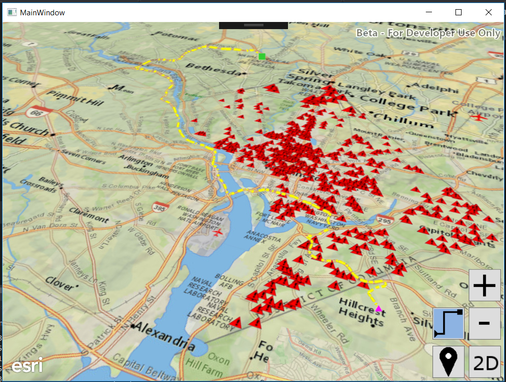

# Exercise 5: Routing (WPF C#)

ArcGIS Runtime Quartz will feature the ability to run ArcGIS geoprocessing for analysis and data management. Quartz Beta 1 offers a taste of geoprocessing by supporting network routing using Network Analyst services and using local network datasets. By learning how to use routing in this exercise, you will learn key skills that will help you use other geoprocessing capabilities coming in Quartz.

This exercise walks you through the following:
- Get the user to click an origin point and a destination point
- Calculate a driving route from the origin to the destination
- Display the route on the map or scene

Prerequisites:
- Complete [Exercise 4](Exercise 4 Buffer and Query.md), or get the Exercise 4 code solution compiling and running properly, preferably in an IDE.

If you need some help, you can refer to [the solution to this exercise](../../solutions/dotNETWPF/Ex5_Routing), available in this repository.

## Get the user to click an origin point and a destination point

After doing Exercise 4, this should seem familiar to you.

1. Before your constructor, instantiate symbols for the origin point, destination point, and route line:

    ```
    private static SimpleMarkerSymbol ROUTE_ORIGIN_SYMBOL = new SimpleMarkerSymbol(SimpleMarkerSymbolStyle.Triangle, Colors.Fuchsia, 10);
    private static SimpleMarkerSymbol ROUTE_DESTINATION_SYMBOL = new SimpleMarkerSymbol(SimpleMarkerSymbolStyle.Square, Colors.LimeGreen, 10);
    private static SimpleLineSymbol ROUTE_LINE_SYMBOL = new SimpleLineSymbol(SimpleLineSymbolStyle.Dash, Colors.DarkOrange, 5);

    ```
1. Create the button in the UI for routing in the MainWindow.xaml, add this above the 'QueryandBufferButton':
    ```
    <Button x:Name="RoutingButton" Width="50" Height="50" Padding="1" Margin="0,5" HorizontalAlignment="Left" Content="{DynamicResource Routing}" />
    ```
    
1. Add the click event for the button 'Click="RoutinegButton_Click"':

    ```
    <Button x:Name="RoutingButton" Click="RoutingButton_Click" Width="50" Height="50" Padding="1" Margin="0,5" HorizontalAlignment="Left" Content="{DynamicResource Routing}" />

    ```
    The Code for the method looks like:
     ```
    private void RoutingButton_Click(object sender, RoutedEventArgs e)
    {
    }
    ```
1. Before your constructor, instantiate two `GraphicsOverlay` objects for routing--one for the map and one for the scene--just as you did in a previous exercise. Also declare a MapPoint to store the origin point and set it to `null` for now:

    ```
    private GraphicsOverlay mapRouteGraphics = new GraphicsOverlay();
    private GraphicsOverlay sceneRouteGraphics = new GraphicsOverlay();
    private MapPoint originPoint = null;

    ```

1. In your constructor, add the `GraphicsOverlay` objects to the `MapView`:

    ```
   mapView.GraphicsOverlays.Add(mapRouteGraphics);
    ```    
    
1. In `ViewButton_Click()`, after the call to add the 'bufferAndQuerySceneGraphics' layer, add the scene `GraphicsOverlay` to the `SceneView`:

    ```
    sceneRouteGraphics.SceneProperties.SurfacePlacement = SurfacePlacement.Draped;
    sceneView.GraphicsOverlays.Add(sceneRouteGraphics);
    ```

1. In `ViewButton_Click()`, near the start of the method, set `originPoint` to `null` so that we don't try to use an origin from the 2D map with a destination from the 3D scene or vice versa:

    ```
    originPoint = null;
    ```
    
1. In `QueryandBufferButton_Click()`, if the buffer and query button is selected, un-select the routing button.  Also need to do the same in the RoutingButton_Click to make sure the QueryandBufferButton is unselected. _Note: if we had more than two buttons, we would want to do something smarter than this. Since this exercise is not about building a UI, we're naïvely assuming there will only ever be two buttons._

    ```
    if (RoutingButton.Content == FindResource("RoutingSelected"))
      RoutingButton.Content = FindResource("Routing");
    ```
   
    ```
    private void RoutingButton_Click(object sender, RoutedEventArgs e)
    {
       if (QueryandBufferButton.Content == FindResource("LocationSelected"))
          QueryandBufferButton.Content = FindResource("Location");
    }
   ```
    
1. In the 'RoutingButton_Click()' method, we need to start listening for the 'mapView' or the 'sceneView' to be clicked/tapped and if the button is no longer selected we need to stop listening and clear graphics:

    ```
   RoutingButton.Content = FindResource(RoutingButton.Content == FindResource("Routing") ? "RoutingSelected" : "Routing");
   if (RoutingButton.Content == FindResource("RoutingSelected"))
   {
      if (sceneView != null)
         sceneView.GeoViewTapped += OnView_Tapped;
       mapView.GeoViewTapped += OnView_Tapped;
    }
    else
    {
      mapView.GeoViewTapped -= OnView_Tapped;
      sceneView.GeoViewTapped -= OnView_Tapped;
      mapRouteGraphics.Graphics.Clear();
      sceneRouteGraphics.Graphics.Clear();      
    }
    ```
    
1. In `OnView_Tapped`, after the geoPoint is projected, we want to add an 'if' block to distinquish whether we are working on a route or a buffer and query.  The 'OnView_Tapped' should look like:

    ```
    MapPoint geoPoint = getGeoPoint(e);
    geoPoint = (MapPoint)GeometryEngine.Project(geoPoint, SpatialReference.Create(3857));
    if (QueryandBufferButton.Content == FindResource("LocationSelected"))
    {
        Polygon buffer = (Polygon)GeometryEngine.Buffer(geoPoint, 1000.0);
        GraphicCollection graphics = (threeD ? bufferAndQuerySceneGraphics : bufferAndQueryMapGraphics).Graphics;
        graphics.Clear();
        graphics.Add(new Graphic(buffer, BUFFER_SYMBOL));
        graphics.Add(new Graphic(geoPoint, CLICK_SYMBOL));

        Esri.ArcGISRuntime.Data.QueryParameters query = new Esri.ArcGISRuntime.Data.QueryParameters();
        query.Geometry = buffer;
        LayerCollection operationalLayers;
        if (threeD)
             operationalLayers = sceneView.Scene.OperationalLayers;
        else
             operationalLayers = mapView.Map.OperationalLayers;
        foreach (Layer layer in operationalLayers)
        {
             ((FeatureLayer)layer).SelectFeaturesAsync(query, SelectionMode.New);
         }
     }
     else if (RoutingButton.Content == FindResource("RoutingSelected"))
     {
     }
    ```
    
1.  We need to make a change to the 'getGeoPoint' method.  When in 3D we need to remove the point's z-value if present, since a z-value will cause the routing not to work:
    ```
     geoPoint = sceneView.ScreenToBaseSurface(screenPoint);
     if (geoPoint.HasZ)
        geoPoint = new MapPoint(geoPoint.X, geoPoint.Y, geoPoint.SpatialReference);
    ```    

1. Get the route graphics, depending on whether or not we are in 3D mode inside the 'else if' block for the routing button being selected:    
    ```
    GraphicCollection graphics = (threeD ? sceneRouteGraphics : mapRouteGraphics).Graphics;
    ```    
1. Create an `else if` statement that determines whether or not `originPoint` is `null`:

    ```
    if (originPoint == null) 
    {
    
    } 
    else 
    {
    
    }
    ```

1. If `originPoint` is `null`, then this is the first route point the user has clicked. Save the point as `originPoint`, clear the graphics, and add `originPoint` as a graphic:

    ```
    originPoint = geoPoint;
    graphics.Clear();
    graphics.Add(new Graphic(originPoint, ROUTE_ORIGIN_SYMBOL));
    ```
    
1. If `originPoint` is not `null`, then this is the second route point the user has clicked. Add the point as a graphic, and then reset the routing by setting `originPoint` to `null`. It is in this block that you will write the code that calculates the route, but you will write that code later in this exercise. For now, just add the graphic and set `originPoint` to `null`:

    ```
    graphics.Add(new Graphic(originPoint, ROUTE_DESTINATION_SYMBOL));
    originPoint = null;
    ```
    
1. Compile and run your app. Verify that you can toggle on the routing button, click an origin point, click a destination point, and see both points displayed. Verify this behavior in both 2D and 3D:

    

    
    
## Display the route on the map or scene

1. Before your constructor, declare a `RouteTask` variable and a `RouteParameters` vairable:

    ```
    private RouteTask routeTask;
    private RouteParameters routeParameters;
    ```
    
1. In your 'Initialize()' method, instantiate the `RouteTask`, set its ArcGIS Online username and password, and get the `RouteParameters` from the `RouteTask`. But instantiate them in such a way that if getting the `RouteParameters` fails, both the `RouteTask` and the `RouteParameters` are set to `null`, as a signal to the rest of the code that routing is not available. _Note: in this exercise, we're naïvely hard-coding our username and password. Don't do that! It is too easy for someone to decompile your code. There are at least three better options: use an OAuth 2.0 user login, use an OAuth 2.0 app login (not supported in ArcGIS Runtime Quartz Beta 1, and presents a problem of its own since you shouldn't hard-code your client secret), or challenge the user for credentials. For now, since the exercise is about routing and not security, just hard-code the username and password._ Here is the code to add to your constructor:

    ```
    Uri routeServiceUri = new Uri("http://route.arcgis.com/arcgis/rest/services/World/Route/NAServer/Route_World");
    TokenCredential credentials = await AuthenticationManager.Current.GenerateCredentialAsync(routeServiceUri, "username", "password");
    routeTask = await RouteTask.CreateAsync(routeServiceUri, credentials);
    try
    {
        routeParameters = await routeTask.GenerateDefaultParametersAsync();
    }
    catch (Exception error)
    {
        Console.WriteLine(error.Message);
    }
    ```
    
1. In your else if in 'OnView_Tapped', after setting `destination` and before 'originPoint = null', if getting the `RouteParameters` succeeded (i.e. if `routeParameters` is not `null`), set some of the parameters. We don't need route directions or stops (we already have the stops), but we do need routes. If the `RouteParameters` object is null, disable the routing button because routing is not available:

    ```
    if (routeParameters != null)
    {
        routeParameters.ReturnDirections = false;
        routeParameters.ReturnRoutes = true;
        routeParameters.ReturnStops = false;
     }
     else
        RoutingButton_Click(null, null);
    ```
    
1. Write the to add the stops to the parameters for the route.  You will need to add a new namespace 'using System.Collections.Generic':

    ```
     var stop1 = new Stop(originPoint);
     var stop2 = new Stop(geoPoint);
     var stopPoints = new List<Stop> { stop1, stop2 };
    ```
    
1. After adding the stops, call `routeTask.SolveRouteAsync(routeParameters)` to solve the route asynchronously. Since it is asynchronous call we need to add the keyword async to the method.  The results are returned to our variable 'routeReslut' and then we can get the first route, and add it as a graphic:

    ```
   var routeResult = await routeTask.SolveRouteAsync(routeParameters);
   // get the route from the results
   var route = routeResult.Routes[0];
   // create a graphic (with a dashed line symbol) to represent the route
   var routeSymbol = new SimpleLineSymbol(SimpleLineSymbolStyle.Dash, Colors.Yellow, 5);
   var routeGraphic = new Graphic(route.RouteGeometry, routeSymbol);
   graphics.Add(routeGraphic);
    ```
    
1. Compile and run your app. Verify that you can calculate and display a route in both 2D and 3D:

    
    
    
    
## How did it go?

If you have trouble, **refer to the solution code**, which is linked near the beginning of this exercise. You can also **submit an issue** in this repo to ask a question or report a problem. If you are participating live with Esri presenters, feel free to **ask a question** of the presenters.

If you completed the exercise, congratulations! You learned how to calculate a driving route using a web service and display the route on the map.

Ready for more? Choose from the following bonus challenges:
- Instead of hard-coding your ArcGIS Online username and password, challenge the user for a username and password. This is more of a UI problem than an ArcGIS problem; just get the username and password in a dialog or something and pass them to the `UserCredential` constructor.
- In fact, you can do even better than creating your own username/password dialog. A wise user will feel nervous about typing his or her username and password into an arbitrary app. You can give the user some reassurance by implementing an OAuth 2.0 user login, in which ArcGIS Online (or ArcGIS Enterprise) generates a login page, which you display in a web control. That way, your program never directly handles the username and password, but you get back a short-lived token that you can use to authenticate to ArcGIS services. See if you can implement an OAuth 2.0 user login for the routing. Hint: take a look at [`OAuthTokenCredentialRequest`](https://developers.arcgis.com/net/quartz/wpf/api-reference/); that documentation has suggested steps for performing the OAuth 2.0 login.
- Allow the user to add more than two points for the route.
- Allow the user to add barriers in addition to stops.
- Look at the properties you can set on [`RouteParameters`](https://developers.arcgis.com/net/quartz/wpf/api-reference//html/Properties_T_Esri_ArcGISRuntime_Tasks_NetworkAnalyst_RouteParameters.htm) and try a few of them to change the routing behavior.

That concludes the exercises for this workshop. Well done!
