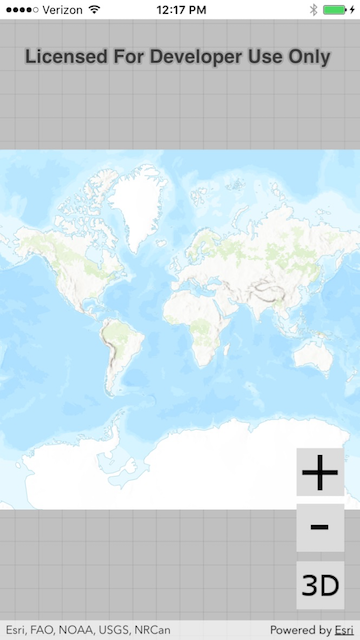
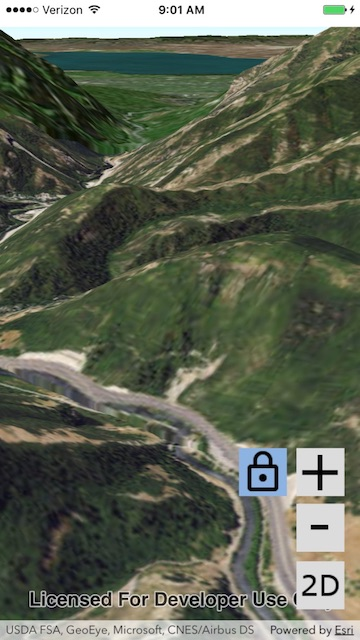

# Exercise 2: Add Zoom In and Zoom Out Buttons (iOS/Swift)

This exercise walks you through the following:
- Add zoom in and zoom out buttons to the UI
- Zoom in and out on the map and the scene
- Add a button for locking the scene's focus point

Prerequisites:
- Complete [Exercise 1](Exercise%201%20Map%20and%20Scene.md), or get the Exercise 1 code solution compiling and running properly in Xcode.

If you need some help, you can refer to [the solution to this exercise](../../../solutions/iOS/Swift/Ex2_ZoomButtons), available in this repository.

## Add zoom in and zoom out buttons to the UI

1. In `Main.storyboard`, add two **Buttons** above the 2D/3D toggle button. Make their size 50x50. Add `gray_background` to each. Choose `zoom_in` for one button’s image and `zoom_out` for the other. _To make adding buttons easier, you might want to add a **View** with a transparent background to contain all the buttons and increase its size as needed._

1. Open `ViewController.swift` in the Assistant Editor. Create an Action connection (not an Outlet connection) from each new button to the ViewController class:

    ```
    @IBAction func button_zoomIn_onAction(_ sender: UIButton) {
    }

    @IBAction func button_zoomOut_onAction(_ sender: UIButton) {
    }
    ```
    
1. Compile and run your app. Verify that the zoom buttons display. If desired, use the Xcode debugger to verify that the action methods are called when you click the buttons.

    

## Zoom in and out on the map and the scene

1. In ArcGIS Runtime, zooming on a map and zooming on a scene use simple but quite different mechanisms. We'll talk more about those mechanisms later, but for now, get ready to zoom by creating an empty `fileprivate func zoomMap(_ factor: Double)` method and a `fileprivate func zoomScene(_ factor: Double)` method in your class.

1. Rather than having your action methods call `zoomMap` and `zoomScene` directly, you can simplify your code by creating a generic `zoom(factor: Double)` method that calls `zoomMap` or `zoomScene` depending on whether you're currently in 2D mode or 3D mode:

    ```
    fileprivate func zoom(_ factor: Double) {
        if (threeD) {
            zoomScene(factor);
        } else {
            zoomMap(factor);
        }
    }
    ```
    
1. In your zoom button action methods, add a call to `zoom(double)` with a _factor_. Use a factor between 0 and 1 to zoom out, and use a factor greater than 1 to zoom in:

    ```
    @IBAction func button_zoomIn_onAction(_ sender: UIButton) {
        zoom(2.0);
    }
    
    @IBAction func button_zoomOut_onAction(_ sender: UIButton) {
        zoom(0.5);
    }
    ```
    
1. For the ArcGIS Runtime 2D map view, the zoom mechanism is relatively simple: get the map scale, divide it by a factor, and use the quotient to set the map view’s viewpoint scale. Write the code for this operation inside the `zoomMap(Double)` method:

    ```
    mapView.setViewpointScale(mapView.mapScale / factor)
    ```

1. Create a private method called `getSceneTarget()` that returns the point on Earth's surface on which the camera is currently focusing. You can use this method for zooming and also the lock focus button you will add later:

    ```
    fileprivate func getSceneTarget() -> AGSGeometry {
        return (sceneView.currentViewpoint(with: AGSViewpointType.centerAndScale)?.targetGeometry)!
    }
    ```
    
1. 3D is awesome, but it is almost always more complicated than 2D, and zooming is no exception. ArcGIS Runtime's 3D scene view uses a _viewpoint_ with a _camera_ to change the user's view of the scene. Objects of type `Camera` are immutable and have a fluent API, so you can get a copy of the scene view’s current viewpoint camera, use a factor to move it toward or away from the camera's current target, and use it as the scene view’s new viewpoint camera. You can even animate the camera's movement and specify the duration of the animated camera movement (the code that follows uses `0.5` to animate for half a second). In this case, we will use the `Camera`'s `zoomTowardTargetPoint` method to create a new `Camera`. Add the following code to your `zoomScene(Double)` method:

    ```
    let target = getSceneTarget() as! AGSPoint
    let camera = sceneView.currentViewpointCamera().zoomTowardTargetPoint(target, factor: factor)
    sceneView.setViewpointCamera(camera, duration: 0.5, completion: nil)
    ```
    
1. Compile and run your app. Verify that the zoom in and out buttons work in both 2D mode and 3D mode.

## Add a button for locking the scene's focus point

This portion of the exercise will teach you how to use _camera controllers_ in ArcGIS Runtime.

1. In `Main.storyboard`, add a **Button** to the left of the zoom in button. Use the `lock` image for this button and `gray_background` for the button's background. To make it appear as a toggle button, change **State Config** to **Selected** and use `lock_selected` as the image and `gray_background` as the background. Make the size 50x50.

1. Open `ViewController.swift` in the Assistant Editor. Right-click and drag the button to create an **Action** connection in `ViewController`, then close the Assistant Editor:

    ```
    @IBAction func button_lockFocus_onAction(_ sender: UIButton) {
    }
    ```

1. In `button_lockFocus_onAction(UIButton)`, toggle the selected state of the button:

    ```
    sender.isSelected = !sender.isSelected
    ```

1. In `button_lockFocus_onAction(UIButton)`, add an `if-else` statement for whether or not the button is selected:

    ```
    if (sender.isSelected) {

    } else {

    }
    ```

1. If the button is NOT selected, it's only one line of code to set the `AGSSceneView`'s camera controller to a default `AGSGlobeCameraController`. Insert this line in your new `else` block:

    ```
    sceneView.cameraController = AGSGlobeCameraController()
    ```

1. If the button IS selected, you need to give the `AGSSceneView` a new `AGSOrbitLocationCameraController`, which locks the camera's focus on a given point. `OrbitLocationCameraController`'s constructor takes two arguments:

    1. The target point on Earth's surface. You can use the current camera's target point by calling your `getSceneTarget()` method.
    1. The distance (in meters) from the target at which the camera should be placed. ArcGIS Runtime's `AGSGeometryEngine` lets you calculate the x/y distance in meters between two points, but the constructor needs an x/y/z distance, which you can calculate using the [Pythagorean theorem](https://en.wikipedia.org/wiki/Pythagorean_theorem) (did we mention that this workshop would require junior high school math?).
    
    The following steps will help you set up this camera controller.

1. In your empty `if` block, get the scene target, verify that it is of type `Point`, and cast it to `Point`:

    ```
    let target = getSceneTarget()
    if (target is AGSPoint) {
        let targetPoint = target as! AGSPoint
        
    }
    ```

1. After getting `targetPoint`, get the `AGSSceneView`'s current camera and its location:

    ```
    let currentCamera = sceneView.currentViewpointCamera()
    let currentCameraPoint = currentCamera.location
    ```

1. If the current camera point is not null, use [`AGSGeometryEngine.geodeticDistanceBetweenPoint1:point2:distanceUnit:azimuthUnit:curveType:()`](https://developers.arcgis.com/ios/latest/api-reference/interface_a_g_s_geometry_engine.html#acac90285631fcd75cb460075759bc519) to calculate the ground distance between the target point and the x/y part of the current camera location. Then use the Pythagorean theorem to calculate the distance from the target point and the current camera:

    ```
    let xyDistance = AGSGeometryEngine.geodeticDistanceBetweenPoint1(
        targetPoint,
        point2: currentCameraPoint,
        distanceUnit: AGSLinearUnit.meters(),
        azimuthUnit: AGSAngularUnit.degrees(),
        curveType: AGSGeodeticCurveType.geodesic)?.distance
    let zDistance = currentCameraPoint.z
    let distanceToTarget = (pow(xyDistance!, 2) + pow(zDistance, 2)).squareRoot()
    ```

1. Create a new [`AGSOrbitLocationCameraController`](https://developers.arcgis.com/ios/latest/api-reference/interface_a_g_s_orbit_location_camera_controller.html) with the target point and distance you calculated. Set its heading and pitch from the current camera. Then give the `AGSSceneView` the camera controller you created:

    ```
    let cameraController = AGSOrbitLocationCameraController(targetLocation: targetPoint, distance: distanceToTarget)
    cameraController.cameraHeadingOffset = currentCamera.heading
    cameraController.cameraPitchOffset = currentCamera.pitch
    sceneView.cameraController = cameraController
    ```

1. Run your app. Switch to 3D mode, navigate to a point where you want to lock, and click the lock button. Verify that navigation now focuses on the target point. Click the lock button again and verify that normal navigation is restored:

    

## How did it go?

If you have trouble, **refer to the solution code**, which is linked near the beginning of this exercise. You can also **submit an issue** in this repo to ask a question or report a problem. If you are participating live with Esri presenters, feel free to **ask a question** of the presenters.

If you completed the exercise, congratulations! You learned how to add buttons that programmatically zoom in and out on a 2D map and a 3D scene, as well as how to work with camera controllers.

Ready for more? Choose from the following:
- Start on [**Exercise 3: Operational Layers**](Exercise%203%20Operational%20Layers.md).
- We used `AGSOrbitLocationCameraController`, which causes navigation to orbit around a fixed location. [`AGSOrbitGeoElementCameraController`](https://developers.arcgis.com/ios/latest/api-reference/interface_a_g_s_orbit_geo_element_camera_controller.html) causes navigation to orbit around a [`AGSGeoElement`](https://developers.arcgis.com/ios/latest/api-reference/protocol_a_g_s_geo_element-p.html), whose location can move. See if you can figure out how to make the camera focus on a moving point.
