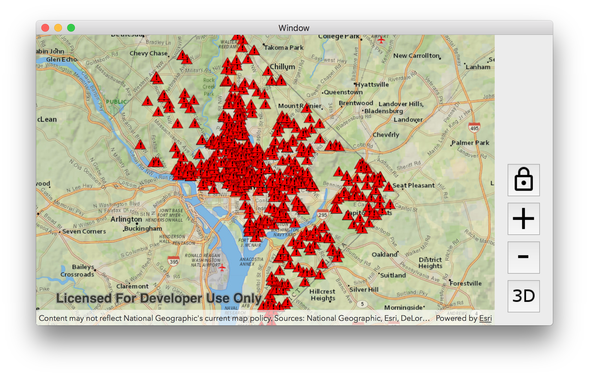
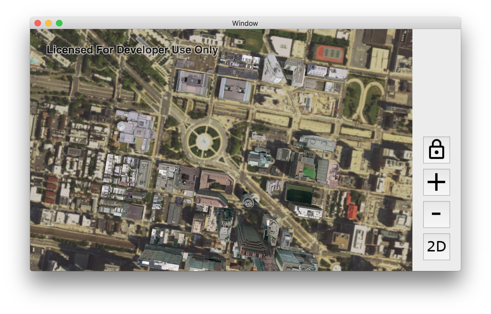
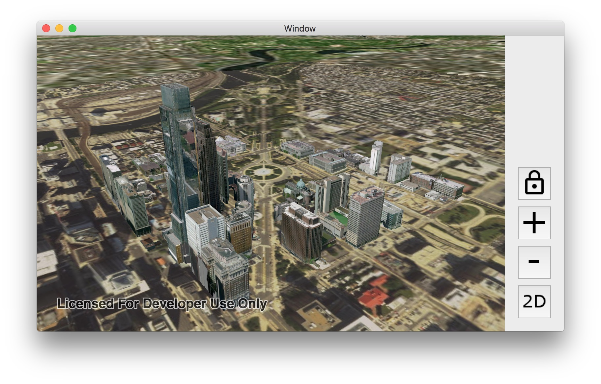

# Exercise 3: Operational Layers (macOS/Swift)

This exercise walks you through the following:
- Add a layer from a mobile map package to the 2D map
- Add a scene layer to the 3D scene

Prerequisites:
- Complete [Exercise 2](Exercise%202%20Zoom%20Buttons.md), or get the Exercise 2 code solution compiling and running properly in Xcode.

If you need some help, you can refer to [the solution to this exercise](../../../solutions/macOS/Swift/Ex3_OperationalLayers), available in this repository.

## Add a layer from a mobile map package to the 2D map

ArcGIS Runtime provides a variety of ways to add **operational layers** to the map and scene--feature services, dynamic map services, offline geodatabases, and mobile map packages, for example. In this exercise, you will use the newest of these: a mobile map package.

1. Download the [D.C. Crime Data mobile map package (`DC_Crime_Data.mmpk`)](../../../data/DC_Crime_Data.mmpk) that we have prepared for you. In Xcode, add `DC_Crime`Data.mmpk` to your project (select your project in the Navigator and choose **File** > **Add Files to <project name>**).

1. In `ViewController.swift`, declare a constant for the MMPK path. Use `NSBundle.mainBundle().pathForResource` to construct the path:

    ```
    fileprivate let MMPK_PATH = URL(string: Bundle.main.path(forResource: "DC_Crime_Data", ofType:"mmpk")!)
    ```

1. At the end of `viewDidLoad()`, instantiate an `AGSMobileMapPackage` with the mobile map package constant. Then load the mobile map package with a completion to run when the mobile map package is done loading:

    ```
    let mmpk = AGSMobileMapPackage(fileURL: MMPK_PATH!)
    mmpk.load {(error) in
        
    }
    ```
    
1. Inside the `load` completion code, get the `MobileMapPackage`'s maps. A mobile map package can contain multiple maps. `DC_Crime_Data.mmpk` only has one map, but it's a good idea to make sure there's at least one. If so, get the first map (index 0), and use it to set the map view’s map. The map in this mobile map package has no basemap, so it's a good idea to set the basemap again. Here's the code that goes inside the event handler method:

    ```
    if 0 < mmpk.maps.count {
        self.mapView.map = mmpk.maps[0]
    }
    self.mapView.map!.basemap = AGSBasemap.topographicVector()
    ```
    
1. Run your app. Verify that the map zooms to Washington, D.C., and that a layer of crime incidents appears on top of the basemap. The incidents appear as red triangles, which is the symbology specified in the mobile map package:

    

## Add a scene layer to the 3D scene

Web scene layers are cached web layers that are optimized for displaying a large amount of 2D and 3D features. Scene layers can be viewed in a variety of ArcGIS clients, including ArcGIS Runtime. Here you will add a scene layer to your 3D scene.

1. Declare a constant value to specify the URL of a scene service. You can use a `SceneServer` URL or an ArcGIS Online or Portal for ArcGIS item URL that represents a scene service. The following URL shows plain gray buildings in Washington, D.C.:

    ```
    fileprivate let SCENE_SERVICE_URL = URL(string:
    "https://www.arcgis.com/home/item.html?id=606596bae9e44394b42621e099ba392a")
    ```

    The following URL shows photo-realistic buildings in Philadelphia:

    ```
    fileprivate let SCENE_SERVICE_URL = URL(string:
    "https://www.arcgis.com/home/item.html?id=a7419641a50e412c980cf242c29aa3c0")
    ```

1. At the end of `viewDidLoad()`, instantiate an `AGSArcGISSceneLayer` with the scene service URL constant. Then load the scene layer with a completion to run when the layer is done loading. (This should seem familiar.)

    ```
    let sceneLayer = AGSArcGISSceneLayer(url: SCENE_SERVICE_URL!)
    sceneLayer.load{(error) in

    }
    ```

1. Inside the `load` completion code, set the scene view's viewpoint to the full extent of the scene layer:

    ```
    self.sceneView.setViewpoint(AGSViewpoint(targetExtent: sceneLayer.fullExtent!))
    ```

1. After the call to `load` (NOT inside the completion block), add the new layer to the scene:

    ```
    self.sceneView.scene?.operationalLayers.add(sceneLayer)
    ```

1. Run your app. Verify that when you switch to 3D, the scene displays the 3D features from the scene layer:



1. Remember in [Exercise 2](Exercise%202%20Zoom%20Buttons.md#zoom-in-and-out-on-the-map-and-the-scene) when you manipulated a camera to zoom in and out? Here we will also use a camera, but this time we will rotate the camera to provide an oblique view of the scene. We will focus the rotation on the current viewpoint's target point. The `AGSCamera.rotateAroundTargetPoint` method lets us specify a change in heading, pitch, and roll; let's change the heading by 45 degrees and the pitch by 65 degrees. After `rotateAroundTargetPoint`, we will give the rotated camera to the scene view. Here is the code to insert inside the completion block immediately after the call to `setViewpoint`:

    ```
    let viewpoint = self.sceneView.currentViewpoint(with: AGSViewpointType.centerAndScale)
    let targetPoint = viewpoint?.targetGeometry
    let camera = self.sceneView.currentViewpointCamera().rotateAroundTargetPoint(targetPoint as! AGSPoint, deltaHeading: 45.0, deltaPitch: 65.0, deltaRoll: 0.0)
    self.sceneView.setViewpointCamera(camera)
    ```

1. Run your app. Verify that when you switch to 3D, the 3D features display and the view is rotated and pitched:


    
## How did it go?

If you have trouble, **refer to the solution code**, which is linked near the beginning of this exercise. You can also **submit an issue** in this repo to ask a question or report a problem. If you are participating live with Esri presenters, feel free to **ask a question** of the presenters.

If you completed the exercise, congratulations! You learned how to add a local feature layer from a mobile map package to a 2D map and a scene layer to a 3D scene.

Ready for more? Choose from the following:

- [**Exercise 4: Buffer a Point and Query Features**](Exercise%204%20Buffer%20and%20Query.md)
- **Bonus**: we used a mobile map package, but you can also add **feature services** to your map and scene. Go to [ArcGIS Online](http://www.arcgis.com/home/index.html), find a feature service URL (hint: a feature service URL has the term `FeatureServer` at or near the end of the URL), and use the [`AGSFeatureLayer`](https://developers.arcgis.com/macos/latest/api-reference/interface_a_g_s_feature_layer.html) and [`AGSServiceFeatureTable`](https://developers.arcgis.com/macos/latest/api-reference/interface_a_g_s_service_feature_table.html) classes to add the feature service to your map and/or globe. You can refer to a [code sample](https://github.com/Esri/arcgis-runtime-samples-macos/tree/master/arcgis-runtime-samples-macos/Features/Feature%20layer%20(feature%20service)) if you need it.
